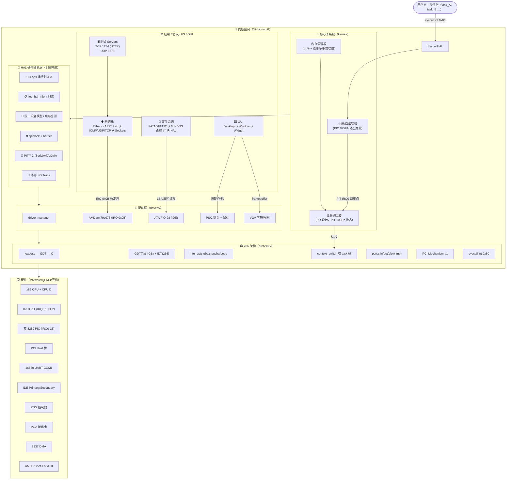
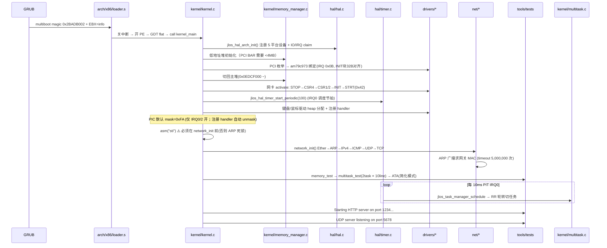

# JohnBeauty OS (JLOS)

> 从 0 写起的 C 语言 32-bit x86 保护模式宏内核：**多任务抢占式调度（PIT 100Hz RR）**、**完整 TCP/IP 7 层协议栈**、**PCI/ATA/PS2/VGA/AMD PCnet-FAST III 网卡驱动**、**FAT16/FAT32 文件系统**、**Composite Widget GUI**、**6 级完整 HAL 硬件抽象层**。

---

## ✨ 功能亮点一览

| 类别 | 已实现功能 |
|---|---|
| 🧠 **内核核心** | 32-bit 保护模式 flat 段、分页/堆 malloc/free(双堆切换)、PIT 100Hz 抢占调度、IDT+双8259 PIC 动态屏蔽 |
| 🧩 **HAL 层 (6级完成)** | IO ops 运行时多态 + jlos_hal_info_t 只读硬件信息 + 统一设备模型(资源冲突检测+回滚) + 可重入自旋锁irqsave + mfence/lfence/sfence 内存屏障 + 环形I/O诊断 Trace |
| 🚗 **驱动** | AMD am79c973 PCI 网卡(20 RX + 8 TX desc 环)、ATA PIO-28 硬盘、PS/2 键盘、PS/2 鼠标、VGA 字符/图形模式、16550 UART COM1、8237 DMA |
| 🌐 **网络** | Ethernet II ⇄ ARP(128 cache + timeout) ⇄ IPv4(路由 + checksum) ⇄ ICMP(ping reply) ⇄ UDP/TCP Socket ⇄ HTTP 1234 + UDP 5678 echo server |
| 📁 **文件系统** | 块设备 HAL 抽象、FAT16/FAT32 BPB 解析、8.3 目录项、簇链、MS-DOS 风格路径解析（兼容 Unix `/` 和 DOS `\`） |
| 🖼️ **GUI** | Desktop 根容器 → Window 可拖动窗口 → Button/Label/EditBox Widget 组合模式；hit-test 鼠标事件分发 |
| 🔧 **工具** | memory_test / multitask_test / hard_driver_test / http_server_test / udp_server_test 5 个测试用例 + debug_console |

---

## 📂 项目目录结构

```
johnbeauty-os/
├── arch/x86/               # x86 底层：loader.s、GDT/IDT、interruptstubs.s(4-byte int#)、context_switch、port I/O、PCI cfg、syscall 0x80
├── hal/                    # HAL 硬件抽象层（6级全部完成）：io/irq/mmu/syscall/context/barrier/spinlock/timer/pci/serial/block/dma/device/diag
├── kernel/                 # 内核核心：kernel_main 三阶段启动、memory_manager(双堆)、multitask(RR调度)
├── drivers/                # 驱动：driver_manager + amd_am79c973 + ata_pio28 + ps2_keyboard + ps2_mouse + vga
├── net/                    # 网络栈：etherframe + arp + ipv4 + icmp + udp + tcp
├── filesystem/             # 文件系统：fat(16/32) + msdospath
├── gui/                    # GUI：desktop + window + widget(composite pattern)
├── common/                 # 共用头：types.h(JLOS_NET_MAX_SLOTS)、multiboot.h、graphics.h
├── tools/                  # 配置(config.h) + tests/* + samples/debug_console
├── docs/                   # 📚 架构文档（见下方索引）
├── linker.ld               # ELF i386 链接脚本
├── Makefile                # gcc -m32 -nostdlib 构建入口
├── HAL_DESIGN.md           # HAL 6级升级设计蓝图
└── Readme_zh.md            # 本文档
```

---

## 🏗️ 整体架构图（ASCII 大图 · GitLab 任何缩放都清晰）

> 默认显示纯文本 ASCII 架构图（无依赖、无留白、字大图全）；折叠块保留原始 Mermaid 源码，**未来本地装 mmdc 可一键导出 2560px 大图 SVG**（见 docs/images/README.txt）。

```
╔══════════════════════════════════════════════════════════════════════════════════╗
║                        🧑‍💻  用户态（多任务 + 测试服务）                           ║
╠════════════════════════════╦═══════════════════════╦═════════════════════════════╣
║  task_A · task_B … (RR)    ║  HTTP @ TCP :1234    ║  UDP  echo @ :5678          ║
║  └─→ syscall  int 0x80 ──┐ ║  └─→ socket()/listen║  └─→ socket()/sendto        ║
╚═══════════════════════════╬╩═══════════════════════╩═════════════════════════════╝
                            ║         ↑ 向上回调            ↑ on_data()
                            ▼         │                  │
╔══════════════════════════════════════════════════════════════════════════════════╗
║  🌐  应用协议 / 文件系统 / GUI  （直接调 HAL 拿资源）                             ║
╠══════════════════════════╦═══════════════════╦═══════════════════╦══════════════╣
║  NET 7 层协议栈          ║  文件系统 FAT     ║  GUI 窗口控件     ║  测试        ║
║  Ether→ARP→IPv4→ICMP    ║  BPB + FAT16/32   ║  Desktop→Window  ║  multitask   ║
║  → UDP/TCP → sockets[]  ║  目录项 + 簇链    ║  → Widget(组合)   ║  memory/ATA  ║
╚═════════════╦════════════╩═══════╦════════════╩═══════╦═══════════╩══════════════╝
              ║   AMD IRQ0x0B      ║   LBA 扇区 R/W      ║   键盘/鼠标/VGA
              ▼                    ▼                    ▼
╔══════════════════════════════════════════════════════════════════════════════════╗
║  🧠  内核核心子系统（kernel/）   ring 0                                            ║
╠══════════════════════════╦═════════════════════════════╦══════════════════════════╣
║  内存管理器  双堆切换    ║  调度器  RR 时间片         ║  中断异常  PIC 动态屏蔽  ║
║  低地址堆 ←→ 主堆        ║  PIT 100Hz  IRQ0 触发     ║  256 门 + 未注册 IRQ 屏蔽║
║  jlos_malloc / free      ║  TERMINATED 跳过           ║  VMware IRQ13 / 0x2E 忽略║
╚═════════════╦════════════╩═══════════╦═════════════════╩═══════════╦══════════════╝
              ║   HAL API 统一入口     ║   调度点 IRQ0              ║   handler 注册
              ▼                        ▼                            ▼
╔══════════════════════════════════════════════════════════════════════════════════╗
║  🧩  HAL 硬件抽象层（6 级全部完成）  架构隔离核心                                  ║
╠═══════╦════════╦═════════╦═══════════════════╦═══════════╦═══════════════════════╣
║ IO 函数║ 只读   ║ 同步原语║  统一设备模型      ║ 硬件包装  ║ 诊断 I/O Trace         ║
║ ops表  ║ jlos_  ║ spinlock║  jlos_device_t    ║ PIT/PCI   ║ 环形 512 条           ║
║ 多态   ║ hal_info║ barrier║  资源冲突回滚     ║ UART/ATA  ║ HAL_CONFIG_TRACE_IO   ║
╚═══════╩═════╦══╩═════════╩═══════╦═════════════╩═════╦═════╩═══════════╦═══════════╝
              ║   driver 激活       ║   资源 claim        ║   调 driver 实现   ║
              ▼                     ▼                    ▼                  ▼
╔══════════════════════════════════════════════════════════════════════════════════╗
║  🚗  驱动子系统（drivers/）  堆上分配对象 jlos_malloc                                ║
╠════════════════╦════════════════╦═══════════════╦═════════════════╦═══════════════╣
║  driver_       ║  AMD am79c973  ║  ATA PIO-28   ║  PS/2 键盘/鼠标  ║  VGA 文本/图形 ║
║  manager 生命周期║  20 RX / 8 TX ║  28bit LBA    ║  扫描码 → ASCII  ║  0xB8000 文本  ║
║  add/activate  ║  INIT 32B 对齐 ║  0x1F0~0x1F7  ║  3 字节鼠标包    ║  0xA0000 图形  ║
╚════════════════╩══════╦═════════╩═══════╦═════════╩═══════╦═════════════╩═══════╦═══════╝
                       ║   in/out + IRQ     ║   arch/x86       ║   原始 port I/O    ║
                       ▼                    ▼                 ▼                    ▼
╔══════════════════════════════════════════════════════════════════════════════════╗
║  🏛️  x86 平台层（arch/x86/）  32-bit protected mode                              ║
╠════════════╦══════════════╦═════════════════╦═════════════════╦═══════════════════╣
║  loader.s  ║  GDT flat    ║  interruptstubs ║  context_switch ║  PCI Mechanism#1  ║
║  GRUB → C  ║  0x08 code   ║  pushl 4字节!!  ║  切 ESP → 栈切换║  0xCF8 / 0xCFC    ║
║  0x2BADB002║  0x10 data   ║  error code分支 ║  cpustate 嵌入  ║  syscall int 0x80  ║
╚════════════╩══════════════╩═════════════════╩═════════════════╩═══════════════════╝
                                          │
                                          ▼
  ┌──────────────────────────────────────────────────────────────────────────────┐
  │  💻  硬件（VMware / QEMU / 真机）                                              │
  │  x86 CPU · 双 8259 PIC · 8253 PIT 100Hz · 16550 UART · PCI Host 桥           │
  │  IDE Primary · PS/2 控制器 · VGA 兼容卡 · 8237 DMA · AMD PCnet-FAST III 网卡 │
  └──────────────────────────────────────────────────────────────────────────────┘
```

<details><summary>📐 查看原始 Mermaid 源码（装 mmdc 后可导出 2560px SVG 大图）</summary>



</details>

---

## 🚀 启动流程（GRUB → 多任务 · ASCII 纵向时间轴）

> 时间从上往下推进，每个节点都写清楚动作名 + 关键硬约束（踩过的坑直接标 ⚠️）。

```
  ═══════════════════════════════════════════════════════════════════════
  T0   GRUB 把 kernel.bin 装进内存
       │
       ▼  magic = 0x2BADB002,  EBX = multiboot_info*
  ┌───────────────────────────────────────────────────────────────────┐
  │  T1  arch/x86/loader.s                                            │
  │     ① cli (关中断)  ② mov CR0.PE = 1 (开保护模式)                 │
  │     ③ ljmp 0x08 → 32-bit flat 代码段                              │
  │     ④ 段寄存器 DS/ES/FS/GS/SS = 0x10                              │
  │     ⑤ 设栈 → ⑥ call kernel_main(EBX)                              │
  └────────────────────────┬──────────────────────────────────────────┘
                           ▼
  ┌───────────────────────────────────────────────────────────────────┐
  │  T2  initializing hardware, stage 1                                │
  │     2a jlos_hal_arch_init()                                        │
  │          ↳ 注册 5 个平台设备: 8259 PIC ×2 / 8253 PIT /            │
  │              PCI Config #1 / 16550 UART COM1                       │
  │          ↳ IO 范围 + IRQ claim 同步保留位图                         │
  │     2b 内存管理器：低地址堆初始化（PCI BAR 必须 <4MB）              │
  │     2c PCI 枚举 0..255:0..31:0..7 → Vendor ID != 0xFFFF           │
  │          ↳ 匹配 AMD 1022:2000 → am79c973_probe()                  │
  │          ↳ jlos_malloc 驱动对象在 0x00050010（低地址堆！）          │
  │          ↳ INIT 块地址 32 字节对齐 ⚠️ 硬件要求                      │
  └────────────────────────┬──────────────────────────────────────────┘
                           ▼  PCI 驱动绑定完，不需要低地址堆了
  ┌───────────────────────────────────────────────────────────────────┐
  │  T3  initializing hardware, stage 2                                │
  │     3a 内存管理器：切回主堆  0x0EDCF000 ~ 0x0EDEFFFF               │
  │     3b IDT 256 门安装 + 双 8259PIC 初始化                         │
  │          PIC mask = 0xFA  ⚠️  仅 IRQ0(timer) + IRQ2(cascade) 开   │
  │          其他 IRQ 在注册 handler 时 HAL 自动 unmask                │
  │     3c 网卡 activate 严格序列（顺序错 = 0xFFFF CSR0 死锁）          │
  │          STOP(0x04) → CSR4 → CSR1/2 = INIT addr →                 │
  │          INIT(0x01) → STRT(0x42 = STRT | INEA)                    │
  │          ⚠️ CSR3/CSR5 禁止手动写，硬件从 INIT 读                    │
  └────────────────────────┬──────────────────────────────────────────┘
                           ▼
  ┌───────────────────────────────────────────────────────────────────┐
  │  T4  initializing hardware, stage 3                                │
  │     4a PIT 100Hz = jlos_hal_timer_start_periodic(100)              │
  │          分频 1193180 / 100 = 11932  →  每 10ms 一次 IRQ0         │
  │     4b 键盘/鼠标驱动：jlos_malloc 堆分配（不能栈分配！）            │
  │          set_handler(IRQ1 / IRQ12) → PIC 自动 unmask              │
  │     4c asm volatile("sti")   ⚠️  必须在 network_init 之前开中断！   │
  │          否则 ARP resolve 发完广播收不到包 = 死锁                  │
  │     4d network_init() 分层 6 步                                    │
  │          Ether → ARP(128 cache) → IPv4(gw/subnet) →               │
  │          ICMP(ping) → UDP → TCP 状态机                             │
  │          ↳ ARP 广播求网关 MAC → timeout 5,000,000 次 ⚠️ 防 hlt     │
  └────────────────────────┬──────────────────────────────────────────┘
                           ▼  启动完成，进入测试和服务
  ┌───────────────────────────────────────────────────────────────────┐
  │  T5  running tests…  +  servers                                    │
  │     5a MEMORY test：multiboot / heap start / alloc 验证            │
  │     5b multitask_test：task_A + task_B 各打 10 行 = 正常轮转       │
  │        每 10ms PIT IRQ0 → RR schedule → 切 ESP → iret             │
  │     5c ATA test：VMware 简化模式跳过（防止 #GP）                   │
  │     5d 🟢 Starting HTTP server on port 1234...                     │
  │        🟢 UDP server listening on port 5678                        │
  └───────────────────────────────────────────────────────────────────┘
```

<details><summary>📐 查看原始 Mermaid sequenceDiagram 源码（装 mmdc 可导大图）</summary>



</details>

**关键硬约束（踩坑总结）**：
1. `am79c973 INIT 块` 必须 **32 字节对齐**；`CSR3/CSR5` 禁止手动写，硬件从 INIT 块读
2. 网卡初始化序列：`STOP → CSR4 → CSR1/CSR2 → INIT → STRT(0x42=STRT\|INEA)`；`CSR0.IENA(0x0400)=1`
3. `sti()` 必须在 `network_init()` 之前（ARP resolve 要收中断包）
4. 中断 stub 用 **`movl/pushl` 4 字节 int#**，不能用 `movb/pushb` 1 字节（栈错位 → EIP 垃圾）
5. `jlos_cpu_state_t` 成员顺序 100% 匹配 interruptstubs.s push：`eax ebx ecx edx esi edi ebp error eip cs eflags`
6. `cpustate` **嵌入 jlos_task_t**，不能放 task 栈上（否则中断 pusha 覆盖下次调度现场）
7. VMware 环境：忽略 IRQ13 (int 0x0D) / int 0x2E 伪中断；ATA 测试简化模式防 #GP

---

## 📚 详细架构文档索引

所有子系统深度文档见 [docs/jlos_kernel_readme.md](./docs/jlos_kernel_readme.md) 入口：

| 文档 | 子系统 | 核心内容 |
|---|---|---|
| [docs/hal/jlos_hal_subsystem_readme.md](./docs/hal/jlos_hal_subsystem_readme.md) | HAL 硬件抽象层 | IO ops 多态表 + jlos_hal_info_t + 统一设备模型 + 资源冲突回滚 + 可重入自旋锁 + 环形 I/O Trace 诊断 |
| [docs/kernel/jlos_kernel_subsystem_readme.md](./docs/kernel/jlos_kernel_subsystem_readme.md) | kernel/ 核心 | 三阶段硬件启动 + 双堆内存管理器 + PIT 100Hz RR 调度 + PIC 动态屏蔽 + printf 线程安全 |
| [docs/net/jlos_net_subsystem_readme.md](./docs/net/jlos_net_subsystem_readme.md) | net/ 网络协议栈 | 7层分层 + AMD RX/TX 描述符环 + 收/发包时序图 + ARP cache + Socket 数组 |
| [docs/filesystem/jlos_filesystem_subsystem_readme.md](./docs/filesystem/jlos_filesystem_subsystem_readme.md) | filesystem/ 文件系统 | 块 HAL → BPB → FAT16/32 簇链 → 8.3 目录项 → MS-DOS 路径解析 |
| [docs/hdc/jlos_drivers_subsystem_readme.md](./docs/hdc/jlos_drivers_subsystem_readme.md) | drivers/ 驱动层 | driver_manager 生命周期 + AMD 网卡 7 条硬约束 + ATA 寄存器表 + PCI 枚举绑定流程 |
| [docs/gui_arch/jlos_gui_arch_subsystem_readme.md](./docs/gui_arch/jlos_gui_arch_subsystem_readme.md) | GUI + arch/x86 | GDT/IDT 布局 + 中断栈压入顺序详解 + 上下文切换时序 + Composite Widget 树 |

---

## 🔧 编译与运行

### 环境依赖
```
gcc-multilib  (支持 gcc -m32)
nasm + binutils (i386 as / ld melf_i386)
grub-pc-bin + xorriso  (grub-mkrescue 生成可引导 ISO)
运行：VMware Workstation / QEMU (qemu-system-i386)
```

### 构建命令
```bash
cd johnbeauty-os
make            # 生成 johnkernel.iso（GRUB2 multiboot）
make clean      # 清理 obj / johnkernel.bin / johnkernel.iso
```

开启 HAL I/O 诊断追踪（查"写 CF8 后网卡中断丢失"类竞态）：
```bash
CFLAGS_EXTRA="-DHAL_CONFIG_TRACE_IO=1" make clean all
# 运行到怀疑点：调用 jlos_hal_trace_dump(128) 打印最近 128 条 in/out 记录
```

### QEMU 直接运行
```bash
qemu-system-i386 -cdrom johnkernel.iso -serial stdio -netdev user,id=n0 -device pcnet,netdev=n0
```

### ✅ 启动成功关键字段（串口/VGA 输出）
```
princess yihan is safe and happy!     # kernel_main 第 1 行（公主平安开心）
initializing hardware, stage 1..3 start
switched to low memory manager for PCI driver allocation
AMD am79c973 PCI command: 0x00000007   IRQ=0B  interrupt=2B
POST-START CSR0=0x01F3  STRT=01 INEA=01 INTR=01 RXON=01 TXON=01
.interrupts activated
.NET: [ OK ] EtherFrame → ARP → IPv4(gw 192.168.159.1/24) → ICMP → UDP → TCP
Starting HTTP server on port 1234...
UDP server listening on port 5678
task: A  task: B  ... × 10 轮      # PIT 100Hz 抢占调度正常
```

---

## 🎯 设计哲学

| 原则 | 落地方式 |
|---|---|
| **隔离优先** | 所有硬件操作统一走 HAL；驱动/Kernel/Net/FS 不直接调 arch/x86 port API（便于未来移植 ARM/RISC-V） |
| **安全优先** | PIC 默认仅开 IRQ0/IRQ2；IO/IRQ/MMIO/DMA 资源 claim 冲突立即返回负错误码；设备注册失败自动回滚 |
| **0 开销抽象** | `HAL_CONFIG_TRACE_IO=0` → `#if` 剪掉整段诊断代码，编译后 0 字节；spinlock inline = 1 条 xchg + mfence |
| **可调试优先** | 自旋锁可重入 irqsave、环形 512 条 I/O Trace；KERNEL_CONFIG_DEBUG_NETWORK/LOG 三级日志 |

---

## 📖 背景 / 源项目

1. 原始教程（C++ 版，Viktor Engelmann 德国）：<https://www.youtube.com/playlist?list=PLHh55M_Kq4OApWScZyPl5HhgsTJS9MZ6M>
2. 学习搬运视频（B 站）：<https://www.bilibili.com/video/BV1Ng411x7As>
3. 原作者主页：<http://www.algorithman.de/Autor/index.php>
4. 语言选择：原教程 C++（有优雅命名空间）；本项目重写为纯 C（考虑内核可移植性 + 编译器支持广度）。
5. ⚠️ GUI 提示：建议不要开启 GUI 图形模式（老硬件/某些 VMware 版本对 VGA 寄存器有损坏风险），默认用串口/VGA 文本模式即可。
6. 源项目的网卡驱动，arp, tcp, udp, gdt, interrupts等存在问题，无法直接跑通。本项目继承并修复了问题，并做了自己的优化。个人觉得优化的不错。

---

## ❓ 历史 Question（留档）

### 1. GDT i[0]/i[1] 顺序问题
原 `gdt.cpp:10` 代码：
```cpp
i[0] = (uint32_t)this;
i[1] = sizeof(GlobalDescriptorTable) << 16;
// ↓ 原作者可能误写成以下相反
i[1] = (uint32_t)this;
i[0] = sizeof(global_descriptor_table) << 16;
```
> 在 `interrupts.activate()` 后启动虚拟机失败，提示虚拟 CPU 异常。**交换 i[0] 和 i[1] 后**，正常收到硬件中断。（GDTR 低 16 位是 limit，高 32 位是 base）

### 2. Mouse 颜色反转问题
原 `mouse.cpp:60` 点击颜色代码：
```cpp
for (uint8_t i = 0; i < 3; i++)
    if ((buffer[0] & (1<<i)) != (buttons & (1<<i)))
        VideoMemory[80*y+x] = ((VideoMemory[80*y+x] & 0xF000)>>4)
                             | ((VideoMemory[80*y+x] & 0x0F00)<<4)
                             | ((VideoMemory[80*y+x] & 0x00FF));
```
> 加上这段后，光标点击移动时**初始位置颜色不会恢复**（翻转后未复位）。本项目 VGA 驱动改为独立鼠标光标缓冲避免。

---

## 📋 历史 TODO（早期规划，已完成项保留对照）

| 历史 TODO | 当前状态 |
|---|---|
| 网卡仅 AMD am79c973，Intel 芯片机器无法跑通 | ✅ 现跑 VMware/QEMU（都模拟 AMD PCnet-FAST III），功能全覆盖；Intel e1000 为未来可选驱动 |
| 文件系统未实现 | ✅ 已实现 FAT16/FAT32 + 块设备 HAL + MS-DOS 路径解析；见 filesystem/ 目录和文档 |

---

## 💡 Tips

> 公主平安开心 🌸
