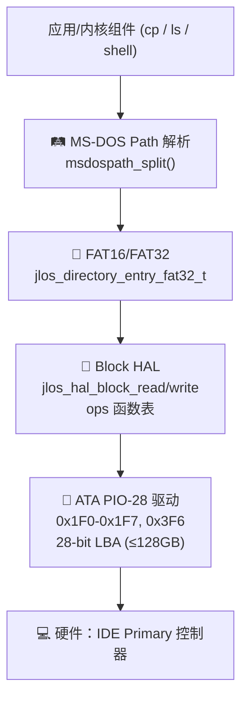

# JLOS 文件系统子系统架构与功能文档

> 文件系统层走「块设备 HAL → FAT16/FAT32 解析 → MS-DOS 路径」三层隔离。上层只走块设备 HAL API，未来替换 AHCI/NVMe 无需改 FS 代码。

---

## 1. 目录与文件

```text
filesystem/
├── msdospath.h / msdospath.c    🛤️  MS-DOS 风格路径解析（a/b/c.txt, 8.3, 支持 / 和 \）
└── fat.h / fat.c                📀  FAT16/FAT32 文件系统：BPB 读取 + 目录项 + 簇链
hal/
└── block.h / block.c            💾 块设备 HAL（后端 ops 表：ATA PIO-28 → AHCI/NVMe 预留）
drivers/
└── ata.h / ata.c                🚗 ATA PIO-28 驱动（IDE 0x1F0 Command Block 寄存器）
```

---

## 2. 三层架构图（ASCII 从上到下调用链 · GitLab 清晰）

```text
┌────────────────────────────────────────────────────────────────────┐
│  👤 应用 / 内核组件  (cp 拷贝 / ls 列目录 / shell 命令)              │
└────────────────────────────────────┬───────────────────────────────┘
                                     ▼  open/read/write/ls
┌────────────────────────────────────────────────────────────────────┐
│  🛤️  MS-DOS 路径解析层  (filesystem/msdospath.c)                    │
│     · split() 拆分 "/a/b/c.txt" → components[3] = {a,b,c.txt}      │
│     · normalize() 去除 "." / ".." 段                               │
│     · 兼容 "/" (Unix) 和 "\" (DOS) 分隔符                           │
└────────────────────────────────────┬───────────────────────────────┘
                                     ▼  目录项 / 簇号
┌────────────────────────────────────────────────────────────────────┐
│  📀  FAT16/FAT32 文件系统层  (filesystem/fat.c)                     │
│     · BPB 读: 从分区 LBA0 读 jlos_bios_parameter_block32_t          │
│     · 目录: 8.3 短文件名 jlos_directory_entry_fat32_t               │
│     · 簇链: FAT[簇号] = 下一簇 / 0x0FFF = EOF                       │
│     · cluster_lba(cl) = data_area_lba + (cl-2) × sec_per_clu       │
└────────────────────────────────────┬───────────────────────────────┘
                                     ▼  LBA 扇区号 + 扇区数
┌────────────────────────────────────────────────────────────────────┐
│  💾  块设备 HAL 抽象层  (hal/block.c)                               │
│     · jlos_hal_block_read(dev, lba, buf, count)                    │
│     · jlos_hal_block_write(dev, lba, buf, count)                   │
│     · ops 函数表: 当前 = ATA PIO-28；未来换 AHCI/NVMe 只改后端     │
└────────────────────────────────────┬───────────────────────────────┘
                                     ▼  0x1F0 寄存器 R/W
┌────────────────────────────────────────────────────────────────────┐
│  🚗  ATA PIO-28 驱动层  (drivers/ata.c)                             │
│     · 0x1F0-0x1F7 Command Block + 0x3F6 Alt Status                 │
│     · 28-bit LBA 最大 128 GiB；HAL 层校验范围，超限返回 -2         │
│     · insw/outsw 512B/sector 16-bit 数据传送                       │
└────────────────────────────────────┬───────────────────────────────┘
                                     ▼  IDE 硬件信号
┌────────────────────────────────────────────────────────────────────┐
│  💻  硬件层：IDE Primary 控制器 + 硬盘                               │
└────────────────────────────────────────────────────────────────────┘
```

<details><summary>📐 查看原始 Mermaid 源码（装 mmdc 可导出大图 SVG）</summary>



</details>

---

## 3. 块设备 HAL（硬件隔离层）

### 3.1 统一结构（设备无关）

```c
/* hal/block.h — 后端 ops 表，VFS/FS 只调这些 API */
typedef struct jlos_hal_block_dev {
    jlos_hal_block_dev_type_t dev_type;      /* ATA_PIO28 / ATA_DMA / AHCI / NVMe */
    uint32_t bytes_per_sector;                /* 通常 512 */
    uint64_t total_sectors;                   /* 0 = 未 identify */
    const jlos_hal_block_ops_t *ops;          /* 具体后端函数表 */
    union { jlos_ata_t ata; } dev_priv;       /* 后端私有数据（ATA 对象）*/
    uint8_t inited;
} jlos_hal_block_dev_t;
```

### 3.2 API（上层只调这些）

| API | 行为 |
| --- | --- |
| `jlos_hal_block_ata_pio28_create(dev, port_base, master)` | 绑定 ATA PIO-28 后端 |
| `jlos_hal_block_init/destroy/identify/flush(dev)` | 生命周期 |
| `jlos_hal_block_read(dev, lba, buf, count)` | 连续读 count 扇区 → 内部扇区循环 + LBA 校验 |
| `jlos_hal_block_write(dev, lba, buf, count)` | 连续写（PIO 单扇区写保证正确）|

### 3.3 后端 ops → ATA PIO-28 映射
- `init` → `jlos_ata_init(port, master)` 设置 Command Block 寄存器
- `read_sectors` → `jlos_ata_read28(lba, buf, 512)`（每扇区调一次，支持多扇区循环）
- `write_sectors` → `jlos_ata_write28(lba, buf, 512)`
- `identify` → `jlos_ata_identify()` 读扇区数、型号

**LBA 限制**：PIO-28 最大 0x0FFFFFFF 扇区 ≈ 128 GiB，HAL 层校验超范围直接返回 `-2`，不会硬写入错地址。

---

## 4. FAT16 / FAT32 文件系统

### 4.1 BIOS Parameter Block（BPB）— 统一 FAT16/FAT32 头

```c
/* filesystem/fat.h — 从分区 LBA 0 读取，packed 对齐磁盘 */
typedef struct {
    /* FAT12/16/32 通用开头 */
    uint8_t  jump[3];                         /* EB xx 90 跳转 */
    uint8_t  soft_name[8];                    /* "MSWIN4.1" 等 */
    uint16_t m_bytes_per_sector;              /* 通常 512，与 HAL 扇区大小交叉校验 */
    uint8_t  m_sectors_per_cluster;
    uint16_t m_reserved_sectors;              /* FAT32 通常 32 */
    uint8_t  m_fat_copies;                    /* 通常 2，FAT1 = 主 FAT2 = 备份 */
    uint16_t m_root_dir_entries;              /* FAT16 有，FAT32 = 0 */
    uint16_t m_total_sectors;                 /* FAT16 总数；FAT32 = 0 */
    uint16_t m_fat_sector_count;              /* FAT16 每 FAT 扇区数；FAT32 = 0 */
    /* FAT32 扩展字段 */
    uint32_t m_total_sector_count;            /* FAT32 总扇区数 */
    uint32_t m_table_size;                    /* FAT32 每 FAT 扇区数 */
    uint32_t m_root_cluster;                  /* FAT32 根目录起始簇号（通常 2）*/
    /* …… FAT 信息扇区号、备份 BPB 扇区、卷标、FAT 类型标签 */
} __attribute__((packed)) jlos_bios_parameter_block32_t;

void jlos_read_bios_block(jlos_ata_t *hd, uint32_t partition_offset_lba);
```

### 4.2 目录项（8.3 短文件名，FAT32 扩展格式）

```c
typedef struct {
    uint8_t  name[8], ext[3];                 /* 8.3 文件名，首字节 0xE5=已删除 */
    uint8_t  m_attributes;                    /* 0x10=目录 0x20=归档 … */
    uint16_t m_first_cluster_hi;              /* FAT32 高 16 位簇号 */
    uint16_t m_w_time, m_w_date;              /* 修改时间/日期（FAT 压缩格式）*/
    uint16_t m_first_cluster_low;             /* 低 16 位簇号 */
    uint32_t m_size;                          /* 文件大小，目录 = 0 */
} __attribute__((packed)) jlos_directory_entry_fat32_t;
```

**cluster → LBA 换算**：
```text
data_area_lba = reserved_sectors + fat_copies × fat_sector_count
                + (root_dir_entries × 32 + bytes_per_sector - 1) / bytes_per_sector
cluster_lba(cl) = data_area_lba + (cl - 2) × sectors_per_cluster
```

---

## 5. MS-DOS 路径解析

```c
/* filesystem/msdospath.h */
typedef struct {
    char drive;                 /* 'C' / 'D'，0 = 当前驱动器 */
    bool absolute;              /* 开头是 / 或 \ */
    char components[16][13];    /* 每段 8.3 → 最多 12 字节（8+'.'+3）*/
    int  components_count;
} jlos_msdospath_t;

int  jlos_msdospath_parse(const char *input, jlos_msdospath_t *out);
void jlos_msdospath_normalize(jlos_msdospath_t *p); /* 去除 "." ".." 段 */
```

**支持输入形式**：
- `C:\DIR1\DIR2\FILE.TXT`（标准 DOS）
- `/home/user/a.c`（Unix 风格，统一转换）
- `../lib/foo.h`（相对路径，normalize 后补全）

---

## 6. VMware ATA 注意事项（硬约束）
- VMware 默认 IDE 控制器在 PIO 复杂模式下会触发 **General Protection Fault (#GP)**
- 解决方案：kernel.c ATA 测试采用简化模式（`ATA test skipped (use simplified mode)`），仅 HAL + FAT 结构层保证正确
- 真实硬件/QEMU 下：开启完整 ATA 测试，走 `identify → read28 → write28` 全流程
