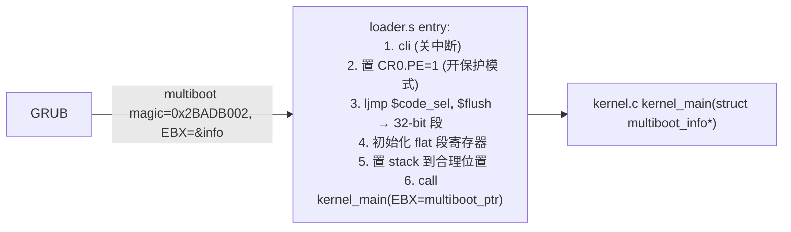
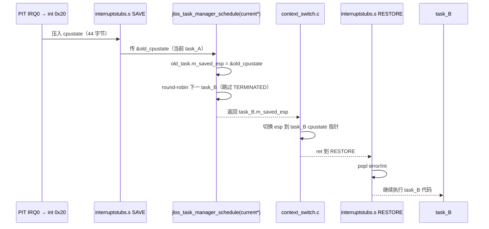

# JLOS GUI + x86 架构子系统架构与功能文档

> x86 平台最底层：GRUB multiboot → 汇编 loader.s → GDT/IDT 初始化 → interrupt stubs（汇编+C）→ 上下文切换；GUI 层基于 composite widget 树模式：Desktop → Window → Widget。

---

## 1. 目录与文件

```
arch/x86/
├── loader.s                 🚀 GRUB multiboot 入口（关中断 → GDT → 32-bit 保护模式 → C kernel_main）
├── gdt.h / gdt.c            📐 GDT(全局描述符表): flat 4GB 代码段/数据段/TSS
├── interrupts.h / .c / .s   ⚡ IDT + 256 中断门
│                            interruptstubs.s: 256 个 asm stub, 4-byte int# push → C handler
├── context_switch.c         🔄 切任务栈 & jlos_cpu_state_t 恢复
├── port.h / port.c          ⚡ I/O port: inb/outb/insw/outsl + slow(jmp $+2) 变体
├── pci.h / pci.c            💻 PCI Mechanism #1: 0xCF8 addr / 0xCFC data
└── syscalls.h / .c          📞 软中断 int 0x80: syscall 表 (预留)
gui/
├── widget.h / widget.c      🧩 控件基类 + 复合控件（composite pattern）
├── window.h / window.c      🪟 Window: 可拖动(composite_widget + dragging)
└── desktop.h / desktop.c    🏠 Desktop: 根 composite, 包含所有 window, 鼠标事件分发
common/
├── types.h                  🧱 全局类型 + JLOS_NET_MAX_SLOTS 等宏
├── multiboot.h              🎓 GRUB multiboot_info 结构定义
└── graphics.h               🎨 颜色/Rect/Point GUI 基本类型
```

---

## 2. x86 平台启动汇编与关键结构

### 2.1 loader.s → kernel_main 时序



### 2.2 GDT（全局描述符表）

```
GDT 布局（flat memory model, 简化无分段）：
0x00 null        (0)
0x08 code seg    base=0 limit=4GB  G=1k DPL=0 P=1 S=1 TYPE=code(XR)
0x10 data seg    base=0 limit=4GB  G=1k DPL=0 P=1 S=1 TYPE=data(RW)
0x18 TSS         TSS 段（预留，用于未来任务切换）
```

### 2.3 IDT（256 门描述符）

```
int 0x00..0x1F  → CPU 异常 (#DE/#DB/NMI/#BP/#OF/#BR/#UD/#NM/#DF/…/#MF/#AC/#MC/#XF)
int 0x20..0x2F  → 双8259A PIC: IRQ0(PIT)=0x20, IRQ1(KBD)=0x21, IRQ11(NIC)=0x2B, IRQ12(Mouse)=0x2C
int 0x80        → syscall 软中断（预留）
```

### 2.4 中断/异常栈压入顺序（⚠️ 100% 匹配 jlos_cpu_state_t 顺序！）

```
interruptstubs.s 汇编 SAVE 宏（按序 push）
  ① pusha（按 PUSHA 顺序: EAX, ECX, EDX, EBX, ESP(old), EBP, ESI, EDI）
    但是！我们自己的 push 顺序严格写成:
       pushl %eax    → [0] m_eax
       pushl %ebx    → [1] m_ebx
       pushl %ecx    → [2] m_ecx
       pushl %edx    → [3] m_edx
       pushl %esi    → [4] m_esi
       pushl %edi    → [5] m_edi
       pushl %ebp    → [6] m_ebp
  ② pushl $error_code_or_0  → [7] m_error（无 error code 的异常手动 push 0）
  ③ pushl $int_number (4-byte!! movl 不能 movb/pushb) → 防止栈错位/EIP=0x00000003
  ↓ 异常/中断硬件自动 push:
  ④ m_eip → m_cs → m_eflags (用户态还会 push ss/esp，当前 ring0 内核态无)
```

**对应 jlos_cpu_state_t（ multitask.h ）**：
```c
typedef struct {
    uint32_t m_eax, m_ebx, m_ecx, m_edx, m_esi, m_edi, m_ebp;
    uint32_t m_error;                  /* 第 8 成员，对应 pushl error code */
    uint32_t m_eip, m_cs, m_eflags;    /* 最后 3，硬件 push */
} __attribute__((packed)) jlos_cpu_state_t;  /* packed = 44 字节正好 */
```

**教训**：顺序错一位 → 调度返回 EIP=0x00000003 → UNHANDLED INT 0x06(无效指令) → 键盘鼠标崩。

### 2.5 上下文切换（任务调度）



**关键规则**（切任务稳定性）：
- task->cpustate 必须 **嵌入 jlos_task_t**，不能放在 task stack 上（否则中断 push 会被下次调度覆盖）
- task_init 时 `m_eflags = 0x002`（IF=0，关中断切完再开）
- task_init 时 `m_esp = stack_top`；m_ss = data selector

---

## 3. GUI 子系统（Composite Widget 模式）

```mermaid
flowchart TB
    subgraph Tree["控件树 (Composite 组合模式)"]
        D["🏠 Desktop（根节点 jlos_composite_widget_t）<br/>所有 windows 父容器 + 鼠标分发"]
        W1["🪟 Window<br/>dragging=true/false"]
        W2["🪟 Window"]
        WB["Widget: Button"]
        WL["Widget: Label"]
        WE["Widget: EditBox"]
        D --> W1 --> WB
        D --> W2 --> WL
        W2 --> WE
    end

    Mouse["PS/2 鼠标 3-byte packet IRQ12"]
    Paint["Paint(rect) 自顶向下递归"]

    Mouse --> D.on_mouse_move/down/up
    D -->|命中测试(hit test)| W1.on_mouse_down(窗口标题栏→dragging=1)
    Paint --> D.paint → W1/W2.paint → Widget.paint
```

### 3.1 控件继承关系

```c
/* widget.h — 基类，所有 widget 首成员同布局 → (jlos_widget_t*) 强制转换安全 */
typedef struct jlos_widget {
    struct jlos_widget *parent;
    int32_t m_x, m_y, m_w, m_h;
    uint8_t m_r, m_g, m_b;
    void (*paint)(struct jlos_widget* self);
    /* 事件虚函数 */
    void (*on_mouse_down)(struct jlos_widget*, int32_t x, int32_t y, uint8_t btn);
    void (*on_mouse_up  )(struct jlos_widget*, int32_t x, int32_t y, uint8_t btn);
    void (*on_mouse_move)(struct jlos_widget*, int32_t ox, int32_t oy, int32_t nx, int32_t ny);
} jlos_widget_t;

/* 复合控件：可以有 children，window / desktop 都是它派生 */
typedef struct {
    jlos_widget_t base_widget;
    jlos_widget_t *children[32];
    int children_count;
} jlos_composite_widget_t;

/* window 派生自 composite_widget：多一个 m_dragging 拖动态 */
typedef struct jlos_window {
    jlos_composite_widget_t base_widget;
    bool m_dragging;
} jlos_window_t;
```

### 3.2 窗口拖动流程
1. 鼠标 down → desktop hit_test → 命中某 window 标题栏
2. window.on_mouse_down → m_dragging = true，记录基准坐标
3. 鼠标 move → 若 m_dragging → window.x += dx, window.y += dy → 局部重绘
4. 鼠标 up → m_dragging = false

### 3.3 渲染
- 所有绘制走 `common/graphics.h`：`draw_pixel` / `draw_hline` / `fill_rect` / `draw_text`
- 双缓冲：先画到内存 buffer 再 blit 到 VGA framebuffer（防止撕裂，预留）

---

## 4. 系统调用（预留）

- **门**：`int 0x80` → 中断门注册 `jlos_syscall_handler`
- **调用约定**：EAX = syscall_no, EBX/ECX/EDX = arg1/2/3
- **HAL 统一包装**：hal/syscall.c `jlos_syscall_handler_init()` → 显式设置 handle_interrupt callback（工程约束：必须在 irq_manager_init 之后设）
- 当前用途：预留，用户态多任务切换时返回 ring3 会用到
