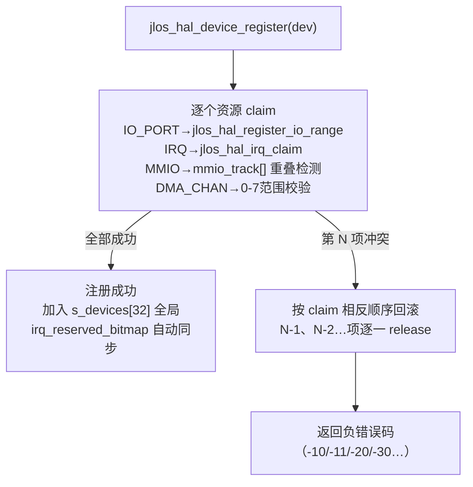

# JLOS HAL 子系统架构与功能文档

> HAL = Hardware Abstraction Layer，所有硬件操作的必经路径。从纯宏映射 → 真隔离 HAL，按 [HAL_DESIGN.md](../../HAL_DESIGN.md) 的 6 级优先级全部完成。

---

## 1. 目录与文件

```
hal/
├── hal.h / hal.c              🧱 核心：IO ops 多态表 + jlos_hal_info_t(硬件探测只读) + IO/IRQ 资源 claim
├── io.h  / io.c               ⚡ IO 抽象：jlos_io8/16/32[_slow]，宏→inline→ops运行时调度
├── irq.h / irq.c              🚩 IRQ 抽象：handler 注册 + claim/release + 动态 PIC mask
├── mmu.h / mmu.c              🧠 MMU 抽象：页目录/页表操作 + 地址空间切换
├── syscall.h / syscall.c      📞 系统调用：int 0x80 门 + 注册回调
├── context.h                  🔄 上下文切换：jlos_cpu_state_t 嵌入 task（禁止放栈）
├── barrier.h                  🧱 内存屏障：x86 mfence/lfence/sfence + ARM dmb + RISC-V fence
├── spinlock.h / spinlock.c    🔒 自旋锁（可重入+irqsave：acquire/release 双屏障）
├── timer.h  / timer.c         ⏰ PIT 8253：start_periodic(freq) + ticks 计数（HPET 预留）
├── pci.h    / pci.c           💻 PCI：Mechanism#1 配置空间 R/W 8/16/32 + 枚举绑定驱动
├── serial.h / serial.c        💬 16550 UART：COM1 默认 init + putc/puts（printf→HAL串口）
├── block.h  / block.c         💾 块设备：ATA PIO-28 后端 + ops 表（AHCI 预留）
├── dma.h    / dma.c           🔀 8237 DMA：channel 0-7 prepare/start/stop（24位地址限制）
├── device.h / device.c        🔌 统一设备模型：jlos_device_t + 资源冲突检测 + 回滚
└── diag.h   / diag.c          🔎 诊断 trace：环形 512 条 I/O 记录 + dump(N)（0 开销开关）
```

---

## 2. HAL 6 级升级架构图（ASCII 箭头链 · GitLab 清晰）

```
  🏆 Level 1          🏆 Level 2          🏆 Level 3          🏆 Level 4
┌─────────────┐    ┌─────────────┐    ┌─────────────┐    ┌─────────────┐
│ 宏→inline函数 │───▶│ 硬件子系统包装 │───▶│ 只读信息聚合  │───▶│ 同步原语 HAL  │
│ + IO ops 多态 │    │ PIT/PCI/Ser │    │ jlos_hal_info│    │ spinlock+bar │
│ (解决类型安全)│    │ ATA/Block/DM│    │ (探测结果集中)│    │ (可重入irqsv)│
└─────────────┘    └─────────────┘    └─────────────┘    └──────┬──────┘
                                                                │
                                                                ▼
  🏆 Level 6                        🏆 Level 5
┌─────────────────────┐          ┌──────────────────┐
│ Test Harness + 诊断 │◀─────────│  统一设备模型     │
│ 环形 512 条 I/O Trace│          │ jlos_device_t    │
│ 0 开销开关 + dump()  │          │ 资源冲突检测+回滚  │
└─────────────────────┘          └──────────────────┘
```

<details><summary>📐 查看原始 Mermaid 源码（装 mmdc 可导出大图 SVG）</summary>


</details>

---

## 3. 核心机制详解

### 3.1 IO ops 运行时多态（Level 1）

```c
/* hal.h — 函数表（1 张 struct，替换宏 if/else 地狱）*/
typedef struct {
    void (*init_io8)(jlos_io8_t*, uint16_t port);
    void (*write_io8)(jlos_io8_t*, uint8_t val);
    uint8_t (*read_io8)(jlos_io8_t*);
    /* io8_slow / io16 / io32 等同理，共 16 个函数指针 */
} jlos_hal_io_ops_t;

extern const jlos_hal_io_ops_t *jlos_hal_io_ops;
extern const jlos_hal_io_ops_t  jlos_hal_x86_fast_io_ops;   /* 直接 in/out，现代 CPU */
extern const jlos_hal_io_ops_t  jlos_hal_x86_slow_io_ops;   /* jmp $+2 延迟（Cyrix/486）*/
```

- **启动时选择**：`jlos_hal_arch_init()` 根据 CPUID 结果（未来加）设置 `jlos_hal_io_ops`
- **所有上层（驱动/核/网络）只调 jlos_io8_write() → ops 表**，不需知道 slow/fast 区别
- **Sanity check**：hal_io.c 每次读写前检查 port 范围 + 是否与保留段重叠（PCI 0xCF8-0xCFF 独占）

### 3.2 硬件只读信息 jlos_hal_info_t（Level 3）

```c
/* hal.h — 所有硬件假设集中到这里，上层只读 */
typedef struct {
    /* CPU：未来 CPUID 探测后填 */
    uint32_t cpu_model;  bool cpu_has_cpuid;  bool cpu_has_apic;
    /* IRQ */
    jlos_hal_irq_mode_t irq_mode;             /* PIC_8259 / APIC */
    uint16_t            irq_base_vector;      /* 0x20 (IRQ0→int32) */
    uint32_t            irq_reserved_bitmap_31_0;  /* claim 自动同步 */
    /* Timer */
    jlos_hal_timer_mode_t timer_mode;         /* PIT_8253 / HPET */
    uint64_t              timer_input_clock_hz;   /* 1193180 Hz */
    /* PCI */
    uint32_t pci_mmconfig_base;  bool pci_ecam_available;
    /* MMIO 预留 */
    uint32_t mmio_reserved_start;  /* 0x000A0000 (VGA shadow) */
    uint32_t mmio_reserved_end;    /* 0xFFFFFFFF (LAPIC/HPET) */
} jlos_hal_info_t;
const jlos_hal_info_t *jlos_hal_get_info(void);   /* 只读指针，禁止修改 */
```

### 3.3 同步原语（Level 4）

#### 内存屏障（[hal/barrier.h](../../hal/barrier.h)）

| 宏 | x86 | ARM | RISC-V | 说明 |
|---|---|---|---|---|
| `jlos_barrier()` | 编译器屏障 `""::: "memory"` | 同左 | 同左 | 防 GCC 重排 |
| `jlos_mb()`   | `mfence`（全） | `dmb ish`（内共享域） | `fence rw, rw` | Load+Store 全部序化 |
| `jlos_rmb()`  | `lfence`（Load） | `dmb ishld` | `fence r, r` | WC/UC 内存读序化 |
| `jlos_wmb()`  | `sfence`（Store） | `dmb ishst` | `fence w, w` | NT/Write-Combine 写序化 |

#### 自旋锁（[hal/spinlock.h](../../hal/spinlock.h)）

```c
typedef struct {
    volatile uint32_t lock;
    uint32_t irq_state;
    int recursion_depth;
} jlos_spinlock_t;

/* 拿锁：关中断 → xchg 原子拿 → acquire mb → depth++
   放锁：release mb → xchg 放 → 恢复 EFLAGS → depth--
   深度>0：重入只 inc/dec，不重复 xchg，不重复关中断 */
uint32_t jlos_spin_lock_irqsave(jlos_spinlock_t *lock);
void     jlos_spin_unlock_irqrestore(jlos_spinlock_t *lock, uint32_t flags);
```

### 3.4 统一设备模型 + 资源冲突检测（Level 5 · ASCII 流程图）

```
┌──────────────────────────────────────────────────────────────┐
│          jlos_hal_device_register(dev)  入口                 │
└──────────────────────────────┬───────────────────────────────┘
                               ▼
┌──────────────────────────────────────────────────────────────┐
│  逐个资源 claim（按 resources[] 顺序）                         │
│    IO_PORT  → jlos_hal_register_io_range  重叠检测            │
│    IRQ      → jlos_hal_irq_claim  bitmap 同步                │
│    MMIO     → mmio_track[]  地址区间重叠检测                  │
│    DMA_CHAN → 0-7 范围校验 + channel 独占检测                 │
└──────────────┬───────────────────────────────┬───────────────┘
               │ 全部 N 项成功                  │ 第 N 项冲突
               ▼                                ▼
┌──────────────────────────┐     ┌──────────────────────────────────┐
│  ✅ 注册成功              │     │  ⏪ 按相反顺序回滚                │
│  · 加入 s_devices[32]    │     │     N-1 → N-2 → … → 1            │
│  · irq_reserved_bitmap   │     │     逐一 release 资源             │
│    自动同步              │     └──────────────┬───────────────────┘
└──────────────────────────┘                    ▼
                                   ┌──────────────────────────┐
                                   │  ❌ 返回负错误码          │
                                   │  -10/-11/-20/-30 …       │
                                   └──────────────────────────┘
```

<details><summary>📐 查看原始 Mermaid 源码（装 mmdc 可导出大图 SVG）</summary>



</details>

```c
/* hal/device.h — 每种总线一个 union 字段，驱动/上层无需关心差异 */
typedef enum { JLOS_RES_IO_PORT, JLOS_RES_MMIO, JLOS_RES_IRQ, JLOS_RES_DMA_CHAN } jlos_resource_type_t;
typedef struct { jlos_resource_type_t type; uint32_t start,end,flags; } jlos_resource_t;

typedef struct jlos_device {
    const char        *name;          /* "8253 PIT Timer" */
    jlos_dev_bus_t    bus_type;       /* PCI / PLATFORM / AMBA */
    bool              registered;
    union {
        struct { uint8_t bus,dev,func; uint32_t bar[6]; } pci;
        struct { uint32_t mmio_base, mmio_size; uint8_t irq; } platform;
    } businfo;
    jlos_resource_t resources[JLOS_HAL_MAX_RESOURCES];   /* 8 项够所有设备 */
    jlos_driver_t  *drv;
} jlos_device_t;
```

**系统已注册平台设备（hal_arch_init 内）**：
- 8259 PIC Master：IO 0x20-0x21
- 8259 PIC Slave：IO 0xA0-0xA1 + IRQ 2（级联）
- 8253 PIT Timer：IO 0x40-0x43 + IRQ 0
- PCI Config Mechanism #1：IO 0xCF8-0xCFF
- 16550 UART COM1：IO 0x3F8-0x3FF

### 3.5 诊断 Test Harness + I/O Trace（Level 6）

> **`HAL_CONFIG_TRACE_IO` 作用域判定**：仅 HAL 内部（hal/ 子目录）使用，因此放在 [hal.h#L8-L11](../../hal/hal.h#L8-L11)，默认 0（关闭），编译时 `-D` 覆盖，不污染全局 config。

| 宏 | =0（默认） | =1（诊断） |
|---|---|---|
| `HAL_TRACE_IO(op,port,val)` | `do{}while(0)` → 0 字节 | 写环形 512 条缓冲：file+line+op+port+val+tick |
| `HAL_TRACE_MSG(m)` | 空 | 打高层语义（"ATA read sectors"/"DMA start"） |
| `HAL_TRACE_DUMP(64)` | 空 | 打印最近 64 条（basename + 行号） |
| 数据段 diag.c | 全部 `#if` 剪掉，0 字节 | 512×~20B ≈ 10KB 环形缓冲 |

已插 trace 的关键路径（全覆盖）：
- **hal/io.c**：每条 `in/out`（8/16/32 位 + slow）写前 WR / 读后 RD
- **hal/pci.c**：config 读→ WR32 0xCF8 + RD32 0xCFC；config 写→ WR32 0xCF8 + WR32 0xCFC
- **hal/serial.c / block.c / dma.c / timer.c**：高层 init/read/prepare 打 MSG，底层 IO 自动由 io.c 记录

---

## 4. 对外关键 API 速查

| 分类 | API | 功能 |
|---|---|---|
| 初始化 | `jlos_hal_arch_init()` | 启动时一次性：设 ops 表 + 注册 5 个平台设备 + 同步 IRQ bitmap |
| 只读硬件信息 | `jlos_hal_get_info()` | 返回 `const jlos_hal_info_t*`（所有硬件假设集中读这里） |
| 资源 claim | `jlos_hal_register_io_range(s,e,owner)` / `jlos_hal_irq_claim(irq,owner)` | 冲突返回非 0，bitmap 自动同步 |
| 设备模型 | `jlos_hal_device_register(dev)` / `unregister` / `count()` / `get(i)` | 原子批量 claim + 失败自动回滚 |
| Timer | `jlos_hal_timer_start_periodic(freq)` / `get_ticks()` / `on_tick()` | 屏蔽 PIT/HPET 差异 |
| 同步 | `jlos_spin_lock_irqsave(lock)` / `unlock_irqrestore` / `jlos_mb/rmb/wmb()` | 可重入 + acquire/release 双屏障 |
| 诊断 | `HAL_TRACE_IO/MSG` + `jlos_hal_trace_dump(last_n)` | 默认 0 开销，开启即查竞态 |
