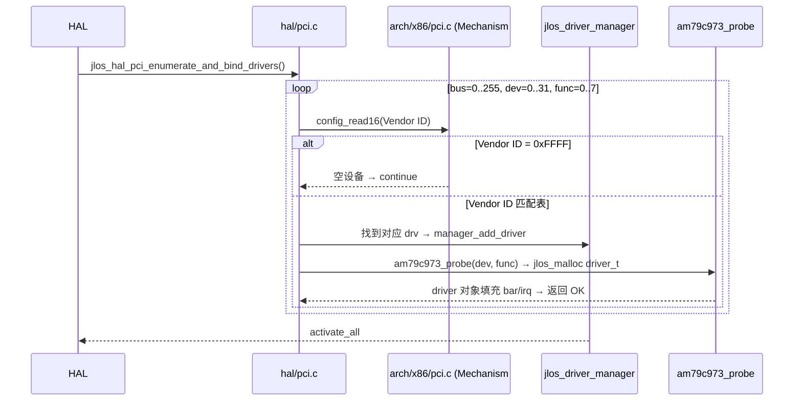

# JLOS 驱动子系统架构与功能文档

> 驱动层走「driver_manager 统一管理 → 各设备 activate/reset/deactivate → HAL 隔离硬件操作」架构。所有驱动对象必须堆上分配（不能栈分配，函数返回时栈销毁会悬挂指针）。

---

## 1. 目录与文件

```text
drivers/
├── driver.h / driver.c          🗂️  驱动基类 + manager（255 个驱动槽）
├── ata.h / ata.c                💽  ATA PIO-28：IDE 命令块读写（0x1F0/0x170）
├── amd_am79c973.h / .c          🖧  AMD PCnet-FAST III：PCI 网卡（IRQ 0x0B），20 RX + 8 TX desc
├── keyboard.h / keyboard.c      ⌨️  PS/2 键盘：IRQ1，扫描码 → ASCII + 事件回调
├── mouse.h / mouse.c            🖱️  PS/2 鼠标：IRQ12，3 字节包 → 坐标/按键事件
└── vga.h / vga.c                🖥️  VGA：字符模式 0xB8000 + 图形模式 buffer
```

---

## 2. 驱动管理层

```c
/* drivers/driver.h — 所有驱动的「基类」C struct，首成员放 activate 指针 */
typedef struct jlos_driver {
    void (*activate)(jlos_driver_t* self);     /* 上电 + 注册中断 handler */
    int  (*reset)(jlos_driver_t* self);         /* 软复位 */
    void (*deactivate)(jlos_driver_t* self);   /* 断电 + 注销中断 */
} jlos_driver_t;

typedef struct jlos_driver_manager {
    int m_num_drivers;
    jlos_driver_t *drivers[255];                /* 255 槽，够用 */
} jlos_driver_manager_t;
```

**生命周期流程（ASCII 箭头链）**：

```text
┌──────────────────────────────────────────┐
│ manager_add_driver(drv*)                 │
│   · 只把指针塞到 drivers[255] 数组        │
│   · 完全不操作硬件，不占 IRQ/IO           │
│   · 驱动对象必须 heap 分配(jlos_malloc)   │
└──────────────────────┬───────────────────┘
                       ▼
┌──────────────────────────────────────────┐
│ manager_activate_all()                    │
│   · 数组顺序 for(i=0..num) drv.activate()│
│   · activate: 上电 init + 注册 IRQ handler│
│   · → HAL 自动 unmask 对应 IRQ           │
└──────────────────────┬───────────────────┘
                       ▼
┌──────────────────────────────────────────┐
│ 运行中：硬件中断 → 驱动 ISR 处理          │
│   · 网卡: RINT=1 → 扫 RX desc 环        │
│   · 键盘: 扫描码 → ASCII → 回调          │
│   · 鼠标: 3字节包 → 坐标/按键事件        │
└──────────────────────┬───────────────────┘
                       ▼  (关机流程预留)
┌──────────────────────────────────────────┐
│ manager 逐个 drv.deactivate()            │
│   · 注销 IRQ handler → PIC re-mask      │
│   · 软复位 / 断电寄存器                  │
└──────────────────────────────────────────┘
```

<details><summary>📐 查看原始 Mermaid 源码（装 mmdc 可导出大图 SVG）</summary>


</details>

---

## 3. 各驱动关键说明

### 3.1 AMD am79c973 PCI 网卡（最复杂驱动）

**硬约束清单**：
1. INIT 块必须 **32 字节对齐**（硬件要求）
2. 初始化序列严格：`STOP(CSR0=0x04) → CSR4 → CSR1/CSR2(INIT block addr) → INIT(0x01) → STRT(0x42=STRT|INEA)`
3. `CSR3/CSR5` **禁止手动写**，硬件从 INIT block 自动读取
4. `CSR0.IENA(0x0400)` 必须为 1 → 允许 IRQ pin 输出
5. RX 描述符推进：用 `last_processed_iter`（迭代次数），**不要**用 `processed_count`（会跳号 → MISS ERROR）
6. VMware 环境：忽略 IRQ13(#0x0D) / 0x2E 伪中断
7. `SWSTYLE=2`（32-bit PCI 共享内存模式）→ **必须用 inl/outl**，不能 inw/outw（16 位读写导致 CSR0=0xFFFF）

**结构图示**：

```text
am79c973 driver 对象 (heap 上分配 jlos_malloc)
├── m_port_base    = 0xC000 (PCI BAR0)
├── m_interrupt    = 0x0B (IRQ 11 → int 0x2B)
├── m_mac[6]       = 00:0C:29:xx:xx:xx
├── INIT block[]   (28 bytes + pad=32B 对齐!)
│   ├── Mode(CSR0 相关)
│   ├── MAC[0-3]/[4-5]
│   ├── RAP → &rx_desc_ring[0]
│   └── SAP → &tx_desc_ring[0]
├── rx_desc_ring[20] = { {OWN=1, buf, ALE+EOF flags} … }
├── tx_desc_ring[8]  = { {OWN=0, buf, ENP+STP flags} … }
└── last_processed_iter (RX desc 推进用)
```

**ISR 流程（IRQ 0x2B）**：
```text
读 CSR0 → 写 W1C 位清中断
  → RINT(0x0020)=1 → 遍历 desc 环直到 OWN=0
       → ALE+EOF=0xC0 → 递交给 etherframe_receive()
       → ABORT+OVF=0x30 → 丢弃，更新 last_processed_iter
  → TINT(0x0200)=1 → 软件释放发送 desc (OWN 置回 0)
```

### 3.2 ATA PIO-28 硬盘驱动

```text
Command Block Registers (port_base = 0x1F0 Primary / 0x170 Secondary)
0x1F0 Data       ← 16-bit in/out 512B/sector
0x1F1 Error
0x1F2 Sector Count   写: 1..255 (0 = 256)
0x1F3 LBAlo          bits 0-7
0x1F4 LBAmid         bits 8-15
0x1F5 LBAhi          bits 16-23
0x1F6 Drive/Head     0xE0 | (master?0:0x10) | (LBA bits 24-27)
0x1F7 Command/Status 读: BSY DRDY DRQ ERR; 写: 0x20=READ, 0x30=WRITE
0x3F6 Alt Status/Control
```

- 读流程：`写 LBA(0x1F3-6) → CMD=0x20 → wait BSY=0 DRQ=1 → insw 256 次`
- 写流程：`写 LBA → CMD=0x30 → wait DRQ → outsw 256 次 → wait BSY=0`

### 3.3 PS/2 键盘 + 鼠标

```text
     Keyboard IRQ1 (int 0x21)                Mouse IRQ12 (int 0x2C)
     port 0x60=data / 0x64=cmd/status         0x64 cmd: 0xD4 下一字节→mouse
           ↓                                           ↓
  扫描码表 → ASCII(可打印) / 0x00 扩展     3-byte packet: Y_ov X_ov btn | X_rel | Y_rel
           ↓                                           ↓
     用户注册的回调 on_key / on_mouse_event
```

- 驱动对象：`jlos_malloc` 分配，**不能**栈分配（否则 activate 后函数返回栈释放 → 悬挂指针 → 按键崩）
- PIC 动态 mask：未注册 handler 前 IRQ1/IRQ12 保持 mask，注册后 HAL 自动 unmask

### 3.4 VGA 驱动
- **禁用 vga_test()**：老硬件/某些 VMware 版本有损坏风险
- 字符模式：0xB8000 = 80×25 text buffer，每单元 = `char | (attr<<8)`（前景/背景色）
- 图形模式：320×200 256 色 = 0xA0000，64KB 线性 buffer

---

## 4. PCI 枚举与驱动绑定流程（kernel.c Stage 1 · ASCII 三层循环）

```text
 HAL 启动入口            hal/pci.c 枚举        arch/x86/pci.c       driver_manager + 驱动probe
       │                      │               Mechanism #1         (注册 + 堆分配)
       │                      │               0xCF8/0xCFC            (AMD 1022:2000)
       ▼                      │                    │                     │
jlos_hal_pci_enumerate_and_bind_drivers()             │                     │
       └─────────────────────▶│                    │                     │
                              ▼                    │                     │
                    ┌── bus = 0..255 ──┐          │                     │
                    │  ┌── dev=0..31 ┐ │          │                     │
                    │  │ ┌─func=0..7┐│ │          │                     │
                    │  │ │          ││ │          │                     │
                    │  │ ▼          ││ │          │                     │
                    │  │ config_read16(Vendor ID) ─│─▶│                   │
                    │  │          ┌───────────────┐   │                   │
                    │  │ Vendor=0xFFFF? 空设备     │   │                   │
                    │  │   Yes → continue 下一个  │   │                   │
                    │  │          └─────────┬─────┘   │                   │
                    │  │                    │ No(匹配)│                   │
                    │  │                    ▼         │                   │
                    │  │         Vendor ID 匹配表查找  │                   │
                    │  │         (e.g. 1022:2000=AMD) │                   │
                    │  │                    └─────────┐│                   │
                    │  │                              ▼▼                   │
                    │  │                 manager_add_driver(drv)            │
                    │  │                              │                    │
                    │  │                              ▼                    │
                    │  │                 am79c973_probe(bus,dev,func)       │
                    │  │                 · jlos_malloc driver_t(低地址堆!)  │
                    │  │                 · 读 PCI BAR0~5 + IRQ line         │
                    │  │                 · INIT 块 32 字节对齐 ⚠️           │
                    │  │                              │                    │
                    │  │                    返回 driver* = OK              │
                    │  └──────────────────────────────┘                    │
                    └─────────────────────────────────────┘                │
                                                                           ▼
                                                manager_activate_all()
                                                  逐个 drv.activate() → 上电+注册IRQ
```

<details><summary>📐 查看原始 Mermaid 源码（装 mmdc 可导出大图 SVG）</summary>



</details>

---

## 5. 驱动调试开关

| 开关 | 位置 | 作用 |
| --- | --- | --- |
| `KERNEL_CONFIG_DEBUG_LOG` | tools/config.h | 通用驱动日志 |
| `KERNEL_CONFIG_DEBUG_NETWORK` | tools/config.h | AMD 网卡每步打印 + 发送内容 hex dump |
| `HAL_CONFIG_TRACE_IO=1` | hal.h (override with -D) | 抓所有驱动 in/out → 查"写 CF8 后网卡中断丢"类竞态 |
