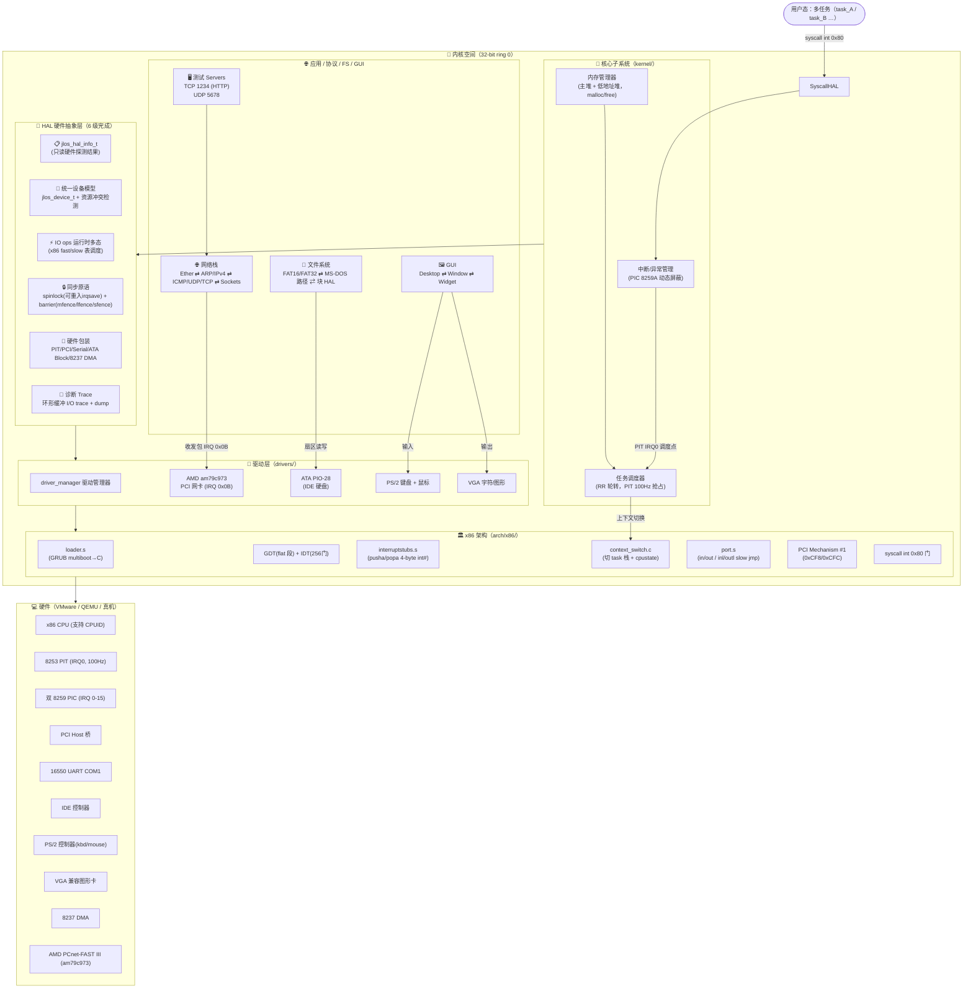
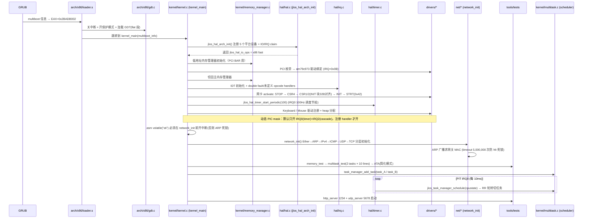

# JLOS (JohnBeauty Operating System) — 内核架构总览

> 一个从 0 写起的 32 位 x86 保护模式单体内核：支持多任务抢占、TCP/IP 协议栈、PCI/ATA/键盘/鼠标/AMD PCnet-FAST III 网卡驱动、FAT16/FAT32 文件系统、GUI 窗口小部件，以及完整的 6 层 HAL 硬件抽象层。

---

## 1. 目录结构

```text
johnbeauty-os/
├── arch/x86/               # x86 平台启动与底层机制（loader、GDT、IDT、中断汇编、任务切换、PCI、port I/O、syscall）
├── hal/                    # 🧩 HAL 硬件抽象层（6 级扩展完成，隔离 arch 与上层）
├── kernel/                 # 🧠 内核核心：启动流程、内存管理、多任务调度
├── drivers/                # 🚗 设备驱动：PCI/ATA/VGA/键盘/鼠标/AMD am79c973 网卡 + driver 管理器
├── net/                    # 🌐 网络协议栈（7 层：Ether → ARP/IPv4 → ICMP/UDP/TCP → socket/servers）
├── filesystem/             # 📁 文件系统（FAT16/32 + MS-DOS 路径 + 块设备 HAL）
├── gui/                    # 🖼️ GUI（desktop 桌面、window 窗口、widget 控件）
├── common/                 # 📚 共用头：types.h、multiboot.h、graphics.h
├── tools/                  # 🔧 配置 + 测试用例（memory/multitask/hard_driver/http/udp）+ debug_console
├── linker.ld               # 链接脚本（ELF i386 布局）
├── Makefile                # 构建入口（gcc -m32 -nostdlib，生成 GRUB multiboot ISO）
└── HAL_DESIGN.md           # HAL 设计蓝图（6 级升级路径）
```

---

## 2. 整体架构图（ASCII 大图 · GitLab 任何缩放都清晰）

> 默认显示纯文本 ASCII 架构图（无依赖、无留白、字大图全）；折叠块保留原始 Mermaid 源码，**未来本地装 mmdc 可一键导出 2560px 大图 SVG**（见 ./images/README.txt）。

```text
╔══════════════════════════════════════════════════════════════════════════════════╗
║                       🧑‍💻  用户态（多任务 + 测试服务）                            ║
╠════════════════════════════╦═══════════════════════╦═════════════════════════════╣
║  task_A · task_B … (RR)    ║  HTTP @ TCP :1234    ║  UDP  echo @ :5678          ║
║  └─→ syscall  int 0x80 ──┐ ║  └─→ socket/listen  ║  └─→ socket()/sendto        ║
╚═══════════════════════════╬╩═══════════════════════╩═════════════════════════════╝
                           ║          ↑ 回调            ↑  on_data()
                           ▼          │                 │
╔══════════════════════════════════════════════════════════════════════════════════╗
║  🌐  应用协议 / 文件系统 / GUI                                                    ║
╠══════════════════════════╦═══════════════════╦═══════════════════╦══════════════╣
║  NET 7 层协议栈          ║  FAT 文件系统     ║  GUI 控件组合树   ║  测试用例    ║
║  Ether→ARP→IPv4→ICMP    ║  BPB→FAT16/32    ║  Desktop→Window  ║  memory/     ║
║  → UDP/TCP→sockets[]    ║  目录项 + 簇链    ║  → Widget        ║  multitask   ║
╚════════════╦═════════════╩══════╦════════════╩═══════╦═══════════╩══════════════╝
             ║  AMD IRQ 0x0B       ║   LBA 扇区 R/W     ║   PS/2 + VGA
             ▼                     ▼                    ▼
╔══════════════════════════════════════════════════════════════════════════════════╗
║  🧠  内核核心子系统（kernel/）  ring 0                                            ║
╠══════════════════════════╦═════════════════════════════╦══════════════════════════╣
║  内存管理器 双堆切换     ║  调度器  RR 时间片         ║  中断异常  PIC 动态屏蔽  ║
║  低地址堆 ↔ 主堆         ║  PIT 100Hz IRQ0 节拍      ║  256 门 + 注册才 unmask ║
║  jlos_malloc / free      ║  TERMINATED 跳过           ║  IRQ13/0x2E 伪中断忽略  ║
╚════════════╦═════════════╩═════════╦═════════════════╩═══════════╦══════════════╝
             ║   HAL API 统一入口     ║   调度点 IRQ0              ║   注册 handler
             ▼                        ▼                            ▼
╔══════════════════════════════════════════════════════════════════════════════════╗
║  🧩  HAL 硬件抽象层（6 级全部完成）  架构隔离核心                                  ║
╠══════╦════════╦═════════╦═══════════════════╦═══════════╦════════════════════════╣
║ IO   ║ 只读   ║ 同步原语║  统一设备模型      ║ 硬件包装  ║ 诊断 I/O Trace          ║
║ ops  ║ jlos_  ║ spinlock║  jlos_device_t    ║ PIT/PCI   ║ 环形 512 条            ║
║ 多态 ║ hal_info║ barrier║  资源冲突回滚     ║ UART/ATA  ║ HAL_CONFIG_TRACE_IO    ║
╚══════╩═════╦══╩═════════╩═══════╦═════════════╩═════╦═════╩═══════════╦══════════╝
             ║   driver activate    ║   claim/release     ║   调 driver impl    ║
             ▼                      ▼                     ▼                    ▼
╔══════════════════════════════════════════════════════════════════════════════════╗
║  🚗  驱动子系统（drivers/）  堆上分配 jlos_malloc                                   ║
╠══════════════╦════════════════╦═══════════════╦═════════════════╦═════════════════╣
║  driver_     ║  AMD am79c973  ║  ATA PIO-28   ║  PS/2 键盘/鼠标  ║  VGA 文本/图形  ║
║  manager 生  ║  20 RX / 8 TX ║  28bit LBA    ║  扫描码→ASCII   ║  0xB8000 text   ║
║  命周期      ║  INIT 32B 对齐 ║  0x1F0~0x1F7  ║  3 字节鼠标包   ║  0xA0000 gfx    ║
╚══════════════╩══════╦═════════╩═══════╦═════════╩═══════╦═════════════╩═══════╦═════╝
                      ║   in/out + IRQ     ║  arch/x86        ║   原始 port I/O    ║
                      ▼                     ▼                  ▼                    ▼
╔══════════════════════════════════════════════════════════════════════════════════╗
║  🏛️  x86 平台层（arch/x86/）  32-bit protected mode                               ║
╠═════════════╦═════════════╦═════════════════╦═════════════════╦═══════════════════╣
║  loader.s   ║  GDT flat   ║  interruptstubs ║  context_switch ║  PCI Mechanism#1  ║
║  GRUB → C   ║  0x08 code  ║  pushl 4字节!!  ║  切 ESP 换栈    ║  0xCF8 / 0xCFC    ║
║  0x2BADB002 ║  0x10 data  ║  error code分支 ║  cpustate 内嵌  ║  syscall int 0x80  ║
╚═════════════╩═════════════╩═════════════════╩═════════════════╩═══════════════════╝
                                          │
                                          ▼
   ┌──────────────────────────────────────────────────────────────────────────────┐
   │  💻  硬件层 VMware / QEMU / 真机                                              │
   │  CPU · 双8259 PIC · 8253 PIT 100Hz · 16550 UART · PCI Host · IDE · PS/2     │
   │  VGA 兼容卡 · 8237 DMA · AMD PCnet-FAST III (am79c973) 网卡                   │
   └──────────────────────────────────────────────────────────────────────────────┘
```

<details><summary>📐 查看原始 Mermaid 源码（装 mmdc 后可导出 2560px SVG 大图）</summary>



</details>

---

## 3. 启动流程（GRUB → 多任务 · ASCII 纵向时间轴）

> 时间从上往下推进，每个节点写清动作 + 关键硬约束（踩过的坑直接标 ⚠️）。

```text
  ═══════════════════════════════════════════════════════════════════════
  T0   GRUB 装载 kernel.bin 到内存
       │
       ▼  EAX = 0x2BADB002  EBX = multiboot_info*
  ┌─────────────────────────────────────────────────────────────────────┐
  │  T1  arch/x86/loader.s  →  GDT → C 入口                             │
  │     cli → mov CR0.PE=1 → ljmp 0x08 切 32-bit 段                     │
  │     DS/ES/FS/GS/SS = 0x10 → 置栈 → call kernel_main(EBX)            │
  └─────────────────────────┬───────────────────────────────────────────┘
                            ▼
  ┌─────────────────────────────────────────────────────────────────────┐
  │  T2  initializing hardware, stage 1                                  │
  │   2a jlos_hal_arch_init()                                            │
  │        · 注册 5 个平台设备 + IO/IRQ claim + 保留位图同步             │
  │        · 返回 jlos_hal_io_ops = x86_fast_ops                        │
  │   2b 内存管理器：低地址堆初始化（PCI BAR 地址 <4MB 要求）             │
  │   2c PCI 枚举 (bus/dev/func) → AMD 1022:2000 match → am79c973_probe │
  │        · driver 对象 jlos_malloc 在 0x00050010（低地址堆！）         │
  │        · INIT 块 32 字节对齐 ⚠️                                      │
  └─────────────────────────┬───────────────────────────────────────────┘
                            ▼  PCI 驱动绑定完成 → 切高地址主堆
  ┌─────────────────────────────────────────────────────────────────────┐
  │  T3  initializing hardware, stage 2                                  │
  │   3a 内存管理器：切回主堆  0x0EDCF000 ~ 0x0EDEFFFF                   │
  │   3b IDT 256 门 + 双 8259 PIC 初始化 + #DF/#UD handler              │
  │        · PIC mask = 0xFA ⚠️ 仅 IRQ0(timer) + IRQ2(cascade) 开       │
  │        · 驱动注册 handler 时 HAL 自动 unmask 对应 IRQ               │
  │   3c 网卡 activate 严格序列（顺序错 = CSR0=0xFFFF 死锁）             │
  │        STOP → CSR4 → CSR1/2(INIT addr) → INIT → STRT(0x42)          │
  │        ⚠️ CSR3/CSR5 禁止手动写，硬件从 INIT 读                       │
  └─────────────────────────┬───────────────────────────────────────────┘
                            ▼
  ┌─────────────────────────────────────────────────────────────────────┐
  │  T4  initializing hardware, stage 3                                  │
  │   4a jlos_hal_timer_start_periodic(100)                              │
  │        分频 1193182/100=11932  → 每 10ms 一次 IRQ0                 │
  │   4b 键盘/鼠标：jlos_malloc 驱动对象（绝对不能栈分配！）             │
  │        → set_handler(IRQ1/IRQ12) → PIC unmask                       │
  │   4c asm volatile("sti")  ⚠️ 必须在 network_init 之前！              │
  │        ARP resolve 发完广播必须能收中断 = 否则死锁                   │
  │   4d network_init() 分层 6 步                                        │
  │        Ether→ARP→IPv4→ICMP→UDP→TCP                                  │
  │        · ARP 广播求网关 MAC → timeout 5,000,000 次 ⚠️ 防 hlt         │
  └─────────────────────────┬───────────────────────────────────────────┘
                            ▼  启动完成 → 跑测试 + 起服务
  ┌─────────────────────────────────────────────────────────────────────┐
  │  T5  running tests… + servers                                        │
  │   5a memory_test：multiboot 地址 / heap_start / malloc 验证          │
  │   5b multitask_test → add_task(task_A/task_B) → 各打 10 行退出       │
  │      └─ 每 10ms PIT IRQ0 → RR schedule → 切 ESP → iret 轮转         │
  │   5c ATA test：VMware 简化模式跳过（防 #GP）                         │
  │   5d 🟢 Starting HTTP server on port 1234...                         │
  │      🟢 UDP server listening on port 5678                            │
  └─────────────────────────────────────────────────────────────────────┘
```

<details><summary>📐 查看原始 Mermaid sequenceDiagram 源码（装 mmdc 可导大图）</summary>



</details>

**关键启动规则（硬约束，见 project_memory.md）**：
1. `am79c973 INIT 块` 必须 **32 字节对齐**
2. 初始化序列：`STOP → CSR4 → CSR1/CSR2 → INIT → STRT(0x42=STRT|INEA)`
3. `CSR3/CSR5` **禁止手动写**，硬件从 INIT 块自动读
4. `sti` 必须在 `network_init()` **之前**（ARP 解析需要收中断包）
5. 中断 stub 用 **4 字节 int#**（movl/pushl），不能用 1 字节 movb/pushb
6. `jlos_cpu_state_t` 严格按 pusha 顺序：eax→ebx→ecx→edx→esi→edi→ebp→error→eip→cs→eflags

---

## 4. 子系统索引文档

| 文档（相对路径） | 子系统 | 内容 |
| --- | --- | --- |
| [hal/jlos_hal_subsystem_readme.md](./hal/jlos_hal_subsystem_readme.md) | HAL 硬件抽象层 | 6 级设计总览 + ops 多态 + 设备模型 + 同步 + trace 图 |
| [kernel/jlos_kernel_subsystem_readme.md](./kernel/jlos_kernel_subsystem_readme.md) | kernel/ 核心 | 内存管理器 + 多任务调度 + 中断/异常 + 三阶段硬件 init |
| [net/jlos_net_subsystem_readme.md](./net/jlos_net_subsystem_readme.md) | net/ 网络协议栈 | 7 层协议栈分层图 + AMD 网卡 RX/TX 描述符环 + ARP/TCP/UDP Socket |
| [filesystem/jlos_filesystem_subsystem_readme.md](./filesystem/jlos_filesystem_subsystem_readme.md) | filesystem/ | FAT16/FAT32 + MS-DOS 路径 + 块设备 HAL 映射 |
| [hdc/jlos_drivers_subsystem_readme.md](./hdc/jlos_drivers_subsystem_readme.md) | drivers/ 驱动 | driver_manager + am79c973 环 + ATA + PS/2 输入 + VGA |
| [gui_arch/jlos_gui_arch_subsystem_readme.md](./gui_arch/jlos_gui_arch_subsystem_readme.md) | GUI + arch/x86 | Desktop/Window/Widget + GDT/IDT/interrupt stubs/ctx switch |

---

## 5. 编译与运行

### 环境要求
- GCC（支持 `-m32`）、GNU Binutils（`--32` as / `melf_i386` ld）
- `grub-mkrescue` + `xorriso`（生成可引导 ISO）
- 运行：VMware / QEMU（`qemu-system-i386 -cdrom johnkernel.iso`）

### 构建命令
```bash
cd /home/veyne/johnbeauty-os
make          # 生成 johnkernel.iso（multiboot + GRUB2）
make clean    # 清理 obj/johnkernel.bin/johnkernel.iso
```

开启 HAL I/O trace（诊断"某PCI驱动写CF8后网卡中断丢失"）：
```bash
CFLAGS_EXTRA="-DHAL_CONFIG_TRACE_IO=1" make clean all
# 运行到断点处：调用 jlos_hal_trace_dump(128) 打印最近 128 条 I/O
```

### 启动日志关键字段（成功标志）
```text
princess yihan is safe and happy!   // kernel_main 第一行
initializing hardware, stage 1..3 start
switched to low memory manager for PCI driver allocation
AMD am79c973 PCI command: 0x00000007   IRQ=0B  interrupt=2B
POST-START CSR0=0x01F3  STRT=01 INEA=01 INTR=01 RXON=01 TXON=01
.interrupts activated
.NET: [ OK ] EtherFrame → ARP → IPv4(gw 192.168.159.1/24) → ICMP → UDP → TCP
Starting HTTP server on port 1234...
UDP server listening on port 5678
task: A  task: B  ...(×10 轮)   // 多任务抢占调度正常
```

---

## 6. 设计哲学

- **隔离优先**：所有硬件操作走 HAL，驱动/Kernel 不直接写 arch/x86 API（便于以后换 ARM/RISC-V）
- **安全优先**：IRQ 动态 mask + 资源冲突检测（IO/IRQ/MMIO 重复 claim 立即报错）
- **0 开销抽象**：`HAL_CONFIG_TRACE_IO=0` / `diag` 关 → 整段 `#if` 包掉，编译后 0 字节
- **可调试优先**：自旋锁 irqsave 可重入 + 环形 I/O trace，能诊断竞态与跨设备冲突
