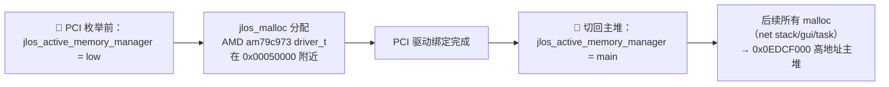
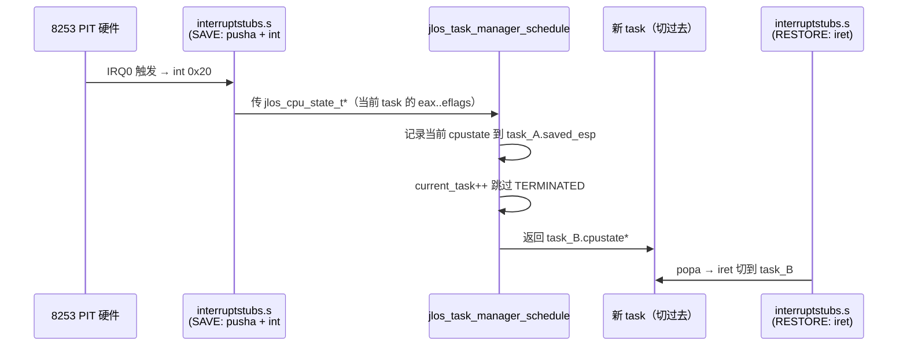

# JLOS Kernel 核心子系统架构与功能文档

> 内核核心三大部分：**内存管理器（双堆切换）**、**任务调度器（PIT 100Hz RR 抢占）**、**中断/异常与硬件三阶段初始化**。所有硬件细节通过 HAL 隔离。

---

## 1. 目录与文件

```text
kernel/
├── kernel.c                 🚀 启动入口 kernel_main + printf(线程安全) + 三阶段硬件初始化
├── memory_manager.h/.c      🧠 内存管理器：页分配 + 堆 malloc/free + 双堆(主/低地址)切换
└── multitask.h/.c           🔄 多任务：jlos_task_t + RR 调度器 + task_entry/exit_stub
```

---

## 2. kernel_main 三阶段启动架构（ASCII 四阶段流水线）

```text
╔═══════════════════════════════════════════════════════════════════╗
║  Stage 1:  initializing hardware, stage 1                         ║
╠═══════════════════════════════════════════════════════════════════╣
║ ① jlos_hal_arch_init()                                            ║
║    → 注册 5 个平台设备 + IO/IRQ claim + 保留位图同步              ║
║ ② 内存管理器：切低地址堆（PCI BAR 必须 <4MB）                     ║
║ ③ PCI 枚举(bus/dev/func) → 匹配 AMD 1022:2000                    ║
║    → am79c973_probe() → 驱动在 0x00050010 + INIT 32B 对齐 ⚠️     ║
╚═══════════════════════════════╤═══════════════════════════════════╝
                                ▼  PCI 驱动绑定完成 → 切主堆
╔═══════════════════════════════════════════════════════════════════╗
║  Stage 2:  initializing hardware, stage 2                         ║
╠═══════════════════════════════════════════════════════════════════╣
║ ① 内存管理器：切回主堆  0x0EDCF000 ~ 0x0EDEFFFF                   ║
║ ② IDT 256 门 + 双 8259PIC 初始化                                  ║
║    → PIC mask = 0xFA ⚠️ 仅开 IRQ0(timer) + IRQ2(cascade)         ║
║ ③ 网卡 activate 严格序列（顺序错 = 0xFFFF CSR0 死锁）              ║
║    STOP(0x04) → CSR4 → CSR1/2(INIT addr) → INIT → STRT(0x42)     ║
║    ⚠️ CSR3/CSR5 禁止手动写，硬件从 INIT 读                        ║
╚═══════════════════════════════╤═══════════════════════════════════╝
                                ▼
╔═══════════════════════════════════════════════════════════════════╗
║  Stage 3:  initializing hardware, stage 3                         ║
╠═══════════════════════════════════════════════════════════════════╣
║ ① jlos_hal_timer_start_periodic(100) → 10ms 一次 IRQ0            ║
║ ② 键盘/鼠标：jlos_malloc 堆分配（绝对不能栈分配！）               ║
║    → set_handler(IRQ1/IRQ12) → PIC 自动 unmask                   ║
║ ③ asm volatile("sti")   ⚠️  必须在 network_init 之前！            ║
║ ④ network_init() 分层 6 步                                        ║
║    Ether → ARP → IPv4 → ICMP → UDP → TCP                         ║
║    ↳ ARP 广播求网关 MAC → timeout 5,000,000 次 ⚠️ 防 hlt         ║
╚═══════════════════════════════╤═══════════════════════════════════╝
                                ▼  启动完成
╔═══════════════════════════════════════════════════════════════════╗
║  running tests…  +  servers                                        ║
╠═══════════════════════════════════════════════════════════════════╣
║ ① MEMORY test：multiboot / heap start / malloc 验证               ║
║ ② multitask_test：task_A + task_B 各打 10 行 = 正常 RR 轮转        ║
║ ③ ATA test：VMware 简化模式跳过（防 #GP）                         ║
║ ④ 🟢 Starting HTTP server on port 1234...                         ║
║    🟢 UDP server listening on port 5678                           ║
╚═══════════════════════════════════════════════════════════════════╝
```

<details><summary>📐 查看原始 Mermaid 源码（装 mmdc 可导出大图 SVG）</summary>

```mermaid
flowchart TB
    subgraph Stage1["initializing hardware, stage 1"]
        HAL1["jlos_hal_arch_init()<br/>5 个平台设备 + 资源注册"]
        LowHeap["内存管理器：切低地址堆<br/>(PCI BAR 需 0x000x xxxx)"]
        PCIEnum["PCI 枚举 → am79c973<br/>驱动绑定(IRQ 0x0B, 32B INIT块对齐)"]
    end
    subgraph Stage2["initializing hardware, stage 2"]
        MainHeap["内存管理器：切回主堆<br/>(0x0EDCF000 ~ 0x0EDEFFFF, 64KB+)"]
        IDTInit["IDT + 双 8259PIC 初始化<br/>mask=0xFA（仅 IRQ0/2 开）"]
        NICActivate["网卡 activate：STOP → CSR4 →<br/>CSR1/CSR2(INIT块) → INIT → STRT(0x42)"]
    end
    subgraph Stage3["initializing hardware, stage 3"]
        PITStart["jlos_hal_timer_start_periodic(100)<br/>IRQ0 产生调度节拍"]
        InputInit["键盘/鼠标：堆上分配<br/>注册 IRQ1/IRQ12 handler → PIC unmask"]
        EnableIntr["asm volatile(\"sti\")<br/>⚠️ 必须在 network_init 前<br/>(ARP resolve 需收包)"]
        NetInit["network_init()<br/>Ether→ARP→IPv4→ICMP→UDP→TCP"]
    end
    subgraph Tests["running tests…"]
        MemTest["MEMORY test start"]
        MultiTest["multitask_test<br/>task_A + task_B 各 10 行退出"]
        ATATest["ATA test skipped(simplified)"]
        Servers["Starting HTTP server on port 1234...<br/>UDP server listening on port 5678"]
    end

    Stage1 --> Stage2 --> Stage3 --> Tests
```

</details>

---

## 3. 内存管理器（双堆架构）

### 3.1 为什么双堆？
PCI 驱动的 BAR 分配要求物理地址低于 4MB（实模式兼容区），如果只有主堆（高地址 0x0EDCF000），分配的驱动对象会被 PCI 控制器拒接。因此启动阶段切换双堆：

```text
┌────────────────────────────────────────────────────────────────────┐
│  🔌  PCI 枚举前：低地址堆启动                                        │
│     jlos_active_memory_manager = &s_low_memory_manager             │
└────────────────────────────────────┬───────────────────────────────┘
                                     ▼
┌────────────────────────────────────────────────────────────────────┐
│  jlos_malloc 分配 AMD am79c973 driver_t                             │
│     → 地址在 0x00050010 附近（<4MB，PCI BAR 要求！）                 │
│     → INIT 块 32 字节对齐 ⚠️                                        │
└────────────────────────────────────┬───────────────────────────────┘
                                     ▼  PCI 驱动绑定完成
┌────────────────────────────────────────────────────────────────────┐
│  🧮  切回主堆：高地址 64KB+                                          │
│     jlos_active_memory_manager = &s_main_memory_manager            │
│     主堆范围：0x0EDCF000 ~ 0x0EDEFFFF                               │
└────────────────────────────────────┬───────────────────────────────┘
                                     ▼
┌────────────────────────────────────────────────────────────────────┐
│  后续所有 malloc：                                                  │
│     net 协议栈 sockets[] / GUI 控件 / task 栈 / 其他驱动对象        │
│     → 全部走 0x0EDCF000+ 高地址主堆                                 │
└────────────────────────────────────────────────────────────────────┘
```

<details><summary>📐 查看原始 Mermaid 源码（装 mmdc 可导出大图 SVG）</summary>



</details>

### 3.2 核心结构（bitmap + size class 分级）
```c
/* memory_manager.h */
#define JLOS_MM_MIN_ALLOC      16
#define JLOS_MM_CLASS_COUNT    32

struct jlos_memory_chunk {
    jlos_memory_chunk_t *next;       /* 主链表：所有 chunk 按地址顺序 */
    jlos_memory_chunk_t *prev;
    jlos_memory_chunk_t *free_next;  /* per-class 空闲链表（双向） */
    jlos_memory_chunk_t *free_prev;
    bool allocated;
    size_t size;                   /*  usable size（不含 header） */
};

typedef struct {
    jlos_memory_chunk_t *first;
    jlos_memory_chunk_t *tail;     /* O(1) 堆扩展 */
    uint8_t *heap_start;
    uint8_t *heap_end;
    uint8_t *heap_current;         /* 当前堆边界 */
    uint32_t size_bitmap;          /* bit N = class N 有空闲 chunk */
    int max_class;
    jlos_memory_chunk_t *class_head[JLOS_MM_CLASS_COUNT];
} jlos_memory_manager_t;
```

### 3.3 分配算法（O(1) 级别）
| 操作 | 复杂度 | 关键机制 |
| --- | --- | --- |
| malloc 查找空闲 class | O(1) | `__builtin_ctz(size_bitmap >> target_cls)` |
| malloc 取空闲 chunk | O(1) | `class_head[cls]` 头部弹出 |
| malloc split | O(1) | 指针算术直接切分 + 尾部加入对应 class |
| free 合并邻居 | O(1) | `free_prev` / `free_next` 双向删除 |
| expand_heap 追加 | O(1) | `tail` 直接追加，无需遍历 |

### 3.4 页帧分配器（32-bit word 级扫描）
```text
页帧分配器（page_frame_allocator.c）
├── 位图：每 bit 代表 1 个物理页帧（4KB）
├── s_first_free_frame：跳过已分配的低地址帧
├── 32-bit word 扫描：每次检查 32 帧
│   ├── word == 0xFFFFFFFF → 整字跳过
│   └── __builtin_ctz(~word) → O(1) 定位第一个空闲帧
└── O(n/32) 扫描效率（相比逐 bit 扫描提升 ~32x）
```

### 3.5 硬约束
- 最小分配 16 字节（向上取整到 2 的幂）
- chunk header 24 字节（next + prev + free_next + free_prev + allocated + size）
- 测试堆必须放在主堆**下方 4096 字节**（防 overlap 覆盖）
- 任何测试运行前必须先初始化内存管理器（否则 heap=NULL，分配 0x00000000 触发 GPF）

---

## 4. 多任务调度器（PIT 100Hz 时间片轮转）

### 4.1 结构全景
```c
/* multitask.h — 严格顺序对应 interruptstubs.s pusha/popa */
typedef struct {
    uint32_t eax, ebx, ecx, edx, esi, edi, ebp;
    uint32_t error;                    /* 有 error code 的异常会 push */
    uint32_t eip, cs, eflags;      /* 中断/异常帧末尾 3 项 */
} __attribute__((packed)) jlos_cpu_state_t;

typedef struct {
    volatile uint32_t status;          /* RUNNING / TERMINATED */
    uint8_t stack[4096];                 /* 4KB 独立栈，从顶向下生长 */
    jlos_cpu_state_t cpustate;           /* ⚠️ 嵌入 struct，不能放在 stack 上 */
    uint32_t saved_esp;                /* 第一次调度前 = &cpustate */
} jlos_task_t;

typedef struct {
    jlos_task_t *tasks[256];
    int num_tasks, current_task;
} jlos_task_manager_t;
```

### 4.2 调度时序图（每 10ms 一次 IRQ0 · ASCII 时间轴）

```text
 时间轴 ──────────────────────────────────────────────────────────────────▶
 8253 PIT 硬件    interruptstubs.s     调度器 切栈       新task_B
 (IRQ0 节拍)    (pusha+push)         (schedule)          (恢复+iret)
      │                 │                   │                │
      ▼  IRQ0 → int 0x20│                   │                │
      └────────────────▶│ SAVE 宏           │                │
                        │  ① pusha(eax ebx ecx edx esi edi ebp │
                        │  ② pushl $error_code_or_0        │
                        │  ③ pushl $int_number (4-byte movl!!)   │
                        │  ④ 硬件已 push eip/cs/eflags       │
                        └──────────────────▶│                   │
                                           │ old_cpustate = task_A 栈│
                                           │ task_A.saved_esp = &old│
                                           │ current_task++ 找下一个│
                                           │ 跳过 TERMINATED task    │
                        ┌───────────────────┘                   │
                        │ 返回 task_B.saved_esp 指针       │
                        ▼                                     │
        RESTORE 恢复：                                          │
          ① popl int# / popl error                           │
          ② popa (恢复 ebp edi esi edx ecx ebx eax)          │
          ③ iret (弹出 eip/cs/eflags → 切到 task_B 代码)     │
                        └──────────────────────────────────────▶│ 运行 task_B
```

<details><summary>📐 查看原始 Mermaid 源码（装 mmdc 可导出大图 SVG）</summary>



</details>

### 4.3 硬约束（教训总结）
1. `cpustate` **必须嵌入 jlos_task_t**，放栈上会被下一次中断 pusha 覆盖
2. 初始化时 `eflags = 0x002`（IF=0），entry stub 切完 ESP 后再开中断
3. 任务退出必须走 `jlos_task_exit_stub` → 设 `TERMINATED` → 调度器跳过
4. jlos_cpu_state_t 成员顺序 **必须 100% 匹配 interruptstubs.s push 顺序**（否则 EIP=0x00000003 触发 0x06 异常）

---

## 5. 中断/异常与 PIC 动态屏蔽

### 5.1 PIC 双 8259A 屏蔽策略（动态）
- **默认 mask = 0xFA（1111 1010）**：只开 IRQ0 (timer) + IRQ2 (cascade)
- 驱动调 `jlos_irq_manager_set_handler(irq, handler)` 时，**HAL 自动 unmask 对应 IRQ**
- 之前的静态全 unmask 导致了 "Unhandled interrupt 0x21"（开了 IRQ1 却没 handler）

### 5.2 IRQ → 向量映射（x86 双 8259）
| 硬件 IRQ | 向量号 | 用途 |
| --- | --- | --- |
| IRQ0 | 0x20 | 8253 PIT（调度） |
| IRQ1 | 0x21 | PS/2 键盘 |
| IRQ2 | 0x22 | PIC 级联（始终保留） |
| IRQ11 | 0x2B | **AMD am79c973** 网卡（收包） |
| IRQ12 | 0x2C | PS/2 鼠标 |

### 5.3 中断 stubs 关键规则
- 中断号必须用 **`movl/pushl`（4 字节）**，不能用 `movb/pushb`（1 字节）→ 会栈错位 + EIP 垃圾值
- 异常分两类：**8/10/11/12/13/14/17/21 带 error code**；其余不带 → 进 C handler 前区分对齐
- VMware 需**忽略 IRQ 13 (0x0D) + 0x2E** 伪中断（硬件 bug）

---

## 6. printf 线程安全（与 HAL 自旋锁协作）

```c
/* kernel.c */
static jlos_spinlock_t s_printf_lock = JLOS_SPINLOCK_INIT;

void printf(const char *str) {
    uint32_t flags = jlos_spin_lock_irqsave(&s_printf_lock);
    /* 串行写 16550 UART + VGA text 0xB8000（不会被抢占） */
    jlos_hal_serial_default_puts(str);
    /* ... VGA text buffer 更新 ... */
    jlos_spin_unlock_irqrestore(&s_printf_lock, flags);
}
```

- **解决问题**：多任务下 task_A 打 `task: ` 没打完被切到 task_B 打 `task: B` → 输出 `ttask: BA` 错位
- 可重入：printf_hex16 内部再调 printf → depth++ 不会死锁
- 关中断拿锁：防止 printf 途中 PIT IRQ0 切任务，持有锁的人被切走导致死锁

---

## 7. 关键入口点

| 函数/文件 | 作用 | 调用时机 |
| --- | --- | --- |
| `kernel_main(multiboot_info*)` [kernel.c](../../kernel/kernel.c) | C 启动入口，跑三阶段 init + 测试 + servers | loader.s 跳转到这里 |
| `jlos_memory_manager_init(mgr, mmu, start, size)` | 堆 chunk 链表初始化 | Stage1 早期 |
| `jlos_task_init(task, mmu, entrypoint)` | 4KB 栈顶设初值，构造 entry_stub 返回的 cpustate | multitask_test 前 |
| `jlos_task_manager_schedule(mgr, cpustate)` | 找下一个 RUNNING 任务，返回其 cpustate* | IRQ0 结束前、`yield` 手动 |
