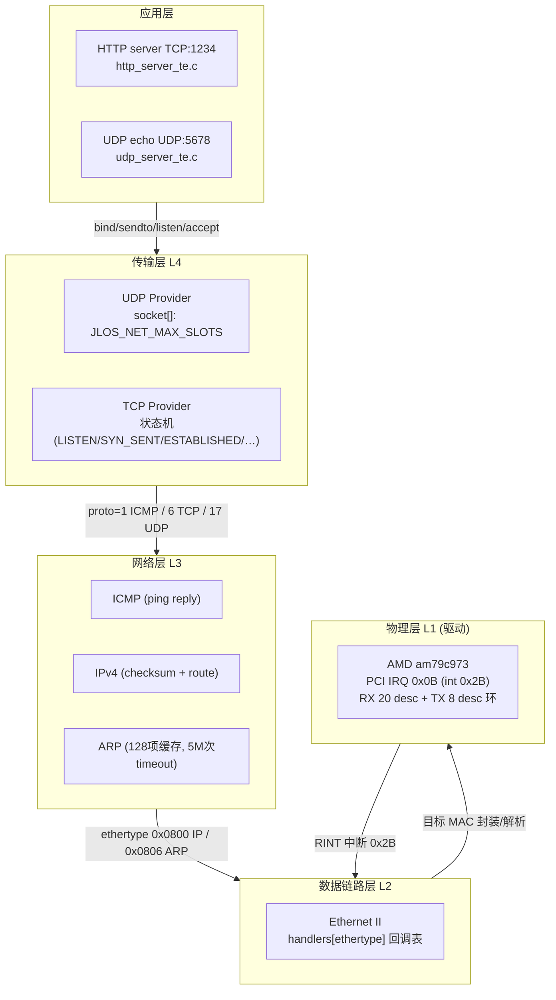

# JLOS 网络子系统架构与功能文档

> 完整 7 层协议栈（物理→数据链路→网络→传输→应用），全部从零手写。底层驱动用 AMD PCnet-FAST III (am79c973) PCI 网卡，中断 IRQ 0x0B。

---

## 1. 目录与文件

```
net/
├── network.h / network.c         🚀 网络入口：分层 init + IP 设置 + ARP 求网关
├── etherframe.h / etherframe.c   🖇️  L2 数据链路：Ethernet II 收/发 → 按 ethertype 分发
├── arp.h        / arp.c          📡  ARP：缓存 128 项 + 请求/应答 + 广播 + timeout 5M 次
├── ipv4.h       / ipv4.c         🌐  L3 IPv4：收/发 + checksum + gateway/subnet
├── icmp.h       / icmp.c         🎯  L3 ICMP：echo reply(ping)
├── udp.h        / udp.c          📦  L4 UDP：socket 数组(JLOS_NET_MAX_SLOTS) + 端口绑定
└── tcp.h        / tcp.c          🔗  L4 TCP：状态机 + 三次握手/四次挥手 + socket 数组
```

---

## 2. 协议栈分层架构图（ASCII 7 层塔 · GitLab 清晰）

```
┌──────────────────────────────────────────────────────────────────────┐
│  应用层  L7                                                           │
│  ┌─────────────────────────┐  ┌─────────────────────────────────┐    │
│  │ HTTP server TCP :1234    │  │ UDP echo UDP :5678              │    │
│  │ http_server_te.c         │  │ udp_server_te.c                 │    │
│  └────────────┬────────────┘  └──────────────┬──────────────────┘    │
└───────────────┼ bind/sendto/listen/accept ───┼───────────────────────┘
                ▼                               ▼
┌──────────────────────────────────────────────────────────────────────┐
│  传输层  L4                                                           │
│  ┌─────────────────────────┐  ┌─────────────────────────────────┐    │
│  │ UDP Provider             │  │ TCP Provider                    │    │
│  │ sockets[] = JLOS_NET_MAX │  │ 状态机: LISTEN → SYN → ESTAB   │    │
│  └────────────┬────────────┘  └──────────────┬──────────────────┘    │
└───────────────┼ proto=17(UDP) / 6(TCP) ──────┼───────────────────────┘
                ▼                               ▼
┌──────────────────────────────────────────────────────────────────────┐
│  网络层  L3                                                           │
│  ┌──────────────┐  ┌──────────────────┐  ┌────────────────────────┐  │
│  │ ARP          │  │  IPv4            │  │ ICMP                   │  │
│  │ 128 cache项  │  │ checksum+路由    │  │ echo reply (ping 通)   │  │
│  │ timeout 5M次 │  │ gw/subnet        │  │                        │  │
│  └──────┬───────┘  └────────┬─────────┘  └──────────┬─────────────┘  │
└─────────┼ ethertype 0x0806 ─┴─ 0x0800 IP ──────────┼─────────────────┘
          ▼                                           ▼
┌──────────────────────────────────────────────────────────────────────┐
│  数据链路层  L2                                                        │
│  ┌──────────────────────────────────────────────────────────────┐    │
│  │  Ethernet II 帧 (DA+SA+Type+Payload+FCS)                      │    │
│  │  handlers[ethertype] 回调表: 0x0806→ARP, 0x0800→IPv4         │    │
│  └──────────────────────────────┬───────────────────────────────┘    │
└─────────────────────────────────┼ MAC 封装/解析 ─────────────────────┘
                                  ▼
┌──────────────────────────────────────────────────────────────────────┐
│  物理层  L1 (驱动)                                                    │
│  ┌──────────────────────────────────────────────────────────────┐    │
│  │  AMD am79c973 PCI 网卡 (am79c973.c)                           │    │
│  │  IRQ 0x0B → int 0x2B  |  RX 20 desc 环 |  TX 8 desc 环       │    │
│  │  收包: RINT 中断0x2B → 走上面 L2→L3→L4→App                    │    │
│  └──────────────────────────────────────────────────────────────┘    │
└──────────────────────────────────────────────────────────────────────┘
```

<details><summary>📐 查看原始 Mermaid 源码（装 mmdc 可导出大图 SVG）</summary>



</details>

---

## 3. 收包/发包路径

### 3.1 收包（IRQ 0x2B → 应用 · ASCII 分层流水线）

```
 AMD网卡硬件     am79c973 ISR     etherframe      L3: ARP/IPv4      L4: UDP/TCP     应用层server
 (RINT中断)     (int 0x2B)       handler         (分发处理)        (socket匹配)   (on_data回调)
      │              │                │                 │                │               │
      ▼ RINT=1       │                │                 │                │               │
 CSR0.0x0020 ───────▶│                │                 │                │               │
                     ▼                │                 │                │               │
               ① 读CSR0              │                 │                │               │
               ② 写W1C位清中断        │                 │                │               │
               ③ 遍历RX desc环(20条)│                 │                │               │
                  until OWN=0         │                 │                │               │
                  ALE+EOF=0xC0 正常   │                 │                │               │
                  ABORT+OVF=0x30 丢弃 │                 │                │               │
                     └───────────────▶│                 │                │               │
                                     ▼                 │                │               │
                           etherframe_receive(frame,size)               │               │
                           查handlers[frame.type]:                     │               │
                             0x0806 → ARP                              │               │
                             0x0800 → IPv4  ──────────────┐            │               │
                                     │ 是ARP?           │            │               │
                   ┌─────────────────┴──────┐  ┌────────┴────────┐   │               │
                   ▼                        ▼  ▼                 ▼   ▼               ▼
            arp_receive(packet)      ipv4_receive(packet)
            · 请求→单播回reply+缓存   · checksum校验
            · 应答→缓存+解阻塞等待者   · protocol字段分发
                                     ┌──────────┬───────────┐
                                     ▼ ICMP     ▼ UDP       ▼ TCP
                              icmp_receive   udp_receive  tcp_receive
                              → echo reply   dst_port=5678 →状态机+ACK
                                             找socket*
                                                  └───────────▶ on_data()
```

<details><summary>📐 查看原始 Mermaid 源码（装 mmdc 可导出大图 SVG）</summary>

```mermaid
sequenceDiagram
    participant NIC as AMD 网卡硬件
    participant AMD as am79c973 ISR(IRQ 0x0B=0x2B)
    participant ETH as etherframe_handler
    participant ARP as arp_handler(0x0806)
    participant IP  as ipv4_handler(0x0800)
    participant ICMP as icmp_handler
    participant L4 as udp/tcp_handler(dport→socket)
    participant APP as 应用层 server

    NIC->>AMD: RINT=1 (CSR0.0x0020) → 触发 int 0x2B
    AMD->>AMD: 读 CSR0 → 写 W1C 位清中断
    AMD->>AMD: 遍历 RX desc 环(20 条) until OWN=0
    Note over AMD: ALE+EOF=0xC0 正常; ABORT+OVF=0x30 错误 → 丢弃
    AMD->>ETH: etherframe_receive(frame, size)
    ETH->>ETH: 查 handlers[frame.type]（0x0806/0x0800 已注册）
    alt 是 ARP
        ETH->>ARP: arp_receive(packet)
        ARP->>ARP: 是请求？→ 单播回 reply + 加缓存
        ARP->>ARP: 是 reply？→ 加缓存 + 解阻塞等待者
    else 是 IPv4
        ETH->>IP: ipv4_receive(packet)
        IP->>IP: checksum → protocol 字段分发
        alt ICMP echo request
            IP->>ICMP: icmp_receive → 构造 echo reply 原路回
        else UDP
            IP->>L4: udp_receive(dst_port=5678) → socket*
            L4->>APP: socket->on_data(data)
        else TCP
            IP->>L4: tcp_receive → 状态机推进 + ACK
        end
    end
```

</details>

### 3.2 发包（应用 → 网卡 TX desc 环）
```
应用 send() → udp_send / tcp_send_segment
  → ipv4_send(src,dst,proto)：加 IP 头 + checksum
    → arp_resolve(dst_ip)：查缓存 → 未命中→广播 ARP request（timeout 5,000,000）
      → etherframe_send(dst_mac, 0x0800)
        → am79c973_send()：取 TX desc → buf 指针 + 长度 + ENP(0x80) + OWN=1
          → 硬件 TXON 发完 → TINT 中断（写 W1C 清 CSR0）
```

---

## 4. AMD am79c973 驱动关键参数（与项目硬约束一致）

```c
/* drivers/amd_am79c973.h */
#define AMD_RX_DESCRIPTORS   20
#define AMD_TX_DESCRIPTORS   8

/* INIT 块（⚠️ 32 字节对齐！CSR3/CSR5 手动写无效）
 * 偏移 0x00: Mode
 * 偏移 0x04: ADDR[0-3] 过滤 MAC
 * 偏移 0x14: RAP (RX Ring 指针)  ← 必须是正确偏移
 * 偏移 0x18: SAP (TX Ring 指针)
 */

/* RX desc flag（接收）*/
#define AMD_RX_OWN       0x80000000   /* OWN=1 = 网卡持有写, =0 = 驱动持有读 */
#define AMD_RX_EOF       0x00800000   /* 包结束 */
#define AMD_RX_ALE       0x00400000   /* 地址匹配 */
#define AMD_RX_ABORT     0x02000000   /* 接收中止 */
#define AMD_RX_OVF       0x01000000   /* FIFO 溢出 */

/* TX desc flag（发送）*/
#define AMD_TX_OWN       0x80000000
#define AMD_TX_ENP       0x00800000   /* 包结束（⚠️ 发送必须置） */
#define AMD_TX_STP       0x00400000   /* 包开始 */

/* 初始化序列（错顺序不工作）*/
//   STOP → CSR4 → CSR1/CSR2(INIT 块 addr/addr+16) → INIT → STRT(0x42=STRT|INEA)
//   CSR0: IENA(0x0400) 必须置 1 → 允许 IRQ pin 输出
```

**索引推进规则**：用 `last_processed_iter`（迭代计数），**不能**用 processed_count（会跳 desc）→ 否则 MISS 错误。

---

## 5. Socket 数组（无 hash，简单端口线性匹配）

```c
/* common/types.h → JLOS_NET_MAX_SLOTS（无硬编码 65535！）*/
/* net/udp.c / net/tcp.c → handlers[JLOS_NET_MAX_SLOTS], sockets[JLOS_NET_MAX_SLOTS] */

typedef struct {
    uint16_t port;   /* 0 = 空槽 */
    void (*on_receive)(uint8_t *data, uint32_t size,
                       uint32_t src_ip, uint16_t src_port, void *ctx);
    void *ctx;
} jlos_udp_socket_t;
```

| Layer | 端口占用 | 启动日志 |
|---|---|---|
| HTTP server (TCP) | 1234 | `Starting HTTP server on port 1234...` |
| UDP server | 5678 | `UDP server listening on port 5678` |

---

## 6. 调试诊断开关（与 HAL Kconfig 协作）

- `KERNEL_CONFIG_DEBUG_NETWORK`：net 子系统每一步详细打印
- `KERNEL_CONFIG_DEBUG_LOG`：通用日志控制
- `HAL_CONFIG_TRACE_IO=1`：抓所有 PCI/网卡寄存器读写 + MAC 端口 0xC000

---

## 7. 启动流程核对清单（成功网络栈）

1. ✅ **sti() 已调用**：ARP resolve 循环期间要收包
2. ✅ ARP cache 有 `gw_ip → 00:50:56:C0:00:08`（VMware 网关 MAC）
3. ✅ `.NET: [ OK ] EtherFrame → ARP(0x0806) → IPv4(0x0800,gw 192.168.159.1/24) → ICMP → UDP → TCP`
4. ✅ 网卡 CSR0 post-start = 0x01F3：STRT=1, INEA=1, INTR=1, RXON=1, TXON=1, IDON=1
5. ✅ IRQ 2B(IRQ11) = am79c973 handler 注册（PIC 自动 unmask）
