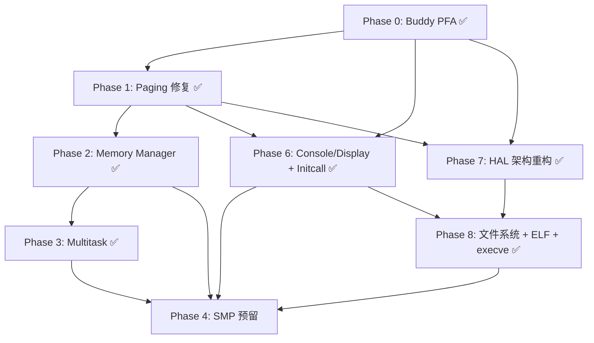

# JohnSunshine OS 内核架构升级计划

版本: v3.1 | 日期: 2026-09-21 | 作者: JohnLove

> v3.1 变更：与代码逐项核对后修正 5 处过时状态（MM-2 / MT-1 / MT-2 / MT-4 / PAG-5 / F13）；「实施优先级」重写为批次升级路线；开发日志与 v2.3 以前历史档案迁至 history_update.md。

***

## 优化原则

1. **核心功能对齐生产级：多架构可移植、多核可扩展、运行稳定、基础路径性能优秀。**
2. **经典结构优先，性能优先。** 
3. **拒绝"最小修改"思维。** 
4. **稳定性 > 性能 > 改动大小。**
5. **面向未来多核/SMP 设计，HAL 层先做抽象，架构相关代码不侵入内核子系统。**
6. **各子系统按依赖顺序升级，底层先于上层；先修正确性与锁粒度，再做数据结构优化。**
7. **命名遵循 JLOS 规范（`jlos_<subsystem>_<action>`），日志只写错误类型 tag，不重复时间戳/子系统/函数名（由框架自动封装）。**
8. **生产级内核, vmplayer测试，目标运行在硬件上**

***

## 里程碑总览

| 模块           | 完成项                                                                                           | 验证                                         |
| -------------- | ------------------------------------------------------------------------------------------------ | -------------------------------------------- |
| 网络驱动       | AMD AM79C973 初始化（CSR/BCR 配置、描述符环、IRQ 处理）                                          | ERR=0，收发稳定                              |
| ARP            | 请求/响应 + 非阻塞查找缓存                                                                       | ARP 缓存正常更新                             |
| IPv4           | 路由 + 校验和 + 收发封装                                                                         | 正常收发                                     |
| ICMP           | Echo Request/Reply（完整 payload 校验）                                                          | ping 可正常工作                              |
| UDP            | 非阻塞 send/recv + Socket 管理                                                                   | 收发正常，无 ERR=1 循环                      |
| TCP            | 完整状态机 + 三次握手/四次挥手 + SYN/FIN 序列号处理                                              | curl 直连成功                                |
| HTTP           | HTTP/1.1 响应 + Content-Length + 正确 header                                                     | curl -v 原生解析 200 OK                      |
| 虚拟内存       | 3:1 高半核分页 + 内核/用户地址空间隔离 + per-context lock + COW + context\_clone 浅拷贝          | 动态映射，ring3 用户进程正常运行             |
| 内存管理       | Buddy PFA + Bootstrap Allocator + Linux 风格虚拟布局 + 批量 expand\_heap + 修复 prev 合并方向    | 256MB                     |
| 系统调用       | exit/fork/read/write/get\_errno/get\_pid/yield/sleep/wait\_pid/brk/pipe/fd\_close                | per-thread errno + wait\_pid 退出码          |
| 多任务调度     | MLFQ 四级反馈队列 + 老化升级 + 抢占/协作可切换 + pid hash table + O(1) zombie 清理               | 时间片轮转正常，交互型优先                   |
| 同步原语       | 信号量 + 互斥锁(可重入+所有权传递) + 条件变量                                                    | spinlock 关中断保护                          |
| IPC            | 管道(堆分配环形缓冲+引用计数) + 消息队列(柔性数组)                                               | FIFO 顺序，close/destroy 分离                |
| 用户进程       | ring3 用户态进程 + 用户栈(64KB多页)映射 + TSS 特权级切换 + fork COW + exit stub 修复             | Hello from ring3 + Wake up 验证通过          |
| FPU/SSE        | Lazy 上下文切换 (CR0.TS + #NM handler) + FXSAVE/FXRSTOR + HAL ext\_state 抽象层 + 干净模板初始化 | multitask\_test + ring3 正常运行             |
| 多任务测试基线 | fork copy\_thread+ret\_from\_fork 经典范式 + buddy 经典顺序构造 + wait/wake 阻塞 + PF 按需分页   | MEMORY/MULTITASK ALL PASSED, TEST1-4 全 PASS |
| VMA/mmap 阶段1 | VMA 结构统一 brk/stack + page\_fault/fork/destroy VMA 驱动 + mmap 接口预留 + COW 批量锁优化 `jlos_paging_cow_range` | 四套测试 + rbtree 5 项 ALL PASSED    |
| 红黑树 DSA     | CLRS 风格红黑树（哨兵 nil 节点 + 侵入式 container\_of），find/find\_le/insert/remove/遍历           | rbtree 5 项 ALL PASSED                |
| Initcall 机制  | 5 级 initcall（CORE/SUBSYS/DEVICE/LATE/POST）+ 链接器段 + `jlos_do_initcalls()` 替代 call\_constructors | 全部子系统自动注册，ALL PASSED        |
| Framebuffer Console | VBE 1024×768×32 framebuffer + 8×16 ASCII 字体 + 软件光标(erase/draw) + 鼠标光标(invert) | 1024×768 显示，键盘/鼠标正常          |
| 输入子系统     | keyboard/mouse 驱动自动注册 + 事件回调（console 键盘输入 + 鼠标光标移动）                        | initcall DEVICE 级自动注册             |
| HAL 层重构     | timer B2 链表选优 + serial/dma/pci/ext\_state A 分层 + 职责归属 + 去 drivers 依赖                | 编译通过 + 全测试 PASSED               |
| F4 文件系统    | VFS 抽象 + FAT32 驱动 + MBR 分区层 + 块设备抽象 + dsa 补充 + init 集成                            | FAT32 挂载成功，hello.elf 可读        |
| ELF 加载器     | ELF32 EXEC + i386 校验 + PT\_LOAD 按页映射 + VMA 计入                                             | filesystem/elf.h + elf.c              |
| execve 系统调用 | execve + argv/envp 栈布局（System V ABI x86 32-bit）+ copy\_from\_user 拷贝                      | argc/argv 正确传递，hello.elf 运行   |
| 用户态子项目   | jlcy/ 独立子项目 + crt0.S 汇编入口 + user\_syscall stub + 0x08048000 经典基址                    | hello.elf 编译 + 链接 + 运行通过      |
| MM-5 SSE2 优化 | weak/strong 链接模式 + SSE2 32B 宽写 + CR4.OSFXSR 安全检查 + movdqu 栈保存                       | memset/memcpy 性能提升，ALL PASSED    |

***

## 架构升级总览（v2.5 核心）



> **原则**：先修 BUG，再做优化；底层改好，上层才好改。

***

## Phase 0: Buddy Page Frame Allocator ✅ 已完成

### 实施结果

| 项                                               | 状态 | 说明                                                    |
| ------------------------------------------------ | ---- | ------------------------------------------------------- |
| Buddy 分配器 (MAX\_ORDER=10, free\_area\[0..10]) | ✅    | 空闲链表节点嵌入物理帧前 8 字节                         |
| Bootstrap Allocator (boot\_alloc)                | ✅    | 按字节分配，page\_alloc 为薄 wrapper                    |
| 两阶段初始化 (boot\_alloc → paging → PFA init)   | ✅    | 经典方案 A                                              |
| 元数据按字节分配 (bitmap/refcount/buddy\_order)  | ✅    | 不再固定 1 页，按实际大小                               |
| mark\_occupied 语义统一                          | ✅    | bitmap=1 + refcount=1 + buddy\_order=INVALID            |
| reserve\_bulk 从 buddy 分配                      | ✅    | 修复 mark\_reserve 循环变量 bug (frame+i)               |
| Linux 风格虚拟布局                               | ✅    | DIRECT\_MAP\_SIZE=896MB, HEAP\_BASE=0xF8000000          |
| 内核堆逐帧映射                                   | ✅    | init\_main + expand\_heap 同构 (物理散、虚拟连)         |
| spinlock 保护                                    | ✅    | s\_pfa\_lock                                            |
| 验证                                             | ✅    | 256MB 全流程通过: ring3 + fork COW + 网络 + 多任务 |

### 已知遗留

| #      | 问题                       | 说明                                          | 优先级 |
| ------ | -------------------------- | --------------------------------------------- | ------ |
| PFA-R1 | 全局单 spinlock → 多核瓶颈 | 留给 Phase 4 per-CPU cache                    | 低     |
| PFA-R2 | boot\_alloc 用完不释放指针 | s\_boot\_heap\_ptr 后续不再被引用，无实际影响 | 极低   |

***

## Phase 1: Paging 子系统修复与优化 ✅ 已完成

### 已完成修复

| #      | 项                                                              | 状态 | 位置                   |
| ------ | --------------------------------------------------------------- | ---- | ---------------------- |
| PAG-D1 | PSE 4MB flag 保留 (change\_flags\_1 保留 PS 位)                 | ✅    | paging.c               |
| PAG-D2 | TLB 刷新策略 (非 active context 不刷, active 按 threshold 批量) | ✅    | paging.c               |
| PAG-D3 | Boot allocator 集成 (paging\_init 接收 alloc\_fn)               | ✅    | paging.c               |
| PAG-D4 | Linux 风格虚拟布局 (DIRECT\_MAP\_SIZE=896MB)                    | ✅    | paging.h               |
| PAG-D5 | 内核段权限分离 (.text RO, .data/.bss RW)                        | ✅    | paging.c               |
| PAG-D6 | access\_ok 地址范围 fast check                                  | ✅    | paging.c               |
| PAG-1  | map\_range 回滚用 unmap\_nolock 锁内完成                        | ✅    | paging.c               |
| PAG-2  | Per-context spinlock 替代全局锁                                 | ✅    | paging.h + paging.c    |
| PAG-3  | access\_ok 仅范围检查，删掉页表遍历                             | ✅    | paging.c               |
| PAG-4  | context\_clone 内核 4MB PDE 浅拷贝共享（4KB 内核 PT 仍深拷贝）  | ✅    | paging.c               |
| PAG-5  | context\_destroy 用 num\_page\_tables 短路非 present PDE        | ✅    | paging.c               |
| PAG-8  | COW fault handler 一次锁内完成                                  | ✅    | paging.c               |
| PAG-9  | context\_clone malloc 失败处理                                  | ✅    | paging.c               |
| PAG-11 | fork COW 只遍历 present PDE                                     | ✅    | paging.c + multitask.c |
| PAG-D7 | **flush\_all\_tlb asm 缺 early-clobber（严重 Bug）**：输出约束 `"=r"(cr4)` 允许 GCC 将输入与 `%0` 分配同一寄存器，而 asm 先写 `%0` 再读输入 → 输入被 CR4 值摧毁 → `andl` 退化为 `and %0,%0` 空操作 → PGE 从未翻转，**整个 flush 变空操作**。后果：COW 置 RO 后父进程 TLB 内陈旧 RW 表项存活，写直落共享帧，fork 子进程栈隔离失效（10 子压测间歇 `pressure N FAIL r=0 code=0`，printk 拖慢时序即掩盖）。修复：`"=r"` → `"=&r"` | ✅    | arch/x86/paging.c     |

### 已知遗留（低优先级）

| #     | 问题                     | 说明         | 优先级 |
| ----- | ------------------------ | ------------ | ------ |
| PAG-7 | 无 page table slab cache | 预分配 PT 池 | 低     |

***

## Phase 2: Memory Manager 升级 ✅ 已完成

### 已完成修复

| #       | 项                                                                              | 状态 | 位置                     |
| ------- | ------------------------------------------------------------------------------- | ---- | ------------------------ |
| MM-Bug1 | **prev 合并方向错误**（严重 Bug）：header 留在 chunk 地址，size 虚增 → 内存越界 | ✅    | memory\_manager.c free() |
| MM-Bug2 | **next 合并后 self->tail 未更新**：tail 指向被吸收的 chunk → 野指针             | ✅    | memory\_manager.c free() |
| MM-2    | expand\_heap 从逐页 malloc 改为 reserve\_bulk + 批量 map                        | ✅    | memory\_manager.c        |
| MM-2b   | expand\_heap 分配后与 tail 空闲 chunk 合并（减少碎片）                          | ✅    | memory\_manager.c        |

### 已知遗留（Phase 4 SMP 范畴）

| #    | 问题                                     | 说明                            | 优先级 |
| ---- | ---------------------------------------- | ------------------------------- | ------ |
| MM-3 | 无 per-type cache（task / fd / pipe 走通用 class） | kmem\_cache 专用精确尺寸 cache | 低     |

***

## Phase 3: Multitask 调度器升级 ✅ 已完成

### 已完成修复

| #           | 项                                                                                                                                                                                                                                                                                                              | 状态   | 位置                      |
| ----------- | --------------------------------------------------------------------------------------------------------------------------------------------------------------------------------------------------------------------------------------------------------------------------------------------------------------- | ------ | ------------------------- |
| MT-Exit     | **exit stub 修复**：asm → C 函数 + cli/sti 原子写 ZOMBIE + 清空 g\_current\_task\_ptr 防野指针                                                                                                                                                                                                                  | ✅      | context\_switch.c         |
| MT-1/5      | **pid hash table**（256 桶，链地址法）：zombie parent 查找 O(n)→O(1)，wait\_pid 查找 O(n)→O(1)                                                                                                                                                                                                                  | ✅      | multitask.h + multitask.c |
| MT-Wait     | WAITING 唤醒用 pid hash 替代 O(n) 扫表                                                                                                                                                                                                                                                                          | ✅      | multitask.c schedule()    |
| MT-7        | exec init\_user 失败已正确 return -1（确认无需改动）                                                                                                                                                                                                                                                            | ✅ 确认 | multitask.c               |
| MT-8        | fork COW 已 skip non-present PDE（确认无需改动）                                                                                                                                                                                                                                                                | ✅ 确认 | multitask.c               |
| MT-SlotIdx  | **slot\_idx 维护 UAF 修复**：free 紧凑删除（末尾搬到被删位置）未更新被搬任务的 slot\_idx → 该任务 slot\_idx 失效 → schedule fallback 失败 → 越界写入错误位置 → tasks\[] stale 指针 → UAF。加 `tasks[idx]==task` 校验 + 搬移后更新被搬任务 slot\_idx                                                             | ✅      | multitask.c               |
| MT-RqUB     | **rq\_dequeue** **`__builtin_ctz(0)`** **UB 修复**：先 ctz 后判空, GCC 在 UB 假设下可能优化掉判空 → runqueue 真空时 ctz 返回垃圾值 → `rq[l]` 越界 → `first=&head`（自指）→ `list_del(head)` 删 head 自己 → runqueue 彻底损坏 → schedule `return cpustate` 死循环卡死。调换为先判空再 ctz                        | ✅      | multitask.c               |
| MT-ForkList | **fork 浅拷贝链表节点修复**：`*child=*parent` 复制了 `rq_node`/`zombie_node`（指向 parent 节点地址, 非 child 自己）只重置了 `pid_hash_node` → `task_on_rq(child)` enqueue 前误判 true + `jlos_task_free` 误判 child 在 zombie 链表。补 `jlos_list_init` 重置两个链表节点                                        | ✅      | multitask.c               |
| MT-TF | **exit 泄漏全局 syscall trapframe（严重 Bug）**：`jlos_process_exit` 经 syscall 路径永不返回 → `s_x86_syscall_entry` 尾部清空 `g_hal_syscall_trapframe` 永不执行 → 全局残留指向已释放栈的死 trapframe → 下一个内核任务 exec 误走 via-trapframe 分支（写死帧 + 返回 0）→ 调用方从 naked stub 掉落 → triple fault（vmplayer 禁用 CPU）。修复：exit 开头补 `g_hal_syscall_trapframe = NULL` | ✅      | multitask.c + arch/x86/kernel_syscall.c |
| MT-Cleanup  | **冗余字段/死代码清理**：删 `jlos_task_t.fds_size`（边界检查全用 `JLOS_TASK_FDS_NUM` 常量, 该字段仅写不读）+ 删 `set_blocked`/`set_waiting` 中 `yield=true` 死赋值（两函数同时改 status, 进不了 schedule 的 RUNNING 分支读 yield）。`yield` 字段本身保留（`syscall_yield`/`need_resched`/降优先级判断真实使用） | ✅      | multitask.h + multitask.c |

### 设计决策

| 决策                                         | 理由                                                                                        |
| -------------------------------------------- | ------------------------------------------------------------------------------------------- |
| 用 pid hash 替代 parent 指针 + children 链表 | parent 被 free 后 hash 自动返回 NULL，无悬空指针风险；当前无信号/ptrace，不需要 parent 指针 |
| task struct 仅加 1 个字段 (`next_hash`)      | 不加 `parent`/`children_head`/`next_sibling`/`prev_sibling`，将来加信号系统时再补           |
| 保持 swap-with-last O(1) 删除                | 倒序遍历 + swap 不会跳过元素（已确认正确）                                                  |

### 已知遗留（低优先级）

| #    | 问题                           | 说明                             | 优先级 |
| ---- | ------------------------------ | -------------------------------- | ------ |
| ~~MT-3~~ | ~~O(n) 调度选择（4 层 × n 任务）~~ | **已解决**：`rq[]` 已是 per-level 链表数组 + `rq_nonempty` bitmap ctz 选层（multitask.h:117-121），选择路径 O(1) | 已解决 |
| ~~MT-4~~ | ~~静态 256 task 数组~~ | **已解决**：tasks 动态数组 + add_task 倍增扩容（见 5.3）；fork 入口残留 256 硬上限，见批次 4 | 已解决 |
| MT-6 | 单全局 runqueue                | per-CPU runqueue 留给 Phase 4    | 低     |

***

## Phase 4: SMP 预留（多 CPU 准备）

本阶段不实现 SMP，而是为 SMP 预留清晰的扩展点。当前单核实现中就把架构搭好，避免未来重写。

| 序号 | 任务                                                                               | 涉及文件                   | 复杂度 |
| ---- | ---------------------------------------------------------------------------------- | -------------------------- | ------ |
| 4.1  | PFA: per-CPU frame cache (order-0 batch refill/drain)                              | page\_frame\_allocator.c/h | 中     |
| 4.2  | Paging: TLB shootdown IPI 抽象接口 `jlos_hal_paging_tlb_shootdown(cpu_mask, addr)` | hal/paging.h + 实现占位    | 低     |
| 4.3  | MM: per-CPU freelist + batch drain to global                                       | memory\_manager.c          | 中     |
| 4.4  | Multitask: per-CPU runqueue + task->cpu + task->cpumask                            | multitask.h + multitask.c  | 高     |
| 4.5  | HAL: 抽象 `jlos_hal_get_cpu_id()` / `jlos_hal_num_cpus()`                          | hal/cpu.h                  | 低     |
| 4.6  | Spinlock: ticket lock 替换当前实现（为多核公平性）                                 | hal/spinlock.c             | 中     |

***

## Phase 5: 核心四子系统生产级优化（v3.0）

在 Phase 0-4 基础功能全通 + 经典结构就位后，聚焦**稳定性能 + 多核可扩展 + 多架构可移植**三项目标。按依赖顺序分 4 个子阶段推进，每步独立可回滚。依赖关系：`Phase 5.1（锁粒度+正确性）→ 5.2（性能热点）→ 5.3（经典化/扩展性）→ 5.4（SMP/多架构预留）`。

### 5.1 锁粒度细化 + 正确性收紧（高优，先做，低侵入）

| ID | 任务 | 根因与影响 | 涉及文件 | 复杂度 | 状态 |
| --- | --- | --- | --- | --- | --- |
| ~~PFA-1~~ | ~~拆 `s_pfa_lock` 为 buddy + refcount + owner 三套锁~~ | **已实现**：refcount 用 `jlos_atomic_add_unless`/`cmpxchg` 完全原子化（无锁），owner 独立 `s_owner_lock`，buddy 独立 `s_buddy_lock`，`s_free_frames` 原子计数 | page_frame_allocator.c | — | ✅ 已完成 |
| ~~PFA-6~~ | ~~`set_owner_type` 用独立 `s_owner_lock`~~ | **已实现**：`s_owner_lock` 已保护 owner/type 读写，与 buddy 锁无交叉 | page_frame_allocator.c | — | ✅ 已完成 |
| ~~MM-1a~~ | ~~拆 `s_mm_lock` 为 `s_slab_lock` + `s_heap_lock`~~ | **已实现**：slab 路径用 `s_slab_lock`，heap 路径用 `s_heap_lock`，数据结构无交叉，消除全局串行化 | memory_manager.c | — | ✅ 已完成 |
| ~~MM-2~~ | ~~`kvfree` DIRECT_MAP 区域非 SLAB_OBJ/KV_CONTIG type 加 assertion 日志~~ | **已实现**：非预期 type `printk_err("bad type ...")` + halt 兜底，等价 Linux BUG_ON（memory_manager.c:362-366） | memory_manager.c | — | ✅ 已完成 |
| PAG-7 | `jlos_active_paging_context` HAL 化为 per-CPU 访问器 | 裸全局指针，SMP 下多核 switch 乱序；HAL 抽象方便 ARM/RISC-V | paging.c / hal/paging.h | 中 | 待做 |

### 5.2 性能热点（高频路径 O(1) / 跳空扫 / 批量化）

| ID | 任务 | 根因与影响 | 涉及文件 | 复杂度 | 状态 |
| --- | --- | --- | --- | --- | --- |
| ~~PAG-1~~ | ~~`context_destroy` 4MB PDE 批量释放~~ | **已实现**：destroy 对 4MB PDE 已 `free_order(MAX_ORDER)` 单次释放；unmap 4MB 用户区分支 `free_bulk(1024)` 无创建者，属死路径 | paging.c | — | ✅ 已完成 |
| ~~PAG-2~~ | ~~`pt_used_count[1024]` 替 PT 空扫~~ | **已实现**：判空用帧级 `pt_present_count` O(1)，map/unmap/clone/destroy 全程维护；再加一层计数属负优化 | paging.h / paging.c | — | ✅ 已完成 |
| PAG-4 | 内核 4KB PDE 共享（4MB PDE 已浅拷贝共享；低直接区 + heap 的 4KB PT 每进程仍深拷贝） | Linux 内核半页共享方案：boot 期低直接 4KB 段全局一次置 USER（删 `create_user_mm` 逐进程 `change_flags_range`）→ clone 内核半区浅拷贝 / destroy 跳过内核半区 → 内核 vmalloc/heap 边界 PT boot 期预建 | paging.c + multitask.c | 高 | 待做（可选） |
| ~~PAG-6~~ | ~~`change_flags_range` 批量 TLB 刷新~~ | **已实现**：< 阈值逐页 flush、≥ 阈值循环外统一 `flush_all_tlb`，非 active context 不刷 | paging.c | — | ✅ 已完成 |
| ~~MT-3~~ | ~~fork COW PT 内层连续 non-present 跳过~~ | **已实现短路**：fork 已 skip 非 present PDE + `pt_present_count==0` 整 PT 跳过；残余仅省分支无内存读收益，正解随 F11 mmap/VMA 按映射区遍历 | multitask.c (fork) | — | ✅ 已完成 |
| ~~MT-1~~ | ~~wait queue + timer 唤醒经典化~~ | **已实现**：sleep 走 `sleep_queue` 有序链表（`wake_tick` 排序插入，`task.wait_node` 即 timer node，multitask.c:739-755）；schedule 到期从队首批量唤醒（multitask.c:491-503），O(到期数) 非全表扫描；wait_pid 走 WAITING + pid hash 直连唤醒 | multitask.c | — | ✅ 已完成 |
| ~~MT-2~~ | ~~exit→zombie 直连父进程唤醒~~ | **已实现**：`jlos_sched_wake_waiter` 用 `parent_pid` + `jlos_task_manager_find_pid`（pid hash O(1)）命中唯一合法 waiter（WAITING && waiting_pid==pid）并 `need_resched`（multitask.c:718-737） | multitask.c | — | ✅ 已完成 |
| MT-5 | **实现 `swtch()` 汇编上下文切换** | 已落地为 Linux/xv6 式单轨切换：`jlos_hal_context_switch(old_sp,new_sp)` 保存/恢复 esp+callee-saved；`schedule()` 改 void 内部 swtch 不再返回 cpustate；中断返回路径从「`movl %eax,%esp` 重建现场」改为「现场冻结在任务内核栈、swtch 切回后就地 iret」；新任务（kernel/user）与 fork 子进程都用 swtch 帧首次进入；阻塞原语（sleep/wait_pid/sem）改主动 schedule 而非 spin。multitask ALL PASSED | arch/x86/switch.s + context_switch.c + interrupts_asm.s + multitask.c + sync.c + syscall.c | 高 | ✅ 已完成 |
| ~~PFA-2~~ | ~~`free_bulk` 两级合并~~ | **已实现**：free_bulk 先收集 refcount→0 的帧到数组，排序后连续合并，一次 `buddy_free_range` 释放 | page_frame_allocator.c | — | ✅ 已完成 |

### 5.3 经典化 / 内存布局 / 扩展性

| ID | 任务 | 根因与影响 | 涉及文件 | 复杂度 | 状态 |
| --- | --- | --- | --- | --- | --- |
| ~~PFA-4~~ | ~~引入 `struct jlos_page` 数组~~ | **已实现**：`s_pages[]` 已是 `jlos_page_t` 数组，含 flags/refcount/order/type/u(free_list|owner)，物理帧数据 100% 留给用户 | page_frame_allocator.h / .c | — | ✅ 已完成 |
| ~~MT-4~~ | ~~`tasks[256]` 静态数组动态化~~ | **已实现**：`tasks` 为 kalloc 动态指针数组 + `max_tasks` 字段，`jlos_task_manager_add_task` 满员倍增扩容（multitask.c:439-450）。**残留**：fork 入口仍检查 `JLOS_TASK_MAX_NUM` 硬上限（multitask.c:565），fork 路径并发任务数仍限 256，见批次 4 | multitask.h / multitask.c | — | ✅ 大部分完成 |

### 5.4 SMP / 多架构预留接口

| ID | 任务 | 说明 | 涉及文件 | 复杂度 |
| --- | --- | --- | --- | --- |
| ~~PAG-5~~ | ~~HAL 层加 `jlos_hal_paging_global_pages(enable)`（x86 CR4.PGE）+ `jlos_hal_paging_asid_alloc/free`（ARM/RISC-V 留占位，x86 返回 0）；内核页 PTE 统一加 `JLOS_PTE_GLOBAL` 标志~~ | **已实现**：`jlos_hal_paging_enable_global_pages()`（CR4.PGE 置位）+ `asid_alloc/free` 占位（arch/x86/paging.c:90-106）；`JLOS_PDE/PTE_GLOBAL` 已用于内核直接映射（paging.c:481-494）；CR3 切换保留 GLOBAL 位（paging.c:258-298） | hal/paging.h + arch/x86/paging.c | ✅ 已完成 |
| PFA-5 | 对外多帧 API：`jlos_page_frame_alloc_n(npages)`（合并 reserve_bulk + malloc）/ `jlos_page_frame_free_n(ptr, npages)` | 目前 malloc 单帧 + reserve_bulk 多帧两条独立路径，调用方用错会泄漏；统一出口便于批量优化 | page_frame_allocator.h / .c | 低 |
| ~~MM-5~~ | ~~`memset`/`memcpy` SSE2 32B 宽写~~ | **已实现**：common/types.c 标 weak，arch/x86/lib/memset.s + memcpy.s strong 覆盖，SSE2 安全模式（保存 CR0→clts→保存 xmm0→操作→恢复） | common/types.c + arch/x86/lib/memset.s + memcpy.s | ✅ 已完成 |

***

## Phase 6: Console/Display 子系统 + Initcall 机制 ✅ 已完成

### 6.1 Initcall 机制（替代 call_constructors + .init_array）

| 项 | 状态 | 说明 |
| --- | --- | --- |
| 5 级 initcall 宏 (CORE/SUBSYS/DEVICE/LATE/POST) | ✅ | `kernel/initcall.h`，两层宏 `__JLOS_INITCALL` + `JLOS_INITCALL` 先展开 level 再字符串化 |
| 链接器段定义 | ✅ | `linker.ld` 中 `.initcall0`~`.initcall4` 段 + `__initcallN_start/end` 符号，`ALIGN(4)` 非 `ALIGN(4K)` |
| `jlos_do_initcalls()` | ✅ | `kernel/initcall.c`，按级别顺序遍历 5 个段执行 |
| 删除 `call_constructors` | ✅ | `loader.s` 删除调用 + `kernel.c` 删除函数定义 + `linker.ld` 删除 `.init_array` 段 |
| `john_beauty_main()` 精简 | ✅ | 仅保留底层依赖链 (hal/mmu/tss/device/pfa/paging) + `jlos_do_initcalls()` + tests + halt |

**Initcall 级别分配：**

| 级别 | 子系统 | 说明 |
| --- | --- | --- |
| CORE (0) | memory\_manager, task\_manager | 最底层基础设施 |
| SUBSYS (1) | irq\_manager, driver\_manager, pci\_subsys | 子系统框架初始化 |
| DEVICE (2) | timer, network, display\_device, input\_device, syscall\_handler | 设备/驱动注册 |
| LATE (3) | driver\_manager\_activate\_all | 驱动激活（依赖 DEVICE 注册完成） |
| POST (4) | irq\_manager\_activate | 中断最终激活（依赖全部初始化完成） |

### 6.2 Framebuffer Console（VBE 1024×768×32）

| 项 | 状态 | 说明 |
| --- | --- | --- |
| VBE multiboot 请求 | ✅ | `loader.s` 添加 `MULTIBOOT_VIDEO_MODE` 标志 + 9 个视频字段 (1024×768×32) |
| VBE 结构体定义 | ✅ | `common/multiboot.h` 中 `jlos_vbe_mode_info_t` |
| 8×16 ASCII 字体 | ✅ | `arch/x86/font_8x16.h`/`.c`，256 字符 × 16 字节点阵 |
| Framebuffer console 实现 | ✅ | `arch/x86/fb_console.c`：putc\_at/clear/scroll\_up/erase\_cursor/draw\_cursor/get\_info/invert\_at |
| Framebuffer 映射 | ✅ | `jlos_hal_arch_display_init_fb()`：VBE phys\_base → 内核虚拟地址，write-back 缓存（无 CACHE\_DISABLE） |
| 软件光标 erase/draw 模式 | ✅ | framebuffer 无硬件光标，erase = 反转恢复字符底部 2 行，draw = 反转显示光标 |
| 鼠标光标 | ✅ | `fb_invert_at` 反转整个字符块（与光标底部 2 行视觉区分），`visible` 标志防首次 erase 空位置 |
| Display HAL 接口 | ✅ | `hal/display.h`：`GRAPHIC` → `FRAMEBUFFER`，`set_hw_cursor` → `erase_cursor` + `draw_cursor` |
| VGA text ops 保留 | ✅ | `arch/x86/vga_text.c`：erase\_cursor 空操作 + draw\_cursor CRT 寄存器（未激活，备用） |
| Console 软件层 | ✅ | `kernel/console.c`：erase/draw 光标模式 + `\b` 处理 + info 预填默认值 + `display_device_init` initcall |

### 6.3 输入子系统迁移

| 项 | 状态 | 说明 |
| --- | --- | --- |
| `debug_console.c` → `drivers/input/input.c` | ✅ | 键盘/鼠标驱动注册 + 事件回调，`JLOS_INITCALL_DEVICE` 自动注册 |
| 删除 `KERNEL_CONFIG_DEBUG_CONSOLE` | ✅ | `tools/config.h` 清理 |
| 删除 `KERNEL_CONFIG_DEBUG_NETWORK` | ✅ | `tools/config.h` 清理 |
| 删除 `tools/samples/debug_console.c/.h` | ✅ | 迁移完成，原文件删除 |

### 6.4 Bug 修复

| # | 问题 | 修复 | 文件 |
| --- | --- | --- | --- |
| BC-1 | Backspace scancode 0x0E 缺失 | 添加 `case 0x0E: key_down('\b')` | drivers/keyboard.c |
| BC-2 | `handles[i] = NULL` 覆盖已注册 handler | 删除冗余清零（BSS 已为零） | arch/x86/interrupts.c |
| BC-3 | syscall initcall 与 IRQ manager 同级，handles 清零覆盖 | syscall 从 SUBSYS 改为 DEVICE | kernel/syscall.c |
| BC-4 | 用户栈 VMA end 不含栈顶 `0xBFFFF000` | 改为 `JLOS_TASK_USER_STACK_TOP + JLOS_PAGE_FRAME_SIZE` (= `0xC0000000`) | kernel/multitask.c |

### 6.5 已知遗留

| # | 问题 | 说明 | 优先级 |
| --- | --- | --- | --- |
| CON-1 | 日志环形缓冲 + Shift+PgUp/PgDn 历史查看 | printk 全部历史保存，类比 Linux ring buffer + dmesg | 中 |
| CON-2 | 串口宏开关 `JLOS_SERIAL_ECHO` | 当前串口始终输出，需宏控制开关 | 低 |
| CON-3 | PCI 总线枚举从 HAL 拆到 `drivers/pci/` | arch 无关总线枚举逻辑可上提 drivers 层 | 低 |

***

## Phase 8: 文件系统 + ELF 加载器 + execve + 用户态程序 ✅ 已完成

### 8.1 F4 FAT32 文件系统

| 项 | 状态 | 说明 |
| --- | --- | --- |
| VFS 抽象层 | ✅ | `filesystem/vfs.h/c`：inode/dentry/super\_block/file/fs\_type/mount 抽象 + ops 向量 + inode/dentry hash 缓存 + 路径解析 |
| FAT32 驱动 | ✅ | `filesystem/fat32.h/c`：完整 BPB + 短目录项 + FAT 链遍历 + cluster 读写 |
| MBR 分区层 | ✅ | `filesystem/partition.h/c`：解析 4 个主分区 + FAT32 LBA 类型识别 + partition\_dev 偏移封装 |
| 块设备抽象 | ✅ | `hal/block.h/c`：ops 表转发模式 + uint8\_t priv[64] 不透明私有数据 |
| dsa 补充 | ✅ | `dsa/hash\_chain.h/c` + `dsa/bitmap.h/c` + `dsa/ringbuf.h/c` 供 VFS inode/dentry 缓存使用 |
| init 集成 | ✅ | `kernel/rootfs.c`：ATA 主盘 → MBR 解析 → FAT32 分区 → mount("/")，JLOS\_INITCALL\_LATE 级自动注册 |

### 8.2 ELF 加载器

| 项 | 状态 | 说明 |
| --- | --- | --- |
| ELF32 解析 | ✅ | `filesystem/elf.h/c`：ELF32 header + program header + i386 校验 |
| PT\_LOAD 映射 | ✅ | 按页对齐映射到用户地址空间 + VMA 计入 + 文件内容拷贝 |
| 用户地址布局 | ✅ | 0x08048000 ELF 加载区 + brk 堆 + 0xBFFFF000 用户栈顶 + 0xC0000000 内核空间 |

### 8.3 execve 系统调用

| 项 | 状态 | 说明 |
| --- | --- | --- |
| execve 方案 A | ✅ | 经典做法：复用内核栈，修改 trapframe（eip/cs/user\_esp/user\_ss/eflags），正常 return 由 iret 到新程序 |
| trapframe 修改 | ✅ | `jlos\_cpu\_state\_set\_user\_entry`（hal/cpu\_state.h + arch/x86/cpu\_state.c） |
| 全局 trapframe | ✅ | `g\_hal\_syscall\_trapframe`（hal/kernel\_syscall.c）在 syscall entry 设置/清除 |
| argv/envp 栈布局 | ✅ | System V ABI x86 32-bit 经典栈布局：环境字符串 → 参数字符串 → NULL → envp\[\] → NULL → argv\[\] → argc |
| 用户空间拷贝 | ✅ | `syscall\_copy\_strings` 从用户空间拷贝 argv/envp + `jlos\_exec\_setup\_user\_stack` 写入用户栈 |

### 8.4 用户态子项目（jlcy/）

| 项 | 状态 | 说明 |
| --- | --- | --- |
| 独立子项目 | ✅ | `jlcy/` 与内核隔离，Makefile 用 find+patsubst 自动收集 .c/.S |
| crt0.S 汇编入口 | ✅ | `jlcy/lib/x86/crt0.S`：\_start 从 esp 取 argc/argv → call main → exit syscall |
| syscall stub | ✅ | `jlcy/lib/x86/user\_syscall.c`：int $0x80 入口（eax=num, ebx/ecx/edx=args） |
| syscall\_abi.h | ✅ | `jlcy/include/syscall\_abi.h`：syscall 号从 enum 改 #define（C 和汇编通用）+ \_\_ASSEMBLY\_\_ 保护 |
| hello.c 示例 | ✅ | `jlcy/user/hello.c`：int main(int argc, char \*\*argv) 纯 C，get\_pid + printf + return 7 |
| 构建集成 | ✅ | 根 Makefile：jlcy/user/hello.elf → FAT32 镜像 → VMDK 磁盘 → 内核 rootfs 挂载后 execve |

### 8.5 MM-5 SSE2 优化

| 项 | 状态 | 说明 |
| --- | --- | --- |
| weak/strong 链接模式 | ✅ | `common/types.c` 标 `__attribute__((weak))`，`arch/x86/lib/memset.s` + `memcpy.s` strong 覆盖 |
| SSE2 32B 宽写 | ✅ | movdqa/movdqu + pshufd 广播 + 32B 循环（16B×2） |
| CR4.OSFXSR 安全检查 | ✅ | 启动早期 CR4.OSFXSR 未置位时回退字节循环，避免 #UD |
| CR0.TS 安全模式 | ✅ | 保存 CR0 → clts → 保存 xmm0 → SSE2 操作 → 恢复 xmm0 → 恢复 CR0 |
| 栈对齐安全 | ✅ | movdqu 保存 xmm0 到栈（32 位内核栈不保证 16B 对齐） |
| 小尺寸阈值 | ✅ | < 64B 直接字节循环，避免 SSE2 开销 |

### 8.6 验证

```
memory:    ALL PASSED
pfa:       ALL PASSED
paging:    ALL PASSED
multitask: ALL PASSED  (ring3: exited=1, exit_code=7, argc=1, argv[0]=/hello.elf)
```

### 8.7 已知遗留

| # | 问题 | 说明 | 优先级 |
| --- | --- | --- | --- |
| FS-1 | FAT32 只读挂载 | 写操作（create/write/delete）未实现 | 中 |
| FS-2 | open/close/read/write syscall 未实现 | 当前只有 execve，无通用文件 syscall | 高 |
| FS-3 | VFS dentry cache 未做 LRU 淘汰 | 当前 hash 缓存无上限 | 低 |

***

## Phase 7: HAL 层架构合规重构 ✅ 已完成

### 7.1 分层模式判定

HAL 层三种经典分层做法及判定标准：

| 模式 | 做法 | 适用场景 |
| ---- | ---- | -------- |
| A    | HAL 声明 + arch 定义（编译期绑定） | 单实现、编译期选定架构 |
| B    | ops 表 + 转发（运行时切一个） | 需运行时切换单一实现 |
| B2   | 实例注册链表 + rating 选优（多实例共存） | 多实现共存、按优先级选优 |

**判定关键**：是否需要运行时多实现共存。多架构不构成 B/B2 的理由（编译期链接选不同 arch 目录即可），多核只影响 timer 和 irq。

各子系统决策：

| 子系统 | 模式 | 理由 |
| ------ | ---- | ---- |
| timer  | B2   | 多时钟源共存 + SMP per-cpu timer 演进路径，dsa/list 链表注册 + rating 选优 |
| serial | A    | 16550 单芯片族，编译期绑定 |
| dma    | A    | 8237 遗留 ISA DMA，单实现 |
| pci    | A    | 单配置机制；HAL 拥通用类型 + read16/8/write16/8 位操作，arch 拥 controller 结构 + read32/write32 硬件原语 |
| display| B    | 已有 ops，多后端共存（framebuffer/VGA） |
| block  | B    | 已有 ops，多控制器共存 |
| ext\_state | A | HAL 自定义不透明结构（raw[512]+used），arch 实现 fxsave/fxrstor |

### 7.2 第 1 批：局部修复

| # | 修复 | 文件 |
| - | ---- | ---- |
| L1 | dma.c count 端口 bug + 死代码 + 重复 OR | hal/dma.c |
| L2 | serial.c UART 命名规范化 | hal/serial.c |
| L3 | pci.h 0x80000000u 魔数宏化（JLOS_HAL_PCI_CONFIG_ADDR_ENABLE） | hal/pci.h |
| L4 | block.h/c ATA28 LBA 魔数宏化 | hal/block.h, hal/block.c |
| L5 | device.h/c mmio owner 改 char[24] + jlos_strlcpy 复制 | hal/device.h, hal/device.c |
| L6 | display.c 单语句 if 花括号统一 | hal/display.c |

### 7.3 第 2 批：职责归属

| # | 修复 | 文件 |
| - | ---- | ---- |
| O1 | 4 个 syscall 全局变量移出 hal.c → 新建 hal/kernel_syscall.c | hal/kernel_syscall.c |
| O2 | hal.c 自持 s_hal_info + jlos_hal_info_get_for_init() 替代 g_hal_info extern | hal/hal.c, hal/hal.h |
| O3 | 新建 hal/hal_arch.h 拆出 arch 注入函数声明（11 个文件加 include） | hal/hal_arch.h |
| O4 | user_syscall 移到 user/ 目录 + Makefile 加 user | user/user_syscall.h, user/user_syscall.c, Makefile |

### 7.4 第 3 批：下沉 arch

| # | 修复 | 文件 |
| - | ---- | ---- |
| S1 | timer B2：hal/timer.h 定义 jlos_timer_device + dsa/list 链表注册 + rating 选优；arch/x86/pit.c SUBSYS 级注册 | hal/timer.h, hal/timer.c, arch/x86/pit.c |
| S2 | serial A：hal/serial.h 纯声明，删 hal/serial.c，新建 arch/x86/uart_8250.c | hal/serial.h, arch/x86/uart_8250.c |
| S3 | dma A：hal/dma.h 纯声明，删 hal/dma.c，新建 arch/x86/dma_8237.c | hal/dma.h, arch/x86/dma_8237.c |
| S4 | ext_state A：hal/ext_state.h 自定义 raw[512]+used 结构，arch/x86/fpu.c 改用 raw，删 arch/x86/fpu_state.h | hal/ext_state.h, arch/x86/fpu.c |

### 7.5 第 4 批：PCI 分层 + block 去 drivers

| # | 修复 | 文件 |
| - | ---- | ---- |
| P1 | PCI A 分层：hal/pci.h 自定义类型 + 不透明 controller，hal/pci.c 只留 read16/8/write16/8 通用逻辑 + initcall | hal/pci.h, hal/pci.c |
| P2 | arch/x86/pci.h 定义 controller 结构，arch/x86/pci.c 实现全部 arch 部分，函数名统一 jlos_hal_pci_ 前缀 | arch/x86/pci.h, arch/x86/pci.c |
| P3 | drivers/amd_am79c973 参数类型跟随改名 | drivers/amd_am79c973.h, drivers/amd_am79c973.c |
| P4 | block C1：hal/block.h 去掉 #include drivers/ata.h，union dev_priv 改 uint8_t priv[64] + _Static_assert | hal/block.h, hal/block.c |

### 7.6 PCI read32/write32 由 arch 定义的设计理由

read32 是"发起硬件访问"的原语（地址编码 + 端口操作整体 arch 特有），read16/8 是"在结果上做位操作"的通用算法（调 read32 再移位，所有 arch 复用，避免 DRY 违反）。因此 HAL 拥有 read16/8/write16/8，arch 拥有 read32/write32。

### 7.7 验证

- 编译通过（`make clean && make`）
- 全测试 PASSED：memory/pfa/paging/multitask + 网络栈 + timer 选优生效
- 12 项遗留检查全部通过：hal/ 下无架构宏、无 #include arch、无 #include drivers（仅 block.c .c 文件保留）、无 g_hal_info extern、无 typedef 别名、timer.c 无 PIT 端口、serial.c/dma.c 已删、fpu_state.h 已删、user_syscall 已移走、block.h 不依赖 drivers、ext_state.h 不 include arch

***

## 升级路线（v3.1 批次规划）

P0 阶段（Phase 0/1/2/3/6/7/8）已全部完成，Phase 5 四个子阶段均已大部分收尾（仅剩 PAG-7 / PFA-5 / MM-3 / PAG-4）。剩余工作按依赖与收益分 5 个批次：

| 批次 | 内容 | 理由 | 依赖 |
| ---- | ---- | ---- | ---- |
| ~~**1（P1）**~~ | ~~F5 open/close/read/write/seek syscall + FS-1 FAT32 写支持~~ | **已完成**：open/close/read/write/lseek/unlink syscall + fat32 write/create/unlink + file\_test（write/read match、lseek、unlink+reopen-fail）ALL PASSED | Phase 8 ✅ |
| ~~**2（P1）**~~ | ~~5.1/5.4 接口收尾：PAG-7 + PFA-5~~ | **已完成**：PAG-7 `s_active_paging_context[JLOS_MAX_CPUS]` per-CPU 化（arch/x86/paging.c）；PFA-5 `jlos_page_frame_alloc_n/free_n` 统一多帧 API，mm/paging/测试全量切换 | 无 |
| **3（P1/P2）** | F7 signal/kill + F11 mmap/munmap（匿名映射） | ✅ F8 fork/clone（COW + ret\_from\_fork）已完成并压测通过；剩 F7 信号（经典进程模型最后缺件）与 F11（VMA/demand paging 已就绪，syscall 14/15 stub 已留号） | 批次 2 ✅ |
| **3.5（穿插加固）** | 调度器加固三件套：schedule() 入口 cli+eflags 恢复（竞态窗口根治）、IRQ0 EOI 前移到 schedule 之前（消除切换后中断压制）、syscall trapframe 全局改 per-task（wait\_pid 阻塞窗口与 MT-TF 同机制，一并根治） | 三个已知竞态/时序缺陷一次收口；均小时级 | 无 |
| **4（P2）** | 经典化收尾：MM-3 per-type size class cache + MT-4 残留（fork 入口 JLOS_TASK_MAX_NUM 硬上限，multitask.c:565）+ FS-3 dentry cache LRU 淘汰 + PAG-4 内核 4KB PDE 共享（可选） | 消除剩余结构性短板：task 表扩容已做但 fork 路径仍限 256；MM-3 精确尺寸 cache 降低 slab 内部碎片 | 批次 3 |
| **5（P3）** | SMP 预留（Phase 4：4.1 per-CPU frame cache / 4.2 TLB shootdown 抽象 / 4.3 per-CPU freelist / 4.4 per-CPU runqueue / 4.5 cpu id 抽象 / 4.6 ticket lock）+ A2/A3 恒等映射与 boot 页表清理 | 多核落地前置；A2（0~1MB 恒等映射残留）/ A3（boot_page_dir 未释放）为 GRUB 退出后的历史残留 | 批次 4 |
| 穿插 | F9 DHCP + F10 DNS（网络栈已通，经典收尾）；F14 日志环形缓冲 + F15 串口宏开关 + CON-1~3 console 遗留 | 无依赖、量级小，可穿插任意批次间隙 | 无 |

完成后进入 Phase 4 SMP 实现 + 多架构（ARM/RISC-V）阶段。

### 实施优先级（历史，已被批次规划取代）

| 优先级 | Phase | 任务                                                                | 依赖        |
| ------ | ----- | ------------------------------------------------------------------- | ----------- |
| **P0** | 0     | Buddy Page Frame Allocator                                          | ✅ 已完成    |
| **P0** | 1     | Paging 全部修复 (per-context lock + clone 浅拷贝 + COW 锁合并等)    | ✅ 已完成    |
| **P0** | 2     | Memory Manager 修复 (prev 合并方向 + tail 更新 + 批量 expand\_heap) | ✅ 已完成    |
| **P0** | 3     | Multitask 升级 (exit stub 修复 + pid hash + O(1) zombie/wait_pid)  | ✅ 已完成    |
| **P0** | 6     | Console/Display 子系统 + Initcall 机制                              | ✅ 已完成    |
| **P0** | 7     | HAL 层架构合规重构（分层模式 + 职责归属 + 下沉 arch + 去 drivers） | ✅ 已完成    |
| **P0** | 8     | 文件系统 + ELF 加载器 + execve + 用户态程序 + SSE2 优化             | ✅ 已完成    |
| **P1** | 5.1   | 锁粒度细化 + 正确性收紧                                             | ✅ MM-2 已核销，仅剩 PAG-7（批次 2） |
| **P1** | 5.2   | 性能热点                                                            | ✅ MT-1/MT-2 已核销，仅剩 PAG-4 可选（批次 4） |
| **P1** | F5/F7 | open/close/read/write syscall + signal/kill 信号机制                | F5/F7 → 批次 1/3 |
| **P2** | 5.3   | 经典化 / 扩展性                                                     | ✅ MT-4 已核销（残留 fork 上限 → 批次 4），仅剩 MM-3 |
| **P2** | F11/F8 | mmap/munmap syscall + 线程支持（clone）                            | → 批次 3 |
| **P3** | 4.x/5.4 | SMP 预留 + 多架构 HAL 接口                                        | PAG-5 已核销，仅剩 PFA-5（批次 2）；4.1~4.6 → 批次 5 |
| **P3** | F9/F10 | DHCP + DNS 网络栈完善                                              | → 穿插 |

***

## 待实现功能（按经典路线图）

| 编号 | 功能                                                     | 模块                              | 依赖               |
| ---- | -------------------------------------------------------- | --------------------------------- | ------------------ |
| F1   | 按需分页 (demand paging, 已实现 brk + stack)             | paging.c                          | 无                 |
| F2   | COW 写时复制 (已实现)                                    | paging.c + multitask.c            | —                  |
| F3   | 用户态 malloc/free                                       | user                              | 依赖 brk（已完成） |
| ~~F4~~ | ~~FAT32 完善 (mount/open/close/read/write/seek/readdir)~~ | **已实现**：VFS + FAT32 + MBR + ELF 加载器 | — |
| F5   | open/close/read/write 系统调用                            | syscall.c                         | **已实现**         |
| ~~F6~~ | ~~ELF 用户态程序加载~~                                   | **已实现**：jlcy/ + crt0.S + execve | —            |
| F7   | signal/kill 信号机制                                     | syscall.c + multitask.c           | 无                 |
| F8   | 线程支持（共享地址空间）                                 | multitask.c                       | **已实现**（fork/clone + COW） |
| F9   | DHCP 自动获取 IP                                         | net                               | 无                 |
| F10  | DNS 域名解析                                             | net                               | 依赖 F9            |
| F11  | mmap 内存映射                                            | paging.c + syscall.c              | 依赖 F4（已完成，VMA/按需分页就绪） |
| ~~F12~~ | ~~FPU/SSE 上下文切换（CR0.TS + lazy save/restore）~~   | **已实现**：arch/x86/fpu.c + hal/ext\_state.h | — |
| ~~F13~~ | ~~O(1) 调度选择（per-level runqueue + bitmap）~~         | **已实现**：rq[] per-level 链表 + rq\_nonempty bitmap ctz 选层（multitask.h:117-121） | —                  |
| F14  | 日志环形缓冲 + Shift+PgUp/PgDn 历史查看                  | kernel/console.c + printk.c       | 无                 |
| F15  | 串口输出宏开关 `JLOS_SERIAL_ECHO`                        | kernel/console.c + hal/serial.h   | 无                 |

***

## 已知遗留（低优先或需更大重构）

| #   | 问题                       | 说明                                                                               |
| --- | -------------------------- | ---------------------------------------------------------------------------------- |
| ~~A1~~ | ~~用户态代码与内核混编~~ | **已解决**：jlcy/ 独立子项目 + ELF 加载器 + execve，用户态 ELF 独立链接 0x08048000 |
| A2  | 0\~1MB 恒等映射残留        | GRUB 退出后不再需要，经典做法移除                                                  |
| A3  | boot\_page\_dir 内存未释放 | 切到内核页表后 4KB 无法回收                                                        |
| A4  | MLFQ 不 starvation-free    | CFS weighted fair queuing 更经典但复杂度高；当前可接受                             |

***

## 参考资料

1. Intel x86 Architecture Manual
2. OSDEV Wiki：<https://wiki.osdev.org/>
3. 《Operating Systems: Three Easy Pieces》
4. 《Modern Operating Systems》 - Andrew Tanenbaum
5. Linux kernel source (buddy allocator, SLUB, scheduler)
6. FreeBSD VM system design
