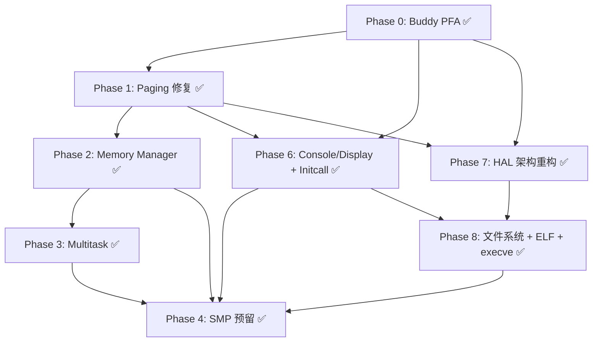

# JohnSunshine OS 内核架构升级计划

版本: v3.9 | 日期: 2026-10-07 | 作者: JohnLove

> v3.9 变更：SMP 升级 Step 1（per-CPU 基础设施：`DEFINE_PER_CPU` + `.data..percpu` section + GS 段访问）与 Step 2（LAPIC 驱动 + fixmap/MMIO/MSR/cache 属性抽象）落地；修复 `jlos_page_frame_get_free` 漏计 per-CPU cache 的记账 bug；确立 SMP 8 步实施计划。详见 history_update.md。

> v3.8 变更：内部测试框架（section-based 自注册 + 12 套件 54 用例全 PASS）+ 修复 jlos_task_sleep_until 缺 schedule + sync 唤醒缺 rq_enqueue/need_resched 两个内核 bug + printk 宽度修饰支持（flags/width 解析）+ 升级优先级纠正（SMP P0 → 64位 P1 → 多架构 P2），详见 history_update.md。

> v3.7 变更：net 子系统 sk_buff 统一网络缓冲区（head/data/tail/end 四指针 + refcount + 分档分配 + 发送/接收路径零拷贝 + csum_partial/csum_fold 重构），详见 history_update.md。

> v3.6 变更：FS 缓存统一 page cache（per-inode address_space + get_block + readpage/writepage + 删 buffer_cache + dirent 走 dir->address_space），详见 history_update.md。

> v3.5 变更：hrtimer 高精度定时器（红黑树 + PIT oneshot + 周期性 tick + sleeper/nanosleep syscall）+ 测试体系改造（initcall TEST 级别自注册 + 测试文件迁移到各子系统 tests/ + tag 规范化 + config.h 移到 include/ + tools/ 目录删除）。

> v3.4 变更：Console 历史回看（F14 日志环形缓冲 + Shift+PgUp/PgDn）+ F15 串口输出宏开关 + framebuffer 列数适配（128×48）。

> v3.3 变更：网络栈 DHCP/DNS 完善（IPv4 广播收发 + 网络配置结构去硬编码 + DHCP 状态机 + DNS 解析器）。

> v3.2 变更：时间子系统升级（clocksource/clock_event_device 分离 + TSC + timekeeping + RTC + wall-clock + 日志真实时间戳 + HAL cpu_relax 抽象）；NTP 同步方案重新设计为用户空间守护进程路线。

> v3.1 变更：与代码逐项核对后修正 5 处过时状态（MM-2 / MT-1 / MT-2 / MT-4 / PAG-5 / F13）；「实施优先级」重写为批次升级路线；开发日志与 v2.3 以前历史档案迁至 history_update.md。

***

## 优化原则

1. **核心功能对齐生产级：多架构可移植、多核可扩展、运行稳定、基础路径性能优秀。**
2. **经典结构优先，性能优先。** 
3. **拒绝"最小修改"思维。** 
4. **稳定性 > 性能 > 改动大小。**
5. **面向未来多核/SMP 设计，HAL 层先做抽象，架构相关代码不侵入内核子系统。**
6. **各子系统按依赖顺序升级，底层先于上层；先修正确性与锁粒度，再做数据结构优化。**
7. **命名遵循 JLOS 规范（`jlos_<subsystem>_<action>`），日志只写错误类型 tag，不重复时间戳/子系统/函数名（由框架自动封装）。**
8. **生产级内核, vmplayer测试，目标运行在硬件上**
9. **魔法字面量用语义宏命名**：裸数值（如 512/256/1024）用有语义的宏替代（如 `JLOS_BLOCK_SECTOR_SIZE`、`JLOS_IDT_ENTRIES`）；KB/MB 等计算机科学定义好的单位换算（如 `1024` KB→字节、`4*1024*1024` 4MB 对齐）不需定义宏。
10. **方案直接对齐成熟系统已验证的最终形态，不给过渡/演进路径**：Linux 等成熟系统已走过并验证的最终结构（如 page cache 统一）直接作为目标落地；不做「先分离再统一」式历史演进，不为迁就现有过渡代码退回折中方案。返工是必要成本，绕路才浪费时间。
12. **不以收益或工作量作为取舍依据**：经典结构 + 性能优先是唯一准绳；即使当前负载小、短期收益不明显、改动较大，只要经典结构正确、性能更优就照做，不做收益/工作量导向的折中或过渡方案。

***

## 里程碑总览

| 模块           | 完成项                                                                                           | 验证                                         |
| -------------- | ------------------------------------------------------------------------------------------------ | -------------------------------------------- |
| 网络驱动       | AMD AM79C973 初始化（CSR/BCR 配置、描述符环、IRQ 处理）                                          | ERR=0，收发稳定                              |
| ARP            | 请求/响应 + 非阻塞查找缓存                                                                       | ARP 缓存正常更新                             |
| IPv4           | 路由 + 校验和 + 收发封装                                                                         | 正常收发                                     |
| ICMP           | Echo Request/Reply（完整 payload 校验）                                                          | ping 可正常工作                              |
| UDP            | 非阻塞 send/recv + Socket 管理                                                                   | 收发正常，无 ERR=1 循环                      |
| TCP            | 完整状态机 + 三次握手/四次挥手 + SYN/FIN 序列号处理                                              | curl 直连成功                                |
| HTTP           | HTTP/1.1 响应 + Content-Length + 正确 header                                                     | curl -v 原生解析 200 OK                      |
| 虚拟内存       | 3:1 高半核分页 + 内核/用户地址空间隔离 + per-context lock + COW + context\_clone 浅拷贝          | 动态映射，ring3 用户进程正常运行             |
| 内存管理       | Buddy PFA + Bootstrap Allocator + Linux 风格虚拟布局 + 批量 expand\_heap + 修复 prev 合并方向    | 256MB                     |
| 系统调用       | exit/fork/read/write/get\_errno/get\_pid/yield/sleep/wait\_pid/brk/pipe/fd\_close                | per-thread errno + wait\_pid 退出码          |
| 多任务调度     | MLFQ 四级反馈队列 + 老化升级 + 抢占/协作可切换 + pid hash table + O(1) zombie 清理               | 时间片轮转正常，交互型优先                   |
| 同步原语       | 信号量 + 互斥锁(可重入+所有权传递) + 条件变量                                                    | spinlock 关中断保护                          |
| IPC            | 管道(堆分配环形缓冲+引用计数) + 消息队列(柔性数组)                                               | FIFO 顺序，close/destroy 分离                |
| 用户进程       | ring3 用户态进程 + 用户栈(64KB多页)映射 + TSS 特权级切换 + fork COW + exit stub 修复             | Hello from ring3 + Wake up 验证通过          |
| FPU/SSE        | Lazy 上下文切换 (CR0.TS + #NM handler) + FXSAVE/FXRSTOR + HAL ext\_state 抽象层 + 干净模板初始化 | multitask\_test + ring3 正常运行             |
| 多任务测试基线 | fork copy\_thread+ret\_from\_fork 经典范式 + buddy 经典顺序构造 + wait/wake 阻塞 + PF 按需分页   | MEMORY/MULTITASK ALL PASSED, TEST1-4 全 PASS |
| VMA/mmap 阶段1 | VMA 结构统一 brk/stack + page\_fault/fork/destroy VMA 驱动 + mmap 接口预留 + COW 批量锁优化 `jlos_paging_cow_range` | 四套测试 + rbtree 5 项 ALL PASSED    |
| 红黑树 DSA     | CLRS 风格红黑树（哨兵 nil 节点 + 侵入式 container\_of），find/find\_le/insert/remove/遍历           | rbtree 5 项 ALL PASSED                |
| Initcall 机制  | 6 级 initcall（CORE/SUBSYS/DEVICE/LATE/POST/TEST）+ 链接器段 + `jlos_do_initcalls()` 替代 call\_constructors | 全部子系统自动注册，ALL PASSED        |
| Framebuffer Console | VBE 1024×768×32 framebuffer + 8×16 ASCII 字体 + 软件光标(erase/draw) + 鼠标光标(invert) | 1024×768 显示，键盘/鼠标正常          |
| 输入子系统     | keyboard/mouse 驱动自动注册 + 事件回调（console 键盘输入 + 鼠标光标移动）                        | initcall DEVICE 级自动注册             |
| HAL 层重构     | timer B2 链表选优 + serial/dma/pci/ext\_state A 分层 + 职责归属 + 去 drivers 依赖                | 编译通过 + 全测试 PASSED               |
| F4 文件系统    | VFS 抽象 + FAT32 驱动 + MBR 分区层 + 块设备抽象 + dsa 补充 + init 集成                            | FAT32 挂载成功，hello.elf 可读        |
| ELF 加载器     | ELF32 EXEC + i386 校验 + PT\_LOAD 按页映射 + VMA 计入                                             | filesystem/elf.h + elf.c              |
| execve 系统调用 | execve + argv/envp 栈布局（System V ABI x86 32-bit）+ copy\_from\_user 拷贝                      | argc/argv 正确传递，hello.elf 运行   |
| 用户态子项目   | jlcy/ 独立子项目 + crt0.S 汇编入口 + user\_syscall stub + 0x08048000 经典基址                    | hello.elf 编译 + 链接 + 运行通过      |
| MM-5 SSE2 优化 | weak/strong 链接模式 + SSE2 32B 宽写 + CR4.OSFXSR 安全检查 + movdqu 栈保存                       | memset/memcpy 性能提升，ALL PASSED    |
| F14 Console 历史回看 | 日志环形缓冲(512行×256列) + Shift+PgUp/PgDn + render_view + framebuffer 列数适配(128×48) | 历史回看正常，光标不覆盖日志          |
| F15 串口宏开关 | `JLOS_SERIAL_ECHO` 编译期宏 + \b 不输出串口（日志 append-only）                                  | 串口日志无 BS 字样                    |
| hrtimer 高精度定时器 | 红黑树 + PIT oneshot + 周期性 tick hrtimer + sleeper/nanosleep syscall（REL + monotonic） | 编译通过，IRQ0 精简为 hrtimer+tick_and_schedule |
| 测试体系改造 | initcall TEST 级别自注册 + 测试迁移到各子系统 tests/ + tag 规范化(t_xxx) + config.h→include/ | 编译通过，kernel.c 删硬编码调用列表    |
| 文件系统缓存 | 统一 page cache：per-inode address_space + get_block + readpage/writepage + 删 buffer_cache + dirent 走 dir->address_space | file_test ALL PASSED |
| 网络缓冲区 | sk_buff 统一缓冲区（head/data/tail/end 四指针 + refcount + 分档分配）+ 发送/接收路径零拷贝 + csum_partial/csum_fold | DHCP/ARP/ICMP/UDP/TCP/HTTP 全通，全测试 ALL PASSED |
| 文件 I/O 系统调用 | open/close/read/write/lseek/unlink syscall + FAT32 create/write/unlink | file_test ALL PASSED |
| 信号机制 | signal/kill/sigreturn syscall + signal_pending / signal_handlers 数组 | signal_test ALL PASSED |
| 线程支持 | clone 共享地址空间 + fork COW（ret_from_fork） | fork/clone 压测通过 |
| DHCP/DNS | DHCP 状态机（DISCOVER/OFFER/REQUEST/ACK）+ DNS 解析器（option 6 取服务器） | BOUND 绑定 IP，ping/curl 通过 |
| 内部测试框架 | section-based 自注册（JLOS_TEST 宏 + .jlos_test 段）+ 12 套件 54 用例 + 汇总表格 | 54 passed 0 failed |
| 内核 bug 修复 | jlos_task_sleep_until 缺 schedule + sync 唤醒缺 rq_enqueue/need_resched | 测试驱动发现并修复 |
| printk 宽度修饰 | flags(-/0) + width 解析 + printk_fmt_uint/int + emit_padded | 汇总表格列对齐 |

***

## 架构升级总览（v2.5 核心）


```mermaid
graph TD
    P0["Phase 0: Buddy PFA ✅"]
    P1["Phase 1: Paging 修复 ✅"]
    P2["Phase 2: Memory Manager ✅"]
    P3["Phase 3: Multitask ✅"]
    P4["Phase 4: SMP 预留 ✅"]
    P6["Phase 6: Console/Display + Initcall ✅"]
    P7["Phase 7: HAL 架构重构 ✅"]
    P8["Phase 8: 文件系统 + ELF + execve ✅"]

    P0 --> P1
    P1 --> P2
    P2 --> P3
    P0 --> P6
    P1 --> P6
    P3 --> P4
    P2 --> P4
    P6 --> P4
    P0 --> P7
    P1 --> P7
    P7 --> P8
    P6 --> P8
    P8 --> P4
```

> **原则**：先修 BUG，再做优化；底层改好，上层才好改。

***

## Phase 0: Buddy Page Frame Allocator ✅ 已完成

### 实施结果

| 项                                               | 状态 | 说明                                                    |
| ------------------------------------------------ | ---- | ------------------------------------------------------- |
| Buddy 分配器 (MAX\_ORDER=10, free\_area\[0..10]) | ✅    | 空闲链表节点嵌入物理帧前 8 字节                         |
| Bootstrap Allocator (boot\_alloc)                | ✅    | 按字节分配，page\_alloc 为薄 wrapper                    |
| 两阶段初始化 (boot\_alloc → paging → PFA init)   | ✅    | 经典方案 A                                              |
| 元数据按字节分配 (bitmap/refcount/buddy\_order)  | ✅    | 不再固定 1 页，按实际大小                               |
| mark\_occupied 语义统一                          | ✅    | bitmap=1 + refcount=1 + buddy\_order=INVALID            |
| reserve\_bulk 从 buddy 分配                      | ✅    | 修复 mark\_reserve 循环变量 bug (frame+i)               |
| Linux 风格虚拟布局                               | ✅    | DIRECT\_MAP\_SIZE=896MB, HEAP\_BASE=0xF8000000          |
| 内核堆逐帧映射                                   | ✅    | init\_main + expand\_heap 同构 (物理散、虚拟连)         |
| spinlock 保护                                    | ✅    | s\_pfa\_lock                                            |
| 验证                                             | ✅    | 256MB 全流程通过: ring3 + fork COW + 网络 + 多任务 |

***

## Phase 1: Paging 子系统修复与优化 ✅ 已完成

### 已完成修复

| #      | 项                                                              | 状态 | 位置                   |
| ------ | --------------------------------------------------------------- | ---- | ---------------------- |
| PAG-D1 | PSE 4MB flag 保留 (change\_flags\_1 保留 PS 位)                 | ✅    | paging.c               |
| PAG-D2 | TLB 刷新策略 (非 active context 不刷, active 按 threshold 批量) | ✅    | paging.c               |
| PAG-D3 | Boot allocator 集成 (paging\_init 接收 alloc\_fn)               | ✅    | paging.c               |
| PAG-D4 | Linux 风格虚拟布局 (DIRECT\_MAP\_SIZE=896MB)                    | ✅    | paging.h               |
| PAG-D5 | 内核段权限分离 (.text RO, .data/.bss RW)                        | ✅    | paging.c               |
| PAG-D6 | access\_ok 地址范围 fast check                                  | ✅    | paging.c               |
| PAG-1  | map\_range 回滚用 unmap\_nolock 锁内完成                        | ✅    | paging.c               |
| PAG-2  | Per-context spinlock 替代全局锁                                 | ✅    | paging.h + paging.c    |
| PAG-3  | access\_ok 仅范围检查，删掉页表遍历                             | ✅    | paging.c               |
| PAG-4  | context\_clone 内核 4MB PDE 浅拷贝共享（4KB 内核 PT 仍深拷贝）  | ✅    | paging.c               |
| PAG-5  | context\_destroy 用 num\_page\_tables 短路非 present PDE        | ✅    | paging.c               |
| PAG-8  | COW fault handler 一次锁内完成                                  | ✅    | paging.c               |
| PAG-9  | context\_clone malloc 失败处理                                  | ✅    | paging.c               |
| PAG-11 | fork COW 只遍历 present PDE                                     | ✅    | paging.c + multitask.c |
| PAG-D7 | **flush\_all\_tlb asm 缺 early-clobber（严重 Bug）**：输出约束 `"=r"(cr4)` 允许 GCC 将输入与 `%0` 分配同一寄存器，而 asm 先写 `%0` 再读输入 → 输入被 CR4 值摧毁 → `andl` 退化为 `and %0,%0` 空操作 → PGE 从未翻转，**整个 flush 变空操作**。后果：COW 置 RO 后父进程 TLB 内陈旧 RW 表项存活，写直落共享帧，fork 子进程栈隔离失效（10 子压测间歇 `pressure N FAIL r=0 code=0`，printk 拖慢时序即掩盖）。修复：`"=r"` → `"=&r"` | ✅    | arch/x86/paging.c     |
| PAG-D8 | paging 架构分层：页表原语下沉 arch/x86（pgtable.h + paging_table.c），通用算法留 kernel/paging.c，权限位抽象 `JLOS_PG_*`，ctx 用不透明 `root` 指针（multi-arch 就位） | ✅ | hal/paging.h + arch/x86/paging_table.c |
| PAG-D9 | unmap 用 `jlos_page_frame_refcount_dec` 替代 `free`，对齐 COW refcount 语义（防 fork 后 munmap 共享页误释放） | ✅ | arch/x86/paging_table.c |

***

## Phase 2: Memory Manager 升级 ✅ 已完成

### 已完成修复

| #       | 项                                                                              | 状态 | 位置                     |
| ------- | ------------------------------------------------------------------------------- | ---- | ------------------------ |
| MM-Bug1 | **prev 合并方向错误**（严重 Bug）：header 留在 chunk 地址，size 虚增 → 内存越界 | ✅    | memory\_manager.c free() |
| MM-Bug2 | **next 合并后 self->tail 未更新**：tail 指向被吸收的 chunk → 野指针             | ✅    | memory\_manager.c free() |
| MM-2    | expand\_heap 从逐页 malloc 改为 reserve\_bulk + 批量 map                        | ✅    | memory\_manager.c        |
| MM-2b   | expand\_heap 分配后与 tail 空闲 chunk 合并（减少碎片）                          | ✅    | memory\_manager.c        |

***

## Phase 3: Multitask 调度器升级 ✅ 已完成

### 已完成修复

| #           | 项                                                                                                                                                                                                                                                                                                              | 状态   | 位置                      |
| ----------- | --------------------------------------------------------------------------------------------------------------------------------------------------------------------------------------------------------------------------------------------------------------------------------------------------------------- | ------ | ------------------------- |
| MT-Exit     | **exit stub 修复**：asm → C 函数 + cli/sti 原子写 ZOMBIE + 清空 g\_current\_task\_ptr 防野指针                                                                                                                                                                                                                  | ✅      | context\_switch.c         |
| MT-1/5      | **pid hash table**（256 桶，链地址法）：zombie parent 查找 O(n)→O(1)，wait\_pid 查找 O(n)→O(1)                                                                                                                                                                                                                  | ✅      | multitask.h + multitask.c |
| MT-Wait     | WAITING 唤醒用 pid hash 替代 O(n) 扫表                                                                                                                                                                                                                                                                          | ✅      | multitask.c schedule()    |
| MT-7        | exec init\_user 失败已正确 return -1（确认无需改动）                                                                                                                                                                                                                                                            | ✅ 确认 | multitask.c               |
| MT-8        | fork COW 已 skip non-present PDE（确认无需改动）                                                                                                                                                                                                                                                                | ✅ 确认 | multitask.c               |
| MT-SlotIdx  | **slot\_idx 维护 UAF 修复**：free 紧凑删除（末尾搬到被删位置）未更新被搬任务的 slot\_idx → 该任务 slot\_idx 失效 → schedule fallback 失败 → 越界写入错误位置 → tasks\[] stale 指针 → UAF。加 `tasks[idx]==task` 校验 + 搬移后更新被搬任务 slot\_idx                                                             | ✅      | multitask.c               |
| MT-RqUB     | **rq\_dequeue** **`__builtin_ctz(0)`** **UB 修复**：先 ctz 后判空, GCC 在 UB 假设下可能优化掉判空 → runqueue 真空时 ctz 返回垃圾值 → `rq[l]` 越界 → `first=&head`（自指）→ `list_del(head)` 删 head 自己 → runqueue 彻底损坏 → schedule `return cpustate` 死循环卡死。调换为先判空再 ctz                        | ✅      | multitask.c               |
| MT-ForkList | **fork 浅拷贝链表节点修复**：`*child=*parent` 复制了 `rq_node`/`zombie_node`（指向 parent 节点地址, 非 child 自己）只重置了 `pid_hash_node` → `task_on_rq(child)` enqueue 前误判 true + `jlos_task_free` 误判 child 在 zombie 链表。补 `jlos_list_init` 重置两个链表节点                                        | ✅      | multitask.c               |
| MT-TF | **exit 泄漏全局 syscall trapframe（严重 Bug）**：`jlos_process_exit` 经 syscall 路径永不返回 → `s_x86_syscall_entry` 尾部清空 `g_hal_syscall_trapframe` 永不执行 → 全局残留指向已释放栈的死 trapframe → 下一个内核任务 exec 误走 via-trapframe 分支（写死帧 + 返回 0）→ 调用方从 naked stub 掉落 → triple fault（vmplayer 禁用 CPU）。修复：exit 开头补 `g_hal_syscall_trapframe = NULL` | ✅      | multitask.c + arch/x86/kernel_syscall.c |
| MT-Cleanup  | **冗余字段/死代码清理**：删 `jlos_task_t.fds_size`（边界检查全用 `JLOS_TASK_FDS_NUM` 常量, 该字段仅写不读）+ 删 `set_blocked`/`set_waiting` 中 `yield=true` 死赋值（两函数同时改 status, 进不了 schedule 的 RUNNING 分支读 yield）。`yield` 字段本身保留（`syscall_yield`/`need_resched`/降优先级判断真实使用） | ✅      | multitask.h + multitask.c |

### 设计决策

| 决策                                         | 理由                                                                                        |
| -------------------------------------------- | ------------------------------------------------------------------------------------------- |
| 用 pid hash 替代 parent 指针 + children 链表 | parent 被 free 后 hash 自动返回 NULL，无悬空指针风险；当前无信号/ptrace，不需要 parent 指针 |
| task struct 仅加 1 个字段 (`next_hash`)      | 不加 `parent`/`children_head`/`next_sibling`/`prev_sibling`，将来加信号系统时再补           |
| 保持 swap-with-last O(1) 删除                | 倒序遍历 + swap 不会跳过元素（已确认正确）                                                  |

***

## Phase 4: SMP 预留（多 CPU 准备）

本阶段不实现 SMP，而是为 SMP 预留清晰的扩展点。当前单核实现中就把架构搭好，避免未来重写。

| 序号 | 任务                                                                               | 涉及文件                   | 复杂度 | 状态 |
| ---- | ---------------------------------------------------------------------------------- | -------------------------- | ------ | ---- |
| 4.1  | PFA: per-CPU frame cache (order-0 batch refill/drain)                              | page\_frame\_allocator.c/h | 中     | ✅   |
| 4.2  | Paging: TLB shootdown IPI 抽象接口 `jlos_hal_paging_tlb_shootdown(cpu_mask, addr)` | hal/paging.h + 实现占位    | 低     | ✅ 接口已声明，实现空 stub 归 SMP |
| 4.3  | MM: slab per-CPU freelist 无锁快路径 + batch drain to global                        | memory\_manager.c          | 中     | ⏸ 结构就位，锁未无锁化，归 SMP |
| 4.4  | Multitask: per-CPU runqueue + task->cpu + task->cpumask                            | multitask.h + multitask.c  | 高     | ✅ rq+cpu 已完成，cpumask 待 SMP |
| 4.5  | HAL: 抽象 `jlos_hal_get_cpu_id()` / `jlos_hal_num_cpus()`                          | hal/smp.h                  | 低     | ✅ section-based per-CPU 实现 |
| 4.6  | Spinlock: ticket lock 替换当前实现（为多核公平性）                                 | hal/spinlock.c             | 中     | ✅   |

***

## SMP 逐步实施（Step 1-8，2026-10-07）

多核支持按 8 步推进（对齐 Linux section-based per-CPU + fixmap/LAPIC/ACPI 最终形态）：

| 步骤    | 内容                                                                 | 状态 |
| ------- | -------------------------------------------------------------------- | ---- |
| Step 1  | per-CPU 基础设施：`DEFINE_PER_CPU` + `.data..percpu` + GS 段访问     | ✅   |
| Step 2  | LAPIC 驱动 + 抽象（fixmap / MMIO 读写 / MSR / cache PCD 属性）       | ✅   |
| Step 3  | ACPI MADT 解析（RSDP→XSDT→MADT 提取 CPU/IOAPIC）+ AP 启动            | ⏳   |
| Step 4  | per-CPU GDT/TSS + 中断改造（切 APIC 模式）                           | ⏳   |
| Step 5  | IPI + TLB shootdown                                                  | ⏳   |
| Step 6  | 调度器 SMP 化                                                        | ⏳   |
| Step 7  | 锁粒度优化                                                           | ⏳   |
| Step 8  | IOAPIC                                                               | ⏳   |

测试策略教训（Step 2 暴露）：记账类接口语义须对齐「系统总量」（`get_free` = buddy + Σper-CPU cache）；测试断言优先用恒等式/不变量（`free + occupied == total`）而非前后差值守恒，避免缺陷藏在不变量里被初始稳态掩盖。

***

## Phase 5: 核心四子系统生产级优化（v3.0）

在 Phase 0-4 基础功能全通 + 经典结构就位后，聚焦**稳定性能 + 多核可扩展 + 多架构可移植**三项目标。按依赖顺序分 4 个子阶段推进，每步独立可回滚。依赖关系：`Phase 5.1（锁粒度+正确性）→ 5.2（性能热点）→ 5.3（经典化/扩展性）→ 5.4（SMP/多架构预留）`。

### 5.1 锁粒度细化 + 正确性收紧（高优，先做，低侵入）

| ID | 任务 | 根因与影响 | 涉及文件 | 复杂度 | 状态 |
| --- | --- | --- | --- | --- | --- |
| ~~PFA-1~~ | ~~拆 `s_pfa_lock` 为 buddy + refcount + owner 三套锁~~ | **已实现**：refcount 用 `jlos_atomic_add_unless`/`cmpxchg` 完全原子化（无锁），owner 独立 `s_owner_lock`，buddy 独立 `s_buddy_lock`，`s_free_frames` 原子计数 | page_frame_allocator.c | — | ✅ 已完成 |
| ~~PFA-6~~ | ~~`set_owner_type` 用独立 `s_owner_lock`~~ | **已实现**：`s_owner_lock` 已保护 owner/type 读写，与 buddy 锁无交叉 | page_frame_allocator.c | — | ✅ 已完成 |
| ~~MM-1a~~ | ~~拆 `s_mm_lock` 为 `s_slab_lock` + `s_heap_lock`~~ | **已实现**：slab 路径用 `s_slab_lock`，heap 路径用 `s_heap_lock`，数据结构无交叉，消除全局串行化 | memory_manager.c | — | ✅ 已完成 |
| ~~MM-2~~ | ~~`kvfree` DIRECT_MAP 区域非 SLAB_OBJ/KV_CONTIG type 加 assertion 日志~~ | **已实现**：非预期 type `printk_err("bad type ...")` + halt 兜底，等价 Linux BUG_ON（memory_manager.c:362-366） | memory_manager.c | — | ✅ 已完成 |
| ~~PAG-7~~ | ~~`jlos_active_paging_context` HAL 化为 per-CPU 访问器~~ | **已实现**：`s_active_paging_context[JLOS_MAX_CPUS]` per-CPU 数组 + get/set 访问器用 `jlos_hal_get_cpu_id()` 索引（arch/x86/paging.c:17/587/594） | arch/x86/paging.c + hal/paging.h | — | ✅ 已完成 |

### 5.2 性能热点（高频路径 O(1) / 跳空扫 / 批量化）

| ID | 任务 | 根因与影响 | 涉及文件 | 复杂度 | 状态 |
| --- | --- | --- | --- | --- | --- |
| ~~PAG-1~~ | ~~`context_destroy` 4MB PDE 批量释放~~ | **已实现**：destroy 对 4MB PDE 已 `free_order(MAX_ORDER)` 单次释放；unmap 4MB 用户区分支 `free_bulk(1024)` 无创建者，属死路径 | paging.c | — | ✅ 已完成 |
| ~~PAG-2~~ | ~~`pt_used_count[1024]` 替 PT 空扫~~ | **已实现**：判空用帧级 `pt_present_count` O(1)，map/unmap/clone/destroy 全程维护；再加一层计数属负优化 | paging.h / paging.c | — | ✅ 已完成 |
| PAG-4 | 内核 4KB PDE 共享（可选细粒度优化） | **核心已实现**：clone 对内核半区 PDE（含 4KB PT 与 4MB PDE）全部浅拷贝共享、destroy 跳过内核半区。剩可选优化：boot 期低直接 4KB 段一次性置 USER、内核 vmalloc/heap 边界 PT boot 期预建 | paging.c + multitask.c | 高 | ✅ 核心已实现（细粒度可选未做） |
| ~~PAG-6~~ | ~~`change_flags_range` 批量 TLB 刷新~~ | **已实现**：< 阈值逐页 flush、≥ 阈值循环外统一 `flush_all_tlb`，非 active context 不刷 | paging.c | — | ✅ 已完成 |
| ~~MT-3~~ | ~~fork COW PT 内层连续 non-present 跳过~~ | **已实现短路**：fork 已 skip 非 present PDE + `pt_present_count==0` 整 PT 跳过；残余仅省分支无内存读收益，正解随 F11 mmap/VMA 按映射区遍历 | multitask.c (fork) | — | ✅ 已完成 |
| ~~MT-1~~ | ~~wait queue + timer 唤醒经典化~~ | **已实现**：sleep 走 `sleep_queue` 有序链表（`wake_tick` 排序插入，`task.wait_node` 即 timer node，multitask.c:739-755）；schedule 到期从队首批量唤醒（multitask.c:491-503），O(到期数) 非全表扫描；wait_pid 走 WAITING + pid hash 直连唤醒 | multitask.c | — | ✅ 已完成 |
| ~~MT-2~~ | ~~exit→zombie 直连父进程唤醒~~ | **已实现**：`jlos_sched_wake_waiter` 用 `parent_pid` + `jlos_task_manager_find_pid`（pid hash O(1)）命中唯一合法 waiter（WAITING && waiting_pid==pid）并 `need_resched`（multitask.c:718-737） | multitask.c | — | ✅ 已完成 |
| MT-5 | **实现 `swtch()` 汇编上下文切换** | 已落地为 Linux/xv6 式单轨切换：`jlos_hal_context_switch(old_sp,new_sp)` 保存/恢复 esp+callee-saved；`schedule()` 改 void 内部 swtch 不再返回 cpustate；中断返回路径从「`movl %eax,%esp` 重建现场」改为「现场冻结在任务内核栈、swtch 切回后就地 iret」；新任务（kernel/user）与 fork 子进程都用 swtch 帧首次进入；阻塞原语（sleep/wait_pid/sem）改主动 schedule 而非 spin。multitask ALL PASSED | arch/x86/switch.s + context_switch.c + interrupts_asm.s + multitask.c + sync.c + syscall.c | 高 | ✅ 已完成 |
| ~~PFA-2~~ | ~~`free_bulk` 两级合并~~ | **已实现**：free_bulk 先收集 refcount→0 的帧到数组，排序后连续合并，一次 `buddy_free_range` 释放 | page_frame_allocator.c | — | ✅ 已完成 |

### 5.3 经典化 / 内存布局 / 扩展性

| ID | 任务 | 根因与影响 | 涉及文件 | 复杂度 | 状态 |
| --- | --- | --- | --- | --- | --- |
| ~~PFA-4~~ | ~~引入 `struct jlos_page` 数组~~ | **已实现**：`s_pages[]` 已是 `jlos_page_t` 数组，含 flags/refcount/order/type/u(free_list|owner)，物理帧数据 100% 留给用户 | page_frame_allocator.h / .c | — | ✅ 已完成 |
| ~~MT-4~~ | ~~`tasks[256]` 静态数组动态化~~ | **已实现**：`tasks` 为 kalloc 动态指针数组 + `max_tasks` 字段，`jlos_task_manager_add_task` 满员倍增扩容（multitask.c:439-450）。**残留**：fork 入口仍检查 `JLOS_TASK_DEFAULT_MAX_NUM` 硬上限（multitask.c:565），fork 路径并发任务数仍限 256，见批次 4 | multitask.h / multitask.c | — | ✅ 大部分完成 |

### 5.4 SMP / 多架构预留接口

| ID | 任务 | 说明 | 涉及文件 | 复杂度 |
| --- | --- | --- | --- | --- |
| ~~PAG-5~~ | ~~HAL 层加 `jlos_hal_paging_global_pages(enable)`（x86 CR4.PGE）+ `jlos_hal_paging_asid_alloc/free`（ARM/RISC-V 留占位，x86 返回 0）；内核页 PTE 统一加 `JLOS_PTE_GLOBAL` 标志~~ | **已实现**：`jlos_hal_paging_enable_global_pages()`（CR4.PGE 置位）+ `asid_alloc/free` 占位（arch/x86/paging.c:90-106）；`JLOS_PDE/PTE_GLOBAL` 已用于内核直接映射（paging.c:481-494）；CR3 切换保留 GLOBAL 位（paging.c:258-298） | hal/paging.h + arch/x86/paging.c | ✅ 已完成 |
| ~~PFA-5~~ | ~~对外多帧 API：`jlos_page_frame_alloc_n(npages)`（合并 reserve_bulk + malloc）/ `jlos_page_frame_free_n(ptr, npages)`~~ | **已实现**：`jlos_page_frame_alloc_n/free_n` 统一多帧 API（page_frame_allocator.c:551/370），malloc/alloc_order/free_order 复用，mm/paging/测试全量切换 | page_frame_allocator.h / .c | ✅ 已完成 |
| ~~MM-5~~ | ~~`memset`/`memcpy` SSE2 32B 宽写~~ | **已实现**：common/types.c 标 weak，arch/x86/lib/memset.s + memcpy.s strong 覆盖，SSE2 安全模式（保存 CR0→clts→保存 xmm0→操作→恢复） | common/types.c + arch/x86/lib/memset.s + memcpy.s | ✅ 已完成 |

***

## Phase 5.5: 四核心子系统深化 + 正确性修复（v3.6）✅ 已完成

对 paging / memory_manager / multitask / page_frame_allocator 四子系统做第二轮经典化扫描后的成果：

| ID | 任务 | 根因与影响 | 涉及文件 | 状态 |
| --- | --- | --- | --- | --- |
| SPIN-1 | spinlock 经典化：去 `recursion_depth`（非递归 ticket lock）+ 补非 irqsave `jlos_spin_lock/unlock`，`irqsave` 变 wrapper | `recursion_depth` 掩盖「持锁期间再抢同锁」的 bug，违背 Linux spinlock 不可重入语义 | hal/spinlock.h + arch/x86/spinlock.c | ✅ |
| SPIN-2 | printk 锁分层：独立 `s_printk_lock`，内层 `jlos_console_putc/puts` 用 `s_console_lock` | printk 外层持 console 锁 + 内层 putc 再抢同锁 = 递归锁嵌套（去递归后死锁，即黑屏根因） | kernel/printk.c + kernel/console.c/h | ✅ |
| PFA-7 | per-CPU cache 补 `percpu_refill`（原只有 drain 无 refill，malloc miss 走 `alloc_n` 每次持 buddy 锁）+ `s_free_frames` 对称记账 | refill 漏减 s_free_frames 致 free 计数虚高；malloc 热路径原持锁取 1 个 | kernel/page_frame_allocator.c | ✅ |
| MT-9 | exit 孤儿 zombie 回收 + schedule skip-prev 防 UAF | 孤儿无父 wait 泄漏 PCB；schedule 在 context_switch 前 free 当前 task 栈 = UAF | kernel/multitask.c | ✅ |
| PAG-8 | PT slab cache（pgtable_cache）评估 | 被 PFA per-CPU refill 替代（per-CPU 无锁快路径 > slab 全局锁），不再单独做 | paging.c | ✅ 结论 |
| MM-6 | slab per-CPU freelist 无锁快路径 | 单核无锁竞争收益为负，归 Phase 4.3（SMP 阶段随 per-CPU runqueue 一起做） | memory_manager.c | ⏸ 归 SMP |

验证：spinlock/pfa/multitask 全测试 ALL PASSED。

***

## Phase 6: Console/Display 子系统 + Initcall 机制 ✅ 已完成

### 6.1 Initcall 机制（替代 call_constructors + .init_array）

| 项 | 状态 | 说明 |
| --- | --- | --- |
| 5 级 initcall 宏 (CORE/SUBSYS/DEVICE/LATE/POST/TEST) | ✅ | `kernel/initcall.h`，两层宏 `__JLOS_INITCALL` + `JLOS_INITCALL` 先展开 level 再字符串化 |
| 链接器段定义 | ✅ | `linker.ld` 中 `.initcall0`~`.initcall5` 段 + `__initcallN_start/end` 符号，`ALIGN(4)` 非 `ALIGN(4K)` |
| `jlos_do_initcalls()` | ✅ | `kernel/initcall.c`，按级别顺序遍历 6 个段执行 |
| 删除 `call_constructors` | ✅ | `loader.s` 删除调用 + `kernel.c` 删除函数定义 + `linker.ld` 删除 `.init_array` 段 |
| `john_beauty_main()` 精简 | ✅ | 仅保留底层依赖链 (hal/mmu/tss/device/pfa/paging) + `jlos_do_initcalls()` + tests + halt |

**Initcall 级别分配：**

| 级别 | 子系统 | 说明 |
| --- | --- | --- |
| CORE (0) | memory\_manager, task\_manager | 最底层基础设施 |
| SUBSYS (1) | irq\_manager, driver\_manager, pci\_subsys | 子系统框架初始化 |
| DEVICE (2) | timer, network, display\_device, input\_device, syscall\_handler | 设备/驱动注册 |
| LATE (3) | driver\_manager\_activate\_all | 驱动激活（依赖 DEVICE 注册完成） |
| POST (4) | irq\_manager\_activate | 中断最终激活（依赖全部初始化完成） |
| TEST (5) | 各子系统测试 | `KERNEL_CONFIG_ENABLE_TESTS` 宏控制，最晚运行 |

### 6.2 Framebuffer Console（VBE 1024×768×32）

| 项 | 状态 | 说明 |
| --- | --- | --- |
| VBE multiboot 请求 | ✅ | `loader.s` 添加 `MULTIBOOT_VIDEO_MODE` 标志 + 9 个视频字段 (1024×768×32) |
| VBE 结构体定义 | ✅ | `common/multiboot.h` 中 `jlos_vbe_mode_info_t` |
| 8×16 ASCII 字体 | ✅ | `arch/x86/font_8x16.h`/`.c`，256 字符 × 16 字节点阵 |
| Framebuffer console 实现 | ✅ | `arch/x86/fb_console.c`：putc\_at/clear/scroll\_up/erase\_cursor/draw\_cursor/get\_info/invert\_at |
| Framebuffer 映射 | ✅ | `jlos_hal_arch_display_init_fb()`：VBE phys\_base → 内核虚拟地址，write-back 缓存（无 CACHE\_DISABLE） |
| 软件光标 erase/draw 模式 | ✅ | framebuffer 无硬件光标，erase = 反转恢复字符底部 2 行，draw = 反转显示光标 |
| 鼠标光标 | ✅ | `fb_invert_at` 反转整个字符块（与光标底部 2 行视觉区分），`visible` 标志防首次 erase 空位置 |
| Display HAL 接口 | ✅ | `hal/display.h`：`GRAPHIC` → `FRAMEBUFFER`，`set_hw_cursor` → `erase_cursor` + `draw_cursor` |
| VGA text ops 保留 | ✅ | `arch/x86/vga_text.c`：erase\_cursor 空操作 + draw\_cursor CRT 寄存器（未激活，备用） |
| Console 软件层 | ✅ | `kernel/console.c`：erase/draw 光标模式 + `\b` 处理 + info 预填默认值 + `display_device_init` initcall |

### 6.3 输入子系统迁移

| 项 | 状态 | 说明 |
| --- | --- | --- |
| `debug_console.c` → `drivers/input/input.c` | ✅ | 键盘/鼠标驱动注册 + 事件回调，`JLOS_INITCALL_DEVICE` 自动注册 |
| 删除 `KERNEL_CONFIG_DEBUG_CONSOLE` | ✅ | `include/config.h` 清理 |
| 删除 `KERNEL_CONFIG_DEBUG_NETWORK` | ✅ | `include/config.h` 清理 |
| 删除 `tools/samples/debug_console.c/.h` | ✅ | 迁移完成，原文件删除 |

### 6.4 Bug 修复

| # | 问题 | 修复 | 文件 |
| --- | --- | --- | --- |
| BC-1 | Backspace scancode 0x0E 缺失 | 添加 `case 0x0E: key_down('\b')` | drivers/keyboard.c |
| BC-2 | `handles[i] = NULL` 覆盖已注册 handler | 删除冗余清零（BSS 已为零） | arch/x86/interrupts.c |
| BC-3 | syscall initcall 与 IRQ manager 同级，handles 清零覆盖 | syscall 从 SUBSYS 改为 DEVICE | kernel/syscall.c |
| BC-4 | 用户栈 VMA end 不含栈顶 `0xBFFFF000` | 改为 `JLOS_TASK_USER_STACK_TOP + JLOS_PAGE_FRAME_SIZE` (= `0xC0000000`) | kernel/multitask.c |

### 6.5 已知遗留

| # | 问题 | 说明 | 优先级 |
| --- | --- | --- | --- |
| CON-3 | PCI 总线枚举从 HAL 拆到 `drivers/pci/` | arch 无关总线枚举逻辑可上提 drivers 层 | 低 |

***

## Phase 8: 文件系统 + ELF 加载器 + execve + 用户态程序 ✅ 已完成

### 8.1 F4 FAT32 文件系统

| 项 | 状态 | 说明 |
| --- | --- | --- |
| VFS 抽象层 | ✅ | `filesystem/vfs.h/c`：inode/dentry/super\_block/file/fs\_type/mount 抽象 + ops 向量 + inode/dentry hash 缓存 + 路径解析 |
| FAT32 驱动 | ✅ | `filesystem/fat32.h/c`：完整 BPB + 短目录项 + FAT 链遍历 + cluster 读写 |
| MBR 分区层 | ✅ | `filesystem/partition.h/c`：解析 4 个主分区 + FAT32 LBA 类型识别 + partition\_dev 偏移封装 |
| 块设备抽象 | ✅ | `hal/block.h/c`：ops 表转发模式 + uint8\_t priv[64] 不透明私有数据 |
| dsa 补充 | ✅ | `dsa/hash\_chain.h/c` + `dsa/bitmap.h/c` + `dsa/ringbuf.h/c` 供 VFS inode/dentry 缓存使用 |
| init 集成 | ✅ | `kernel/rootfs.c`：ATA 主盘 → MBR 解析 → FAT32 分区 → mount("/")，JLOS\_INITCALL\_LATE 级自动注册 |

### 8.2 ELF 加载器

| 项 | 状态 | 说明 |
| --- | --- | --- |
| ELF32 解析 | ✅ | `filesystem/elf.h/c`：ELF32 header + program header + i386 校验 |
| PT\_LOAD 映射 | ✅ | 按页对齐映射到用户地址空间 + VMA 计入 + 文件内容拷贝 |
| 用户地址布局 | ✅ | 0x08048000 ELF 加载区 + brk 堆 + 0xBFFFF000 用户栈顶 + 0xC0000000 内核空间 |

### 8.3 execve 系统调用

| 项 | 状态 | 说明 |
| --- | --- | --- |
| execve 方案 A | ✅ | 经典做法：复用内核栈，修改 trapframe（eip/cs/user\_esp/user\_ss/eflags），正常 return 由 iret 到新程序 |
| trapframe 修改 | ✅ | `jlos\_cpu\_state\_set\_user\_entry`（hal/cpu\_state.h + arch/x86/cpu\_state.c） |
| 全局 trapframe | ✅ | `g\_hal\_syscall\_trapframe`（hal/kernel\_syscall.c）在 syscall entry 设置/清除 |
| argv/envp 栈布局 | ✅ | System V ABI x86 32-bit 经典栈布局：环境字符串 → 参数字符串 → NULL → envp\[\] → NULL → argv\[\] → argc |
| 用户空间拷贝 | ✅ | `syscall\_copy\_strings` 从用户空间拷贝 argv/envp + `jlos\_exec\_setup\_user\_stack` 写入用户栈 |

### 8.4 用户态子项目（jlcy/）

| 项 | 状态 | 说明 |
| --- | --- | --- |
| 独立子项目 | ✅ | `jlcy/` 与内核隔离，Makefile 用 find+patsubst 自动收集 .c/.S |
| crt0.S 汇编入口 | ✅ | `jlcy/lib/x86/crt0.S`：\_start 从 esp 取 argc/argv → call main → exit syscall |
| syscall stub | ✅ | `jlcy/lib/x86/user\_syscall.c`：int $0x80 入口（eax=num, ebx/ecx/edx=args） |
| syscall\_abi.h | ✅ | `jlcy/include/syscall\_abi.h`：syscall 号从 enum 改 #define（C 和汇编通用）+ \_\_ASSEMBLY\_\_ 保护 |
| hello.c 示例 | ✅ | `jlcy/user/hello.c`：int main(int argc, char \*\*argv) 纯 C，get\_pid + printf + return 7 |
| 构建集成 | ✅ | 根 Makefile：jlcy/user/hello.elf → FAT32 镜像 → VMDK 磁盘 → 内核 rootfs 挂载后 execve |

### 8.5 MM-5 SSE2 优化

| 项 | 状态 | 说明 |
| --- | --- | --- |
| weak/strong 链接模式 | ✅ | `common/types.c` 标 `__attribute__((weak))`，`arch/x86/lib/memset.s` + `memcpy.s` strong 覆盖 |
| SSE2 32B 宽写 | ✅ | movdqa/movdqu + pshufd 广播 + 32B 循环（16B×2） |
| CR4.OSFXSR 安全检查 | ✅ | 启动早期 CR4.OSFXSR 未置位时回退字节循环，避免 #UD |
| CR0.TS 安全模式 | ✅ | 保存 CR0 → clts → 保存 xmm0 → SSE2 操作 → 恢复 xmm0 → 恢复 CR0 |
| 栈对齐安全 | ✅ | movdqu 保存 xmm0 到栈（32 位内核栈不保证 16B 对齐） |
| 小尺寸阈值 | ✅ | < 64B 直接字节循环，避免 SSE2 开销 |

### 8.6 验证

```
memory:    ALL PASSED
pfa:       ALL PASSED
paging:    ALL PASSED
multitask: ALL PASSED  (ring3: exited=1, exit_code=7, argc=1, argv[0]=/hello.elf)
```

***

## Phase 8.8: FS 缓存统一 page cache ✅ 已完成（2026-10-05）

将 FS 缓存从裸 sector IO + buffer cache 统一为 Linux 2.4 风格 per-inode page cache。

### 实施结果

| 项目 | 状态 | 说明 |
| ---- | ---- | ---- |
| per-inode address_space | ✅ | `inode->address_space`（文件数据，key=page index）+ `sb->block_mapping`（元数据 FAT/FSINFO） |
| get_block + readpage/writepage | ✅ | `fat32_get_block`（文件内 sector→物理 sector 遍历 FAT 链）+ generic helper（逐 sector 映射 + 读盘 + bh 管理） |
| dirent 走 dir->address_space | ✅ | `dirent_read/write` 用文件内偏移，不走 block_mapping；消除双 page cache 不一致 |
| fi->dir_offset + fi->parent | ✅ | 替代 dir_sector/dir_index；`sync_inode` 用 parent->address_space 回写 |
| 删 buffer_cache | ✅ | `fs/buffer_cache.c/h` 已删，全量切 page cache |
| 验证 | ✅ | file_test ALL PASSED（create/write/read/lseek/unlink/mmap） |

详见 history_update.md 2026-10-05 开发日志。

***

## Phase 8.9: net 子系统 sk_buff 统一网络缓冲区 ✅ 已完成（2026-10-05，阶段 1-4）

将 net 子系统从各层 `kalloc+memcpy` 裸指针传递统一为 Linux 经典 sk_buff 缓冲区，发送/接收路径零拷贝（各层只移动指针）。

### 实施结果

| 项目 | 状态 | 说明 |
| ---- | ---- | ---- |
| sk_buff 结构 + 操作 | ✅ | `net/skbuff.h/c`：四指针 head/data/tail/end + reserve/push/pull/put + 引用计数（refcount + get/free）+ 数据分档分配（≤2048 kalloc，>2048 page_frame_alloc_n） |
| 发送路径改造 | ✅ | ether/ipv4/udp/tcp/icmp/arp send 改用 skb：alloc_skb + skb_put 载荷 + 各层 skb_push 填头部 + NIC DMA + skb_free |
| 接收路径改造 | ✅ | NIC 收帧 alloc_skb+memcpy → 各层 on_received 改 skb + skb_pull 跳过头部 + send_back in-place 回送 |
| csum_partial + csum_fold | ✅ | 替换 check_sum：csum_partial 分段累加 + csum_fold 折叠取反；TCP 用栈上 pseudo header + 分段累加，零临时 kalloc |
| skb_push bug 修复 | ✅ | 删除错误的 `tail -= len`，push 只动 data 不动 tail（否则 skb_len 不随 push 增加，NIC 发包缺头部） |
| TCP 崩溃修复 | ✅ | `arch/x86/lib/memcpy.s` + `memset.s` 入口加 size=0 早期返回（原汇编版无检查，jlos_memcpy(dst,NULL,0) 解引用 NULL → triple fault） |
| 阶段 5 推迟 | ⏸ | 队列（backlog/发送）+ clone 在当前架构无消费者（无 softirq/packet socket，NIC 同步发送），推迟至需求出现时 |
| 验证 | ✅ | DHCP/ARP/ICMP/UDP/TCP 全通：三次握手 + HTTP GET/响应 + 四次挥手；所有内核测试全绿 |

详见 history_update.md 2026-10-05 v3.7 开发日志。

***

## Phase 7: HAL 层架构合规重构 ✅ 已完成

### 7.1 分层模式判定

HAL 层三种经典分层做法及判定标准：

| 模式 | 做法 | 适用场景 |
| ---- | ---- | -------- |
| A    | HAL 声明 + arch 定义（编译期绑定） | 单实现、编译期选定架构 |
| B    | ops 表 + 转发（运行时切一个） | 需运行时切换单一实现 |
| B2   | 实例注册链表 + rating 选优（多实例共存） | 多实现共存、按优先级选优 |

**判定关键**：是否需要运行时多实现共存。多架构不构成 B/B2 的理由（编译期链接选不同 arch 目录即可），多核只影响 timer 和 irq。

各子系统决策：

| 子系统 | 模式 | 理由 |
| ------ | ---- | ---- |
| timer  | B2   | 多时钟源共存 + SMP per-cpu timer 演进路径，dsa/list 链表注册 + rating 选优 |
| serial | A    | 16550 单芯片族，编译期绑定 |
| dma    | A    | 8237 遗留 ISA DMA，单实现 |
| pci    | A    | 单配置机制；HAL 拥通用类型 + read16/8/write16/8 位操作，arch 拥 controller 结构 + read32/write32 硬件原语 |
| display| B    | 已有 ops，多后端共存（framebuffer/VGA） |
| block  | B    | 已有 ops，多控制器共存 |
| ext\_state | A | HAL 自定义不透明结构（raw[512]+used），arch 实现 fxsave/fxrstor |

### 7.2 第 1 批：局部修复

| # | 修复 | 文件 |
| - | ---- | ---- |
| L1 | dma.c count 端口 bug + 死代码 + 重复 OR | hal/dma.c |
| L2 | serial.c UART 命名规范化 | hal/serial.c |
| L3 | pci.h 0x80000000u 魔数宏化（JLOS_HAL_PCI_CONFIG_ADDR_ENABLE） | hal/pci.h |
| L4 | block.h/c ATA28 LBA 魔数宏化 | hal/block.h, hal/block.c |
| L5 | device.h/c mmio owner 改 char[24] + jlos_strlcpy 复制 | hal/device.h, hal/device.c |
| L6 | display.c 单语句 if 花括号统一 | hal/display.c |

### 7.3 第 2 批：职责归属

| # | 修复 | 文件 |
| - | ---- | ---- |
| O1 | 4 个 syscall 全局变量移出 hal.c → 新建 hal/kernel_syscall.c | hal/kernel_syscall.c |
| O2 | hal.c 自持 s_hal_info + jlos_hal_info_get_for_init() 替代 g_hal_info extern | hal/hal.c, hal/hal.h |
| O3 | 新建 hal/hal_arch.h 拆出 arch 注入函数声明（11 个文件加 include） | hal/hal_arch.h |
| O4 | user_syscall 移到 user/ 目录 + Makefile 加 user | user/user_syscall.h, user/user_syscall.c, Makefile |

### 7.4 第 3 批：下沉 arch

| # | 修复 | 文件 |
| - | ---- | ---- |
| S1 | timer B2：hal/timer.h 定义 jlos_timer_device + dsa/list 链表注册 + rating 选优；arch/x86/pit.c SUBSYS 级注册 | hal/timer.h, hal/timer.c, arch/x86/pit.c |
| S2 | serial A：hal/serial.h 纯声明，删 hal/serial.c，新建 arch/x86/uart_8250.c | hal/serial.h, arch/x86/uart_8250.c |
| S3 | dma A：hal/dma.h 纯声明，删 hal/dma.c，新建 arch/x86/dma_8237.c | hal/dma.h, arch/x86/dma_8237.c |
| S4 | ext_state A：hal/ext_state.h 自定义 raw[512]+used 结构，arch/x86/fpu.c 改用 raw，删 arch/x86/fpu_state.h | hal/ext_state.h, arch/x86/fpu.c |

### 7.5 第 4 批：PCI 分层 + block 去 drivers

| # | 修复 | 文件 |
| - | ---- | ---- |
| P1 | PCI A 分层：hal/pci.h 自定义类型 + 不透明 controller，hal/pci.c 只留 read16/8/write16/8 通用逻辑 + initcall | hal/pci.h, hal/pci.c |
| P2 | arch/x86/pci.h 定义 controller 结构，arch/x86/pci.c 实现全部 arch 部分，函数名统一 jlos_hal_pci_ 前缀 | arch/x86/pci.h, arch/x86/pci.c |
| P3 | drivers/amd_am79c973 参数类型跟随改名 | drivers/amd_am79c973.h, drivers/amd_am79c973.c |
| P4 | block C1：hal/block.h 去掉 #include drivers/ata.h，union dev_priv 改 uint8_t priv[64] + _Static_assert | hal/block.h, hal/block.c |

### 7.6 PCI read32/write32 由 arch 定义的设计理由

read32 是"发起硬件访问"的原语（地址编码 + 端口操作整体 arch 特有），read16/8 是"在结果上做位操作"的通用算法（调 read32 再移位，所有 arch 复用，避免 DRY 违反）。因此 HAL 拥有 read16/8/write16/8，arch 拥有 read32/write32。

### 7.7 验证

- 编译通过（`make clean && make`）
- 全测试 PASSED：memory/pfa/paging/multitask + 网络栈 + timer 选优生效
- 12 项遗留检查全部通过：hal/ 下无架构宏、无 #include arch、无 #include drivers（仅 block.c .c 文件保留）、无 g_hal_info extern、无 typedef 别名、timer.c 无 PIT 端口、serial.c/dma.c 已删、fpu_state.h 已删、user_syscall 已移走、block.h 不依赖 drivers、ext_state.h 不 include arch

***

## 升级路线（v3.1 批次规划）

P0 阶段（Phase 0/1/2/3/6/7/8）已全部完成，Phase 5 四个子阶段均已收尾（PAG-7 / PFA-5 已核销，MM-3 跳过，仅剩 PAG-4 可选细粒度优化）。剩余工作按依赖与收益分 5 个批次：

| 批次 | 内容 | 理由 | 依赖 |
| ---- | ---- | ---- | ---- |
| ~~**1（P1）**~~ | ~~F5 open/close/read/write/seek syscall + FS-1 FAT32 写支持~~ | **已完成**：open/close/read/write/lseek/unlink syscall + fat32 write/create/unlink + file\_test（write/read match、lseek、unlink+reopen-fail）ALL PASSED | Phase 8 ✅ |
| ~~**2（P1）**~~ | ~~5.1/5.4 接口收尾：PAG-7 + PFA-5~~ | **已完成**：PAG-7 `s_active_paging_context[JLOS_MAX_CPUS]` per-CPU 化（arch/x86/paging.c）；PFA-5 `jlos_page_frame_alloc_n/free_n` 统一多帧 API，mm/paging/测试全量切换 | 无 |
| ~~**3（P1/P2）**~~ | ~~F7 signal/kill + F11 mmap/munmap（匿名映射）~~ | **已完成**：F7 signal/kill（signal\_test ALL PASSED）+ F11 mmap/munmap（mmap\_test ALL PASSED）+ F8 fork/clone（COW + ret\_from\_fork）压测通过 | 批次 2 ✅ |
| ~~**3.5（穿插加固）**~~ | ~~调度器加固三件套：schedule() 入口 cli+eflags 恢复（竞态窗口根治）、IRQ0 EOI 前移到 schedule 之前（消除切换后中断压制）、syscall trapframe 全局改 per-task（wait\_pid 阻塞窗口与 MT-TF 同机制，一并根治）~~ | **已完成**：schedule() 入口 `jlos_hal_irq_save` + 三出口 `irq_restore`（multitask.c:479/527/544/558）；IRQ0 early-EOI 先于 schedule（interrupts.c:306-312→324）；syscall trapframe 已 per-task 化为 `jlos_task_t.syscall_tf`（入口 set/返回 clear/init NULL/fork clear），exit 经 kfree 隐式回收 | 无 |
| ~~**4（P2）**~~ | ~~经典化收尾~~ | **已完成**：MT-4 残留已不存在（fork 入口无硬上限，max\_tasks 动态翻倍）；FS-3 dentry LRU 淘汰已实现（DCACHE\_MAX=256 + dentry\_shrink）；PAG-4 内核 4KB PDE 浅拷贝共享已实现；MM-3 per-type 专用 cache 跳过（通用 size class 已覆盖，收益太小） | 批次 3 ✅ |
| ~~**5（P3）**~~ | ~~SMP 预留（Phase 4：4.1 per-CPU frame cache / 4.2 TLB shootdown 抽象 / 4.3 per-CPU freelist / 4.4 per-CPU runqueue / 4.5 cpu id 抽象 / 4.6 ticket lock）+ A2/A3 恒等映射与 boot 页表清理~~ | **已完成**：4.1~4.6 全部落地，multitask ALL PASSED；A2（0~1MB 恒等映射）核验无残留，A3（boot_page_dir 4KB）已释放（PFA init 末尾调用 `jlos_arch_paging_free_boot_tables`，refcount_dec 回收） | 批次 4 ✅ |
| ~~**7（时间子系统）**~~ | ~~clocksource/clock_event_device 分离 + TSC + timekeeping + RTC + wall-clock + 日志真实时间戳 + HAL cpu_relax 抽象~~ | **已完成**：阶段 1-3 + 4a 全部落地，详见下方时间子系统升级记录 | 无 |
| ~~穿插~~ | ~~F9 DHCP + F10 DNS；F14 日志环形缓冲 + F15 串口宏开关 + CON-1~2 console 遗留~~ | **已完成**：F9/F10 v3.3、F14/F15 v3.4、CON-1/CON-2 已实现，CON-3（PCI 枚举上提）保留 | 无 |

完成后进入 Phase 4 SMP 实现 + 多架构（ARM/RISC-V）阶段。

***

## 时间子系统升级（2026-09-27，v3.2）

### 阶段 1：clocksource/clock_event_device 分离 + TSC + timekeeping ✅

| 项 | 状态 | 说明 |
| --- | --- | --- |
| clocksource 抽象 | ✅ | `hal/clocksource.h/c`：name/rating/read/mult/shift/mask/list + 注册/选优/cycles_to_ns |
| clock_event_device 抽象 | ✅ | `hal/clock_event.h/c`：结构体 + `JLOS_HAL_TIME_FREQ_HZ` 宏迁移至此 |
| TSC clocksource | ✅ | `arch/x86/tsc.c`：TSC clocksource + PIT Channel 2 轮询校准（2497 MHz） |
| timekeeping | ✅ | `kernel/timek.h/c`：monotonic ns + realtime ns + tick 计数器，`s_timek_inited` 防重入 |
| 64 位除法 | ✅ | `common/lib/udivdi3.c` weak + `arch/x86/udivdi3.c` strong（divl 指令优化） |
| hal/timer 废弃删除 | ✅ | tick 计数器迁移到 timek，6 个文件 include/调用点改名 |
| gettimeofday/clock_gettime | ✅ | syscall 编号 25/26，调用 `jlos_timek_get_realtime_ns`/`jlos_timek_get_monotonic_ns` |

### 阶段 2：RTC + wall-clock 时间 ✅

| 项 | 状态 | 说明 |
| --- | --- | --- |
| RTC 读取 | ✅ | `arch/x86/rtc.c`：CMOS 端口 0x70/0x71 BCD→bin、12/24h、Unix 时间戳转换 |
| RTC initcall | ✅ | LATE 级，通过 `jlos_timek_set_realtime()` 设置 realtime_base_ns |
| 验证 | ✅ | 读取结果 1790550207 秒 ≈ 2026-09-27 23:03:27，正确 |

### 阶段 3：日志时间戳宏切换 ✅

| 项 | 状态 | 说明 |
| --- | --- | --- |
| `JLOS_KERNEL_LOG_REALTIME` 宏 | ✅ | `include/config.h`：0=tick 相对时间 `[0.010000]`，1=wall-clock `[2026-09-27 14:30:25]` |
| printk_print_prefix | ✅ | `kernel/printk.c`：`#if REALTIME` 走 `printk_put_realtime()`，`#elif PRINT_TIME` 走 tick 格式 |
| printk_put_realtime | ✅ | ns→Unix 秒→年月日时分秒，`printk_utoa` + `printk_put_us_padded` 输出 |
| 早期日志 |B-01-01 00:00:00]` | ✅ | RTC initcall（LATE 级）前 realtime_base_ns=0，显示 Unix epoch，预期行为 |

### 阶段 4a：HAL cpu_relax 抽象 + 修复 arp.c 违规 ✅

| 项 | 状态 | 说明 |
| --- | --- | --- |
| `jlos_hal_cpu_relax()` | ✅ | `hal/hal_arch.h` 声明 + `arch/x86/hal_arch.c` 实现（`pause` 指令） |
| arp.c 修复 | ✅ | `net/arp.c:139` 裸 `__asm__("pause")` 改为 `jlos_hal_cpu_relax()` |
| multitask_te 双时间戳修复 | ✅ | 6 个 subcase 合并两次 printk 为一次，消除续行重复前缀 |

## 网络栈 DHCP/DNS 完善（2026-09-28，v3.3）

### 批次 1：IPv4 广播支持 ✅

| 项 | 状态 | 说明 |
| --- | --- | --- |
| 广播 MAC 宏 | ✅ | `net/etherframe.h`：`JLOS_ETHER_BROADCAST_MAC` |
| 广播 IP 宏 | ✅ | `net/ipv4.h`：`JLOS_IPV4_BROADCAST` + `JLOS_IPV4_FMT` 点分十进制格式化宏 |
| IPv4 接收广播 | ✅ | `net/ipv4.c`：接收端增加 `dst_ip == BROADCAST` 判断 |
| IPv4 发送广播 | ✅ | `net/ipv4.c`：发送端广播地址用广播 MAC，单播走 ARP |

### 批次 2：网络配置结构 + 去硬编码 ✅

| 项 | 状态 | 说明 |
| --- | --- | --- |
| `jlos_network_config_t` | ✅ | `net/network.h`：ip/gateway/subnet_mask/dns_server 四字段 |
| `network_stack_t.config` | ✅ | 网络栈加 config 字段，初始 memset 0（未配置态） |
| 去硬编码 IP | ✅ | `network_init` 不再内置 IP，IP 由 DHCP 或用户空间设置 |
| `jlos_network_apply_config` | ✅ | 将 config 写入网卡驱动 + IPv4 gateway/subnet |
| 删冗余自检 | ✅ | `network_init` 从 238 行精简到 66 行，删除所有字段级自检 |

### 批次 3：DHCP 状态机 ✅

| 项 | 状态 | 说明 |
| --- | --- | --- |
| DHCP 报文结构 | ✅ | `net/dhcp.h`：`jlos_dhcp_header_t`（240 字节固定部分）+ options 常量 |
| DHCP 客户端 | ✅ | `net/dhcp.c`：DISCOVER/REQUEST 构造 + OFFER/ACK 解析 + 状态转换 |
| xid 生成 | ✅ | discover 时用 `jlos_timek_get_monotonic_ns()` 低 32 位（init 时 timek 未初始化） |
| UDP 广播接收 | ✅ | `net/udp.c`：广播包额外用 {0, port} 查找，匹配 IP=0.0.0.0 的 socket |
| PAD 填充 | ✅ | 填充到 300 字节，兼容老式 DHCP 服务器 |

### 批次 4：DHCP 触发 + DNS ✅

| 项 | 状态 | 说明 |
| --- | --- | --- |
| DHCP 触发 | ✅ | `net/network.c`：POST 级 initcall `network_dhcp_start`，sti 后中断驱动接收 OFFER/ACK |
| DNS 解析器 | ✅ | `net/dns.h/c`：查询构造 + 响应解析 + 同步 resolve（忙等 + monotonic_ns 超时） |
| DNS 服务器地址 | ✅ | 从 DHCP option 6 获取，不硬编码 |
| 边界检查 | ✅ | DNS 响应解析全程 `p + N > end` 检查，防越界 |

### 网卡驱动 DMA 地址修复 ✅

DHCP 调试过程中发现网卡驱动两个历史 bug，导致 RXON=0（接收器未启动）和 MAC 地址截断：

| 项 | 状态 | 说明 |
| --- | --- | --- |
| DMA 地址转换 | ✅ | `amd_am79c973.c`：5 处 DMA 地址（init_block/描述符环/buffer）加 `VIRT_TO_PHYS()`，网卡 DMA 需物理地址非虚拟地址 |
| CPU 访问转回 | ✅ | `amd_am79c973.c`：send/recv 函数 2 处 CPU 访问加 `PHYS_TO_VIRT()`，描述符 address 存物理地址但 CPU 需虚拟地址 |
| MAC 地址截断 | ✅ | `net/network.c`：`uint32_t` → `uint64_t` 接收 MAC 地址，原截断高 16 位致 DHCP chaddr 后 2 字节为 0 |
| IP 格式宏字节序 | ✅ | `net/ipv4.h`：`JLOS_IPV4_FMT` 字节顺序修正，网络字节序 uint32 最低字节是第一个八位组 |

### 验证结果 ✅

VMware Player NAT 模式，DHCP 全流程验证通过：

```
BOUND: ip = 192.168.159.133, mask = 255.255.255.0, gw = 192.168.159.2, dns = 192.168.159.2
```

- `ping 192.168.159.133` — 7/7 packets received, 0% loss
- `curl http://192.168.159.133:1234` — HTTP/1.1 200 OK（内核 HTTP 服务器响应）
- `echo "johnbeauty" | nc -u 192.168.159.133 5678` — UDP 回显正常

### 后续规划（v3.4 路线，基于项目核心子系统扫描）

NTP 同步走用户空间守护进程路线（经典做法），内核只提供 syscall。以下按依赖与收益排序：

| 优先级 | 阶段 | 内容 | 依赖 | 备注 |
| --- | --- | --- | --- | --- |
| **高** | SMP 实现 | APIC+IPI+per-CPU 激活+AP 启动+负载均衡+锁粒度细化 | — | P0 架构性升级，Phase 4 预留接口已就位；详见 Phase 9 |
| 中 | 用户态运行时 | malloc/free 用户态堆管理（基于 brk，经典 free-list） | brk（已完成） | 解锁用户态应用开发，NTP 守护进程前置 |
| 中 | 4c | 网络 socket syscall（socket/bind/connect/send/recv/close） | 无 | 向用户空间暴露内核 UDP/TCP 栈，大工程 |
| 中 | 调度器优化 | sleep_queue O(n)→红黑树、zombie 扫描优化、考虑 CFS | hrtimer | 性能热点 |
| 中 | TCP 修复 | send 忙等 spin→睡眠、补全 FSM（LAST_ACK）、拥塞控制 | hrtimer | 功能性 bug |
| 低 | 4d | 用户空间 NTP 客户端 | 4b + 4c | NTP 服务器地址从命令行参数读取 |
| 低 | 中断现代化 | 软中断/tasklet（8259→APIC 随 SMP 一并完成） | SMP | |

### 实施优先级（历史，已被批次规划取代）

| 优先级 | Phase | 任务                                                                | 依赖        |
| ------ | ----- | ------------------------------------------------------------------- | ----------- |
| **P0** | 0     | Buddy Page Frame Allocator                                          | ✅ 已完成    |
| **P0** | 1     | Paging 全部修复 (per-context lock + clone 浅拷贝 + COW 锁合并等)    | ✅ 已完成    |
| **P0** | 2     | Memory Manager 修复 (prev 合并方向 + tail 更新 + 批量 expand\_heap) | ✅ 已完成    |
| **P0** | 3     | Multitask 升级 (exit stub 修复 + pid hash + O(1) zombie/wait_pid)  | ✅ 已完成    |
| **P0** | 6     | Console/Display 子系统 + Initcall 机制                              | ✅ 已完成    |
| **P0** | 7     | HAL 层架构合规重构（分层模式 + 职责归属 + 下沉 arch + 去 drivers） | ✅ 已完成    |
| **P0** | 8     | 文件系统 + ELF 加载器 + execve + 用户态程序 + SSE2 优化             | ✅ 已完成    |
| **P1** | 5.1   | 锁粒度细化 + 正确性收紧                                             | ✅ 全部核销（PAG-7 → 批次 2 已完成） |
| **P1** | 5.2   | 性能热点                                                            | ✅ MT-1/MT-2 已核销，PAG-4 核心已实现（细粒度可选） |
| **P1** | F5/F7 | open/close/read/write syscall + signal/kill 信号机制                | F5/F7 → 批次 1/3 |
| **P2** | 5.3   | 经典化 / 扩展性                                                     | ✅ MT-4 已核销（残留 fork 上限 → 批次 4），仅剩 MM-3 |
| **P2** | F11/F8 | mmap/munmap syscall + 线程支持（clone）                            | → 批次 3 |
| **P3** | 4.x/5.4 | SMP 预留 + 多架构 HAL 接口                                        | ✅ PAG-5/PFA-5 已核销；4.1~4.6 → 批次 5 已完成 |
| **P3** | F9/F10 | DHCP + DNS 网络栈完善                                              | ✅ 已完成（v3.3） |

***

## 已解决遗留项归档

> 下列遗留项已在后续阶段解决或决定不做，从各「已知遗留」表移出，统一归档于此：

| 编号 | 问题 | 处理 |
| --- | --- | --- |
| PFA-R1 | 全局单 spinlock 多核瓶颈 | 5.1 拆为 buddy+refcount+owner 三套锁 + 批次 5 per-CPU frame cache |
| PFA-R2 | boot_alloc 用完不释放指针 | 核验无影响：s_boot_heap_ptr 为 static 标量，init 后不再引用，区域已 mark_reserve |
| PAG-7 | 无 page table slab cache | 决定不做：被 PFA per-CPU refill 替代（5.5 PAG-8） |
| MM-3 | 无 per-type cache | 决定不做：通用 size class 已覆盖，收益太小 |
| MT-3 | O(n) 调度选择（4 层 × n 任务） | rq[] per-level 链表 + rq_nonempty bitmap ctz 选层，O(1) |
| MT-4 | 静态 256 task 数组 | tasks 动态指针数组 + add_task 倍增扩容 |
| MT-6 | 单全局 runqueue | 批次 5 per-CPU runqueue（rq[JLOS_MAX_CPUS] + rq_nonempty） |
| CON-1 | 日志无环形缓冲 + 历史查看 | F14 环形缓冲 + render_view + PgUp/PgDn |
| CON-2 | 串口无宏开关 | F15 JLOS_SERIAL_ECHO 编译期宏 + \b 不输出串口 |
| FS-1 | FAT32 只读挂载 | 批次 1 create/write/unlink |
| FS-2 | 无 open/close/read/write syscall | 批次 1 完成 open/close/read/write/lseek/unlink |
| FS-3 | dentry 无 LRU 淘汰 | 批次 4 DCACHE_MAX=256 + dentry_shrink |
| A1 | 用户态代码与内核混编 | jlcy 独立子项目 + ELF 加载器 + execve |
| A2 | 0~1MB 恒等映射残留 | 核验无残留，切换 CR3 后 boot 恒等映射即失效 |
| A3 | boot_page_dir 内存未释放 | PFA init 末尾 free_boot_tables + refcount_dec 回收 |

***

## 已知遗留（低优先或需更大重构）

| #   | 问题                       | 说明                                                                               |
| --- | -------------------------- | ---------------------------------------------------------------------------------- |
| A4  | MLFQ 不 starvation-free    | CFS weighted fair queuing 更经典但复杂度高；当前可接受                             |

***

## 参考资料

1. Intel x86 Architecture Manual
2. OSDEV Wiki：<https://wiki.osdev.org/>
3. 《Operating Systems: Three Easy Pieces》
4. 《Modern Operating Systems》 - Andrew Tanenbaum
5. Linux kernel source (buddy allocator, SLUB, scheduler)
6. FreeBSD VM system design
